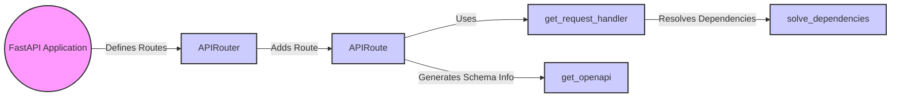

## Path Operations Overview

This component is responsible for defining the application's endpoints, associating URL paths and HTTP methods with handler functions, and generating OpenAPI schema information.

Here's a data flow diagram illustrating the path operations within FastAPI:

### Component Descriptions:

*   **FastAPI Application:** The core application instance that manages API-level functionalities, including routing. It defines routes using the `APIRouter`. **Relevant source files:** `fastapi.applications.FastAPI`

*   **APIRouter:** Groups API routes for modularity. It adds routes to the application using `APIRoute`. **Relevant source files:** `fastapi.routing.APIRouter`

*   **APIRoute:** Represents a single API route, encapsulating request processing logic. It uses `get_request_handler` to generate the route handler and `get_openapi` to generate schema information. **Relevant source files:** `fastapi.routing.APIRoute`

*   **get_request_handler:** Generates the request handler function, handling dependency resolution and endpoint execution. It uses `solve_dependencies` to resolve dependencies. **Relevant source files:** `fastapi.routing.get_request_handler`

*   **solve_dependencies:** Resolves dependencies for a given endpoint. **Relevant source files:** `fastapi.dependencies.utils.solve_dependencies`

*   **get_openapi:** Generates the OpenAPI schema for the application. **Relevant source files:** `fastapi.openapi.utils.get_openapi`