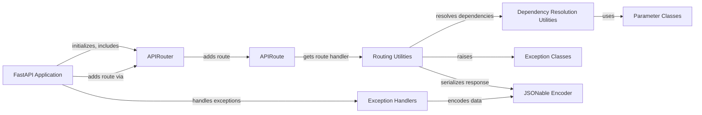

## Component Details

The FastAPI request handling and parameter parsing subsystem is responsible for receiving HTTP requests, extracting and validating parameters from various sources (path, query, headers, cookies, request body), and converting them into usable data for the application's endpoint functions. It ensures that the incoming data conforms to the expected types and constraints, raising appropriate exceptions if validation fails. This process involves defining parameter types using classes like `Path`, `Query`, `Header`, `Cookie`, `Form`, and `File`, and utilizing dependency injection to provide these validated parameters to the endpoint functions.

### FastAPI Application
The core application class that manages request routing, middleware, and exception handling. It initializes the application, sets up the OpenAPI schema, and includes routers to handle different API endpoints.
- **Related Classes/Methods**:

['[`fastapi.fastapi.applications.FastAPI:__init__` (64:964)](https://github.com/fastapi/fastapi/blob/master/fastapi/applications.py#L64-L964)', '[`fastapi.fastapi.applications.FastAPI:setup` (998:1049)](https://github.com/fastapi/fastapi/blob/master/fastapi/applications.py#L998-L1049)', '[`fastapi.fastapi.applications.FastAPI:openapi` (966:996)](https://github.com/fastapi/fastapi/blob/master/fastapi/applications.py#L966-L996)', '[`fastapi.fastapi.applications.FastAPI:add_api_route` (1056:1113)](https://github.com/fastapi/fastapi/blob/master/fastapi/applications.py#L1056-L1113)', '[`fastapi.fastapi.applications.FastAPI:api_route` (1115:1173)](https://github.com/fastapi/fastapi/blob/master/fastapi/applications.py#L1115-L1173)', '[`fastapi.fastapi.applications.FastAPI:add_api_websocket_route` (1175:1188)](https://github.com/fastapi/fastapi/blob/master/fastapi/applications.py#L1175-L1188)', '[`fastapi.fastapi.applications.FastAPI:websocket` (1190:1253)](https://github.com/fastapi/fastapi/blob/master/fastapi/applications.py#L1190-L1253)', '[`fastapi.fastapi.applications.FastAPI:include_router` (1255:1458)](https://github.com/fastapi/fastapi/blob/master/fastapi/applications.py#L1255-L1458)', '[`fastapi.fastapi.applications.FastAPI:get` (1460:1831)](https://github.com/fastapi/fastapi/blob/master/fastapi/applications.py#L1460-L1831)', '[`fastapi.fastapi.applications.FastAPI:put` (1833:2209)](https://github.com/fastapi/fastapi/blob/master/fastapi/applications.py#L1833-L2209)', '[`fastapi.fastapi.applications.FastAPI:post` (2211:2587)](https://github.com/fastapi/fastapi/blob/master/fastapi/applications.py#L2211-L2587)', '[`fastapi.fastapi.applications.FastAPI:delete` (2589:2960)](https://github.com/fastapi/fastapi/blob/master/fastapi/applications.py#L2589-L2960)', '[`fastapi.fastapi.applications.FastAPI:options` (2962:3333)](https://github.com/fastapi/fastapi/blob/master/fastapi/applications.py#L2962-L3333)', '[`fastapi.fastapi.applications.FastAPI:head` (3335:3706)](https://github.com/fastapi/fastapi/blob/master/fastapi/applications.py#L3335-L3706)', '[`fastapi.fastapi.applications.FastAPI:patch` (3708:4084)](https://github.com/fastapi/fastapi/blob/master/fastapi/applications.py#L3708-L4084)', '[`fastapi.fastapi.applications.FastAPI:trace` (4086:4457)](https://github.com/fastapi/fastapi/blob/master/fastapi/applications.py#L4086-L4457)', '[`fastapi.fastapi.applications.FastAPI:on_event` (4476:4495)](https://github.com/fastapi/fastapi/blob/master/fastapi/applications.py#L4476-L4495)']

### APIRouter
Groups API routes with a common prefix and tags. It manages adding routes, including other routers, and handling events, providing a modular way to organize API endpoints.
- **Related Classes/Methods**:

['[`fastapi.fastapi.routing.APIRouter:__init__` (622:860)](https://github.com/fastapi/fastapi/blob/master/fastapi/routing.py#L622-L860)', '[`fastapi.fastapi.routing.APIRouter:add_api_route` (881:961)](https://github.com/fastapi/fastapi/blob/master/fastapi/routing.py#L881-L961)', '[`fastapi.fastapi.routing.APIRouter:api_route` (963:1023)](https://github.com/fastapi/fastapi/blob/master/fastapi/routing.py#L963-L1023)', '[`fastapi.fastapi.routing.APIRouter:add_api_websocket_route` (1025:1044)](https://github.com/fastapi/fastapi/blob/master/fastapi/routing.py#L1025-L1044)', '[`fastapi.fastapi.routing.APIRouter:websocket` (1046:1111)](https://github.com/fastapi/fastapi/blob/master/fastapi/routing.py#L1046-L1111)', '[`fastapi.fastapi.routing.APIRouter:include_router` (1122:1364)](https://github.com/fastapi/fastapi/blob/master/fastapi/routing.py#L1122-L1364)', '[`fastapi.fastapi.routing.APIRouter:get` (1366:1741)](https://github.com/fastapi/fastapi/blob/master/fastapi/routing.py#L1366-L1741)', '[`fastapi.fastapi.routing.APIRouter:put` (1743:2123)](https://github.com/fastapi/fastapi/blob/master/fastapi/routing.py#L1743-L2123)', '[`fastapi.fastapi.routing.APIRouter:post` (2125:2505)](https://github.com/fastapi/fastapi/blob/master/fastapi/routing.py#L2125-L2505)', '[`fastapi.fastapi.routing.APIRouter:delete` (2507:2882)](https://github.com/fastapi/fastapi/blob/master/fastapi/routing.py#L2507-L2882)', '[`fastapi.fastapi.routing.APIRouter:options` (2884:3259)](https://github.com/fastapi/fastapi/blob/master/fastapi/routing.py#L2884-L3259)', '[`fastapi.fastapi.routing.APIRouter:head` (3261:3641)](https://github.com/fastapi/fastapi/blob/master/fastapi/routing.py#L3261-L3641)', '[`fastapi.fastapi.routing.APIRouter:patch` (3643:4023)](https://github.com/fastapi/fastapi/blob/master/fastapi/routing.py#L3643-L4023)', '[`fastapi.fastapi.routing.APIRouter:trace` (4025:4405)](https://github.com/fastapi/fastapi/blob/master/fastapi/routing.py#L4025-L4405)']

### APIRoute
Represents a single API route, defining its path, methods, endpoint function, and dependencies. It is responsible for handling incoming requests, validating data, and serializing responses.
- **Related Classes/Methods**:

['[`fastapi.fastapi.routing.APIRoute:__init__` (429:569)](https://github.com/fastapi/fastapi/blob/master/fastapi/routing.py#L429-L569)', '[`fastapi.fastapi.routing.APIRoute:get_route_handler` (571:586)](https://github.com/fastapi/fastapi/blob/master/fastapi/routing.py#L571-L586)']

### Dependency Resolution Utilities
Handles the resolution of dependencies for API routes. It analyzes the endpoint function's signature, identifies dependencies (including request parameters), and resolves them before calling the endpoint function. This includes parsing and validating request parameters.
- **Related Classes/Methods**:

['[`fastapi.fastapi.dependencies.utils:get_dependant` (265:314)](https://github.com/fastapi/fastapi/blob/master/fastapi/dependencies/utils.py#L265-L314)', '[`fastapi.fastapi.dependencies.utils:get_parameterless_sub_dependant` (135:139)](https://github.com/fastapi/fastapi/blob/master/fastapi/dependencies/utils.py#L135-L139)', '[`fastapi.fastapi.dependencies.utils:get_sub_dependant` (142:171)](https://github.com/fastapi/fastapi/blob/master/fastapi/dependencies/utils.py#L142-L171)', '[`fastapi.fastapi.dependencies.utils:get_flat_dependant` (177:209)](https://github.com/fastapi/fastapi/blob/master/fastapi/dependencies/utils.py#L177-L209)', '[`fastapi.fastapi.dependencies.utils:get_flat_params` (222:228)](https://github.com/fastapi/fastapi/blob/master/fastapi/dependencies/utils.py#L222-L228)', '[`fastapi.fastapi.dependencies.utils:get_typed_signature` (231:244)](https://github.com/fastapi/fastapi/blob/master/fastapi/dependencies/utils.py#L231-L244)', '[`fastapi.fastapi.dependencies.utils:get_typed_return_annotation` (254:262)](https://github.com/fastapi/fastapi/blob/master/fastapi/dependencies/utils.py#L254-L262)', '[`fastapi.fastapi.dependencies.utils:analyze_param` (348:511)](https://github.com/fastapi/fastapi/blob/master/fastapi/dependencies/utils.py#L348-L511)', '[`fastapi.fastapi.dependencies.utils:solve_generator` (553:560)](https://github.com/fastapi/fastapi/blob/master/fastapi/dependencies/utils.py#L553-L560)', '[`fastapi.fastapi.dependencies.utils:solve_dependencies` (572:695)](https://github.com/fastapi/fastapi/blob/master/fastapi/dependencies/utils.py#L572-L695)', '[`fastapi.fastapi.dependencies.utils:_validate_value_with_model_field` (698:713)](https://github.com/fastapi/fastapi/blob/master/fastapi/dependencies/utils.py#L698-L713)', '[`fastapi.fastapi.dependencies.utils:_get_multidict_value` (716:737)](https://github.com/fastapi/fastapi/blob/master/fastapi/dependencies/utils.py#L716-L737)', '[`fastapi.fastapi.dependencies.utils:request_params_to_args` (740:816)](https://github.com/fastapi/fastapi/blob/master/fastapi/dependencies/utils.py#L740-L816)', '[`fastapi.fastapi.dependencies.utils:_extract_form_body` (841:881)](https://github.com/fastapi/fastapi/blob/master/fastapi/dependencies/utils.py#L841-L881)', '[`fastapi.fastapi.dependencies.utils:request_body_to_args` (884:927)](https://github.com/fastapi/fastapi/blob/master/fastapi/dependencies/utils.py#L884-L927)', '[`fastapi.fastapi.dependencies.utils:get_body_field` (930:980)](https://github.com/fastapi/fastapi/blob/master/fastapi/dependencies/utils.py#L930-L980)']

### Routing Utilities
Handles the actual calling of the endpoint function and serializing the response. It orchestrates the dependency resolution and execution of the endpoint logic.
- **Related Classes/Methods**:

['[`fastapi.fastapi.routing:get_request_handler` (217:357)](https://github.com/fastapi/fastapi/blob/master/fastapi/routing.py#L217-L357)', '[`fastapi.fastapi.routing:get_websocket_app` (360:385)](https://github.com/fastapi/fastapi/blob/master/fastapi/routing.py#L360-L385)', '[`fastapi.fastapi.routing:serialize_response` (143:201)](https://github.com/fastapi/fastapi/blob/master/fastapi/routing.py#L143-L201)', '[`fastapi.fastapi.routing:_prepare_response_content` (79:123)](https://github.com/fastapi/fastapi/blob/master/fastapi/routing.py#L79-L123)']

### Parameter Classes
Represents different types of parameters that can be passed to API endpoints, such as path parameters, query parameters, headers, and cookies. These classes define how parameters are parsed, validated, and documented in the OpenAPI schema.
- **Related Classes/Methods**:

['[`fastapi.fastapi.params.Path:__init__` (142:222)](https://github.com/fastapi/fastapi/blob/master/fastapi/params.py#L142-L222)', '[`fastapi.fastapi.params.Query:__init__` (228:306)](https://github.com/fastapi/fastapi/blob/master/fastapi/params.py#L228-L306)', '[`fastapi.fastapi.params.Header:__init__` (312:392)](https://github.com/fastapi/fastapi/blob/master/fastapi/params.py#L312-L392)', '[`fastapi.fastapi.params.Cookie:__init__` (398:476)](https://github.com/fastapi/fastapi/blob/master/fastapi/params.py#L398-L476)', '[`fastapi.fastapi.params.Form:__init__` (597:677)](https://github.com/fastapi/fastapi/blob/master/fastapi/params.py#L597-L677)', '[`fastapi.fastapi.params.File:__init__` (681:761)](https://github.com/fastapi/fastapi/blob/master/fastapi/params.py#L681-L761)', '[`fastapi.fastapi.params.Security:__init__` (778:786)](https://github.com/fastapi/fastapi/blob/master/fastapi/params.py#L778-L786)']

### Exception Handlers
Handles exceptions that occur during request processing, such as HTTP exceptions and validation errors. It provides a centralized mechanism for managing errors and returning appropriate HTTP responses.
- **Related Classes/Methods**:

['[`fastapi.fastapi.exception_handlers:http_exception_handler` (11:17)](https://github.com/fastapi/fastapi/blob/master/fastapi/exception_handlers.py#L11-L17)', '[`fastapi.fastapi.exception_handlers:request_validation_exception_handler` (20:26)](https://github.com/fastapi/fastapi/blob/master/fastapi/exception_handlers.py#L20-L26)', '[`fastapi.fastapi.exception_handlers:websocket_request_validation_exception_handler` (29:34)](https://github.com/fastapi/fastapi/blob/master/fastapi/exception_handlers.py#L29-L34)']

### Exception Classes
Represents exceptions that can be raised during request processing, such as request validation errors and response validation errors. These classes provide structured information about the errors that occurred.
- **Related Classes/Methods**:

['[`fastapi.fastapi.exceptions.RequestValidationError:__init__` (158:160)](https://github.com/fastapi/fastapi/blob/master/fastapi/exceptions.py#L158-L160)', '[`fastapi.fastapi.exceptions.ResponseValidationError:__init__` (168:170)](https://github.com/fastapi/fastapi/blob/master/fastapi/exceptions.py#L168-L170)']

### JSONable Encoder
Encodes data into a JSON-compatible format for responses. It ensures that complex data structures can be serialized into JSON for transmission to the client.
- **Related Classes/Methods**:

['[`fastapi.fastapi.encoders:jsonable_encoder` (102:343)](https://github.com/fastapi/fastapi/blob/master/fastapi/encoders.py#L102-L343)']