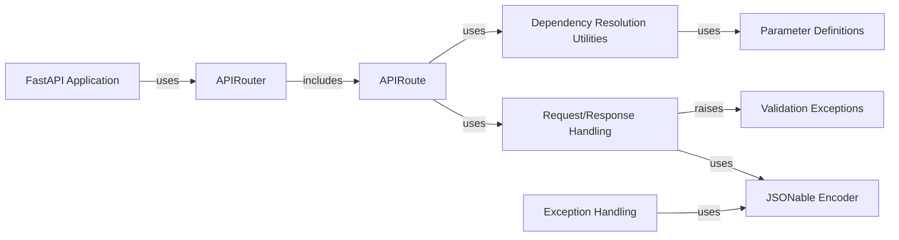

## Component Details

The Request Handling and Validation subsystem in FastAPI is responsible for processing incoming HTTP requests, extracting and validating request parameters, and handling request bodies. It leverages Pydantic models for data validation and provides a declarative way to define and validate request parameters using Path, Query, Header, Cookie, and Body parameters. The subsystem ensures that the application receives well-formed and valid data, contributing to the overall robustness and security of the API.

### FastAPI Application
The core application class that manages request routing, middleware, and exception handling. It uses APIRouter to organize routes and Dependency Injection to resolve dependencies. It's the central point for configuring and running the API.
- **Related Classes/Methods**:

- <a href="https://github.com/fastapi/fastapi/blob/master/fastapi/applications.py#L64-L964" target="_blank" rel="noopener noreferrer">`fastapi.fastapi.applications.FastAPI:__init__` (64:964)</a>
- <a href="https://github.com/fastapi/fastapi/blob/master/fastapi/applications.py#L998-L1049" target="_blank" rel="noopener noreferrer">`fastapi.fastapi.applications.FastAPI:setup` (998:1049)</a>
- <a href="https://github.com/fastapi/fastapi/blob/master/fastapi/applications.py#L966-L996" target="_blank" rel="noopener noreferrer">`fastapi.fastapi.applications.FastAPI:openapi` (966:996)</a>
- <a href="https://github.com/fastapi/fastapi/blob/master/fastapi/applications.py#L1056-L1113" target="_blank" rel="noopener noreferrer">`fastapi.fastapi.applications.FastAPI:add_api_route` (1056:1113)</a>
- <a href="https://github.com/fastapi/fastapi/blob/master/fastapi/applications.py#L1115-L1173" target="_blank" rel="noopener noreferrer">`fastapi.fastapi.applications.FastAPI:api_route` (1115:1173)</a>
- <a href="https://github.com/fastapi/fastapi/blob/master/fastapi/applications.py#L1175-L1188" target="_blank" rel="noopener noreferrer">`fastapi.fastapi.applications.FastAPI:add_api_websocket_route` (1175:1188)</a>
- <a href="https://github.com/fastapi/fastapi/blob/master/fastapi/applications.py#L1190-L1253" target="_blank" rel="noopener noreferrer">`fastapi.fastapi.applications.FastAPI:websocket` (1190:1253)</a>
- <a href="https://github.com/fastapi/fastapi/blob/master/fastapi/applications.py#L1255-L1458" target="_blank" rel="noopener noreferrer">`fastapi.fastapi.applications.FastAPI:include_router` (1255:1458)</a>
- <a href="https://github.com/fastapi/fastapi/blob/master/fastapi/applications.py#L1460-L1831" target="_blank" rel="noopener noreferrer">`fastapi.fastapi.applications.FastAPI:get` (1460:1831)</a>
- <a href="https://github.com/fastapi/fastapi/blob/master/fastapi/applications.py#L1833-L2209" target="_blank" rel="noopener noreferrer">`fastapi.fastapi.applications.FastAPI:put` (1833:2209)</a>
- <a href="https://github.com/fastapi/fastapi/blob/master/fastapi/applications.py#L2211-L2587" target="_blank" rel="noopener noreferrer">`fastapi.fastapi.applications.FastAPI:post` (2211:2587)</a>
- <a href="https://github.com/fastapi/fastapi/blob/master/fastapi/applications.py#L2589-L2960" target="_blank" rel="noopener noreferrer">`fastapi.fastapi.applications.FastAPI:delete` (2589:2960)</a>
- <a href="https://github.com/fastapi/fastapi/blob/master/fastapi/applications.py#L2962-L3333" target="_blank" rel="noopener noreferrer">`fastapi.fastapi.applications.FastAPI:options` (2962:3333)</a>
- <a href="https://github.com/fastapi/fastapi/blob/master/fastapi/applications.py#L3335-L3706" target="_blank" rel="noopener noreferrer">`fastapi.fastapi.applications.FastAPI:head` (3335:3706)</a>
- <a href="https://github.com/fastapi/fastapi/blob/master/fastapi/applications.py#L3708-L4084" target="_blank" rel="noopener noreferrer">`fastapi.fastapi.applications.FastAPI:patch` (3708:4084)</a>
- <a href="https://github.com/fastapi/fastapi/blob/master/fastapi/applications.py#L4086-L4457" target="_blank" rel="noopener noreferrer">`fastapi.fastapi.applications.FastAPI:trace` (4086:4457)</a>
- <a href="https://github.com/fastapi/fastapi/blob/master/fastapi/applications.py#L4476-L4495" target="_blank" rel="noopener noreferrer">`fastapi.fastapi.applications.FastAPI:on_event` (4476:4495)</a>

### APIRouter
A class for grouping API routes with a common prefix and dependencies. It's used to organize the application's routes and middleware, providing a modular way to define API endpoints.
- **Related Classes/Methods**:

- <a href="https://github.com/fastapi/fastapi/blob/master/fastapi/routing.py#L622-L860" target="_blank" rel="noopener noreferrer">`fastapi.fastapi.routing.APIRouter:__init__` (622:860)</a>
- <a href="https://github.com/fastapi/fastapi/blob/master/fastapi/routing.py#L881-L961" target="_blank" rel="noopener noreferrer">`fastapi.fastapi.routing.APIRouter:add_api_route` (881:961)</a>
- <a href="https://github.com/fastapi/fastapi/blob/master/fastapi/routing.py#L963-L1023" target="_blank" rel="noopener noreferrer">`fastapi.fastapi.routing.APIRouter:api_route` (963:1023)</a>
- <a href="https://github.com/fastapi/fastapi/blob/master/fastapi/routing.py#L1025-L1044" target="_blank" rel="noopener noreferrer">`fastapi.fastapi.routing.APIRouter:add_api_websocket_route` (1025:1044)</a>
- <a href="https://github.com/fastapi/fastapi/blob/master/fastapi/routing.py#L1046-L1111" target="_blank" rel="noopener noreferrer">`fastapi.fastapi.routing.APIRouter:websocket` (1046:1111)</a>
- <a href="https://github.com/fastapi/fastapi/blob/master/fastapi/routing.py#L1122-L1364" target="_blank" rel="noopener noreferrer">`fastapi.fastapi.routing.APIRouter:include_router` (1122:1364)</a>
- <a href="https://github.com/fastapi/fastapi/blob/master/fastapi/routing.py#L1366-L1741" target="_blank" rel="noopener noreferrer">`fastapi.fastapi.routing.APIRouter:get` (1366:1741)</a>
- <a href="https://github.com/fastapi/fastapi/blob/master/fastapi/routing.py#L1743-L2123" target="_blank" rel="noopener noreferrer">`fastapi.fastapi.routing.APIRouter:put` (1743:2123)</a>
- <a href="https://github.com/fastapi/fastapi/blob/master/fastapi/routing.py#L2125-L2505" target="_blank" rel="noopener noreferrer">`fastapi.fastapi.routing.APIRouter:post` (2125:2505)</a>
- <a href="https://github.com/fastapi/fastapi/blob/master/fastapi/routing.py#L2507-L2882" target="_blank" rel="noopener noreferrer">`fastapi.fastapi.routing.APIRouter:delete` (2507:2882)</a>
- <a href="https://github.com/fastapi/fastapi/blob/master/fastapi/routing.py#L2884-L3259" target="_blank" rel="noopener noreferrer">`fastapi.fastapi.routing.APIRouter:options` (2884:3259)</a>
- <a href="https://github.com/fastapi/fastapi/blob/master/fastapi/routing.py#L3261-L3641" target="_blank" rel="noopener noreferrer">`fastapi.fastapi.routing.APIRouter:head` (3261:3641)</a>
- <a href="https://github.com/fastapi/fastapi/blob/master/fastapi/routing.py#L3643-L4023" target="_blank" rel="noopener noreferrer">`fastapi.fastapi.routing.APIRouter:patch` (3643:4023)</a>
- <a href="https://github.com/fastapi/fastapi/blob/master/fastapi/routing.py#L4025-L4405" target="_blank" rel="noopener noreferrer">`fastapi.fastapi.routing.APIRouter:trace` (4025:4405)</a>

### APIRoute
Represents a single API route, defining the path, methods, endpoint function, and dependencies. It handles the creation of the request handler function, which is responsible for processing the request and returning a response.
- **Related Classes/Methods**:

- <a href="https://github.com/fastapi/fastapi/blob/master/fastapi/routing.py#L429-L569" target="_blank" rel="noopener noreferrer">`fastapi.fastapi.routing.APIRoute:__init__` (429:569)</a>
- <a href="https://github.com/fastapi/fastapi/blob/master/fastapi/routing.py#L571-L586" target="_blank" rel="noopener noreferrer">`fastapi.fastapi.routing.APIRoute:get_route_handler` (571:586)</a>

### Dependency Resolution Utilities
Utility functions for resolving dependencies, extracting dependencies from function signatures, solving dependencies recursively, and validating parameter types. It interacts with the parameter classes (Path, Query, Body, etc.) to extract information about the expected request parameters and their validation rules.
- **Related Classes/Methods**:

- <a href="https://github.com/fastapi/fastapi/blob/master/fastapi/dependencies/utils.py#L265-L314" target="_blank" rel="noopener noreferrer">`fastapi.fastapi.dependencies.utils:get_dependant` (265:314)</a>
- <a href="https://github.com/fastapi/fastapi/blob/master/fastapi/dependencies/utils.py#L135-L139" target="_blank" rel="noopener noreferrer">`fastapi.fastapi.dependencies.utils:get_parameterless_sub_dependant` (135:139)</a>
- <a href="https://github.com/fastapi/fastapi/blob/master/fastapi/dependencies/utils.py#L142-L171" target="_blank" rel="noopener noreferrer">`fastapi.fastapi.dependencies.utils:get_sub_dependant` (142:171)</a>
- <a href="https://github.com/fastapi/fastapi/blob/master/fastapi/dependencies/utils.py#L177-L209" target="_blank" rel="noopener noreferrer">`fastapi.fastapi.dependencies.utils:get_flat_dependant` (177:209)</a>
- <a href="https://github.com/fastapi/fastapi/blob/master/fastapi/dependencies/utils.py#L212-L219" target="_blank" rel="noopener noreferrer">`fastapi.fastapi.dependencies.utils:_get_flat_fields_from_params` (212:219)</a>
- <a href="https://github.com/fastapi/fastapi/blob/master/fastapi/dependencies/utils.py#L222-L228" target="_blank" rel="noopener noreferrer">`fastapi.fastapi.dependencies.utils:get_flat_params` (222:228)</a>
- <a href="https://github.com/fastapi/fastapi/blob/master/fastapi/dependencies/utils.py#L231-L244" target="_blank" rel="noopener noreferrer">`fastapi.fastapi.dependencies.utils:get_typed_signature` (231:244)</a>
- <a href="https://github.com/fastapi/fastapi/blob/master/fastapi/dependencies/utils.py#L254-L262" target="_blank" rel="noopener noreferrer">`fastapi.fastapi.dependencies.utils:get_typed_return_annotation` (254:262)</a>
- <a href="https://github.com/fastapi/fastapi/blob/master/fastapi/dependencies/utils.py#L348-L511" target="_blank" rel="noopener noreferrer">`fastapi.fastapi.dependencies.utils:analyze_param` (348:511)</a>
- <a href="https://github.com/fastapi/fastapi/blob/master/fastapi/dependencies/utils.py#L553-L560" target="_blank" rel="noopener noreferrer">`fastapi.fastapi.dependencies.utils:solve_generator` (553:560)</a>
- <a href="https://github.com/fastapi/fastapi/blob/master/fastapi/dependencies/utils.py#L572-L695" target="_blank" rel="noopener noreferrer">`fastapi.fastapi.dependencies.utils:solve_dependencies` (572:695)</a>
- <a href="https://github.com/fastapi/fastapi/blob/master/fastapi/dependencies/utils.py#L698-L713" target="_blank" rel="noopener noreferrer">`fastapi.fastapi.dependencies.utils:_validate_value_with_model_field` (698:713)</a>
- <a href="https://github.com/fastapi/fastapi/blob/master/fastapi/dependencies/utils.py#L716-L737" target="_blank" rel="noopener noreferrer">`fastapi.fastapi.dependencies.utils:_get_multidict_value` (716:737)</a>
- <a href="https://github.com/fastapi/fastapi/blob/master/fastapi/dependencies/utils.py#L740-L816" target="_blank" rel="noopener noreferrer">`fastapi.fastapi.dependencies.utils:request_params_to_args` (740:816)</a>
- <a href="https://github.com/fastapi/fastapi/blob/master/fastapi/dependencies/utils.py#L841-L881" target="_blank" rel="noopener noreferrer">`fastapi.fastapi.dependencies.utils:_extract_form_body` (841:881)</a>
- <a href="https://github.com/fastapi/fastapi/blob/master/fastapi/dependencies/utils.py#L884-L927" target="_blank" rel="noopener noreferrer">`fastapi.fastapi.dependencies.utils:request_body_to_args` (884:927)</a>
- <a href="https://github.com/fastapi/fastapi/blob/master/fastapi/dependencies/utils.py#L930-L980" target="_blank" rel="noopener noreferrer">`fastapi.fastapi.dependencies.utils:get_body_field` (930:980)</a>

### Request/Response Handling
Handles incoming requests and serializes responses. It includes functions for preparing the response content, serializing the response, and handling request validation errors. It uses the encoders module to convert data to JSON-compatible formats, ensuring that responses are properly formatted.
- **Related Classes/Methods**:

- <a href="https://github.com/fastapi/fastapi/blob/master/fastapi/routing.py#L79-L123" target="_blank" rel="noopener noreferrer">`fastapi.fastapi.routing:_prepare_response_content` (79:123)</a>
- <a href="https://github.com/fastapi/fastapi/blob/master/fastapi/routing.py#L143-L201" target="_blank" rel="noopener noreferrer">`fastapi.fastapi.routing:serialize_response` (143:201)</a>
- <a href="https://github.com/fastapi/fastapi/blob/master/fastapi/routing.py#L217-L357" target="_blank" rel="noopener noreferrer">`fastapi.fastapi.routing:get_request_handler` (217:357)</a>
- <a href="https://github.com/fastapi/fastapi/blob/master/fastapi/routing.py#L360-L385" target="_blank" rel="noopener noreferrer">`fastapi.fastapi.routing:get_websocket_app` (360:385)</a>

### Parameter Definitions
Defines the parameter classes (Path, Query, Header, Cookie, Body, File, Security) used to declare request parameters. These classes inherit from Param or Body and provide metadata about the parameter, such as its type, default value, and validation rules, enabling a declarative approach to request parameter definition.
- **Related Classes/Methods**:

- <a href="https://github.com/fastapi/fastapi/blob/master/fastapi/params.py#L142-L222" target="_blank" rel="noopener noreferrer">`fastapi.fastapi.params.Path:__init__` (142:222)</a>
- <a href="https://github.com/fastapi/fastapi/blob/master/fastapi/params.py#L228-L306" target="_blank" rel="noopener noreferrer">`fastapi.fastapi.params.Query:__init__` (228:306)</a>
- <a href="https://github.com/fastapi/fastapi/blob/master/fastapi/params.py#L312-L392" target="_blank" rel="noopener noreferrer">`fastapi.fastapi.params.Header:__init__` (312:392)</a>
- <a href="https://github.com/fastapi/fastapi/blob/master/fastapi/params.py#L398-L476" target="_blank" rel="noopener noreferrer">`fastapi.fastapi.params.Cookie:__init__` (398:476)</a>
- <a href="https://github.com/fastapi/fastapi/blob/master/fastapi/params.py#L597-L677" target="_blank" rel="noopener noreferrer">`fastapi.fastapi.params.Form:__init__` (597:677)</a>
- <a href="https://github.com/fastapi/fastapi/blob/master/fastapi/params.py#L681-L761" target="_blank" rel="noopener noreferrer">`fastapi.fastapi.params.File:__init__` (681:761)</a>

### Exception Handling
Provides exception handlers for HTTP exceptions, request validation errors, and WebSocket request validation errors. It uses the encoders module to serialize error responses to JSON, ensuring consistent error formatting.
- **Related Classes/Methods**:

- <a href="https://github.com/fastapi/fastapi/blob/master/fastapi/exception_handlers.py#L11-L17" target="_blank" rel="noopener noreferrer">`fastapi.fastapi.exception_handlers:http_exception_handler` (11:17)</a>
- <a href="https://github.com/fastapi/fastapi/blob/master/fastapi/exception_handlers.py#L20-L26" target="_blank" rel="noopener noreferrer">`fastapi.fastapi.exception_handlers:request_validation_exception_handler` (20:26)</a>
- <a href="https://github.com/fastapi/fastapi/blob/master/fastapi/exception_handlers.py#L29-L34" target="_blank" rel="noopener noreferrer">`fastapi.fastapi.exception_handlers:websocket_request_validation_exception_handler` (29:34)</a>

### Validation Exceptions
Defines the exception classes for request and response validation errors. These exceptions are raised when the request or response data does not conform to the expected schema, providing a mechanism for handling invalid data.
- **Related Classes/Methods**:

- <a href="https://github.com/fastapi/fastapi/blob/master/fastapi/exceptions.py#L158-L160" target="_blank" rel="noopener noreferrer">`fastapi.fastapi.exceptions.RequestValidationError:__init__` (158:160)</a>
- <a href="https://github.com/fastapi/fastapi/blob/master/fastapi/exceptions.py#L168-L170" target="_blank" rel="noopener noreferrer">`fastapi.fastapi.exceptions.ResponseValidationError:__init__` (168:170)</a>

### JSONable Encoder
Provides a function for encoding data to a JSON-compatible format. It handles various data types, including Pydantic models, datetime objects, and UUIDs, ensuring that data can be serialized to JSON correctly.
- **Related Classes/Methods**:

- <a href="https://github.com/fastapi/fastapi/blob/master/fastapi/encoders.py#L102-L343" target="_blank" rel="noopener noreferrer">`fastapi.fastapi.encoders:jsonable_encoder` (102:343)</a>