## Request Handling Component Overview

This diagram illustrates the flow of an incoming HTTP request through the FastAPI application, highlighting the key components involved in request handling, routing, dependency injection, middleware execution, exception handling, and response generation.

```mermaid
graph LR
    Client[Client] -- Sends HTTP Request --> FastAPIApp((FastAPI Application)) 
    FastAPIApp -- Configures Routes --> APIRouter((APIRouter))
    APIRouter -- Defines Endpoint --> APIRoute((APIRoute))
    FastAPIApp -- Uses --> MiddlewarePipeline[Middleware Pipeline]
    MiddlewarePipeline -- Modifies Request/Response --> APIRoute
    APIRoute -- Resolves Dependencies --> DependencyInjection[Dependency Injection System]
    DependencyInjection -- Provides Dependencies --> RouteHandler[Route Handler]
    APIRoute -- Executes --> RouteHandler
    RouteHandler -- Generates Response --> ResponseSerialization[Response Serialization]
    ResponseSerialization -- Serializes Response --> MiddlewarePipeline
    MiddlewarePipeline -- Modifies Response --> FastAPIApp
    FastAPIApp -- Sends HTTP Response --> Client
    RouteHandler -- Raises Exception --> ExceptionHandler[Exception Handling]
    ExceptionHandler -- Handles Exception --> ResponseSerialization


style Client fill:#f9f,stroke:#333,stroke-width:2px
style FastAPIApp fill:#ccf,stroke:#333,stroke-width:2px
style APIRouter fill:#ccf,stroke:#333,stroke-width:2px
style APIRoute fill:#ccf,stroke:#333,stroke-width:2px
style MiddlewarePipeline fill:#ccf,stroke:#333,stroke-width:2px
style DependencyInjection fill:#ccf,stroke:#333,stroke-width:2px
style RouteHandler fill:#ccf,stroke:#333,stroke-width:2px
style ResponseSerialization fill:#ccf,stroke:#333,stroke-width:2px
style ExceptionHandler fill:#ccf,stroke:#333,stroke-width:2px


```

### Component Descriptions:

- **Client**: The user or system that initiates the HTTP request.
    - *Interaction*: Sends an HTTP request to the FastAPI application and receives the HTTP response.
    - *Relevant source files*: N/A

- **FastAPI Application**: The central application instance that inherits from Starlette and manages API routes, middleware, and exception handling.
    - *Interaction*: Receives the incoming HTTP request, configures routes using APIRouter, applies middleware, and sends the final HTTP response back to the client. It also handles exceptions.
    - *Relevant source files*: `fastapi.applications.FastAPI`

- **APIRouter**: A modular component for grouping related API endpoints under a common prefix and set of configurations.
    - *Interaction*: Configures API routes within the FastAPI application, defining the relationship between URL paths and endpoint functions.
    - *Relevant source files*: `fastapi.routing.APIRouter`

- **APIRoute**: Represents a single API endpoint, defining the path, HTTP methods, and the associated handler function.
    - *Interaction*: Defines the route handler, resolves dependencies using the Dependency Injection System, and executes the route handler to generate a response. It also triggers exception handling if necessary.
    - *Relevant source files*: `fastapi.routing.APIRoute`

- **Middleware Pipeline**: A sequence of middleware components that intercept requests and responses to modify or augment the request processing pipeline.
    - *Interaction*: Modifies the incoming request before it reaches the route handler and modifies the outgoing response before it is sent to the client. It enables cross-cutting concerns like authentication, logging, and request tracing.
    - *Relevant source files*: `fastapi.middleware.Middleware`

- **Dependency Injection System**: Manages the resolution and validation of dependencies for API endpoints, ensuring that the required resources are available during request processing.
    - *Interaction*: Provides dependencies to the route handler, ensuring that the handler function has access to the necessary resources.
    - *Relevant source files*: `fastapi.dependencies.utils.solve_dependencies`

- **Route Handler**: The function associated with an API endpoint that processes the request and generates a response.
    - *Interaction*: Receives the processed request and dependencies, executes the endpoint logic, and generates a response. It may also raise exceptions if errors occur.
    - *Relevant source files*: N/A

- **Response Serialization**: Converts the response data into a serialized format (e.g., JSON) that can be sent back to the client.
    - *Interaction*: Serializes the response data into a format suitable for transmission over HTTP.
    - *Relevant source files*: N/A

- **Exception Handling**: A centralized mechanism for catching and handling exceptions raised during request processing, providing a consistent error response format.
    - *Interaction*: Catches exceptions raised by the route handler or other components and generates an appropriate error response.
    - *Relevant source files*: N/A