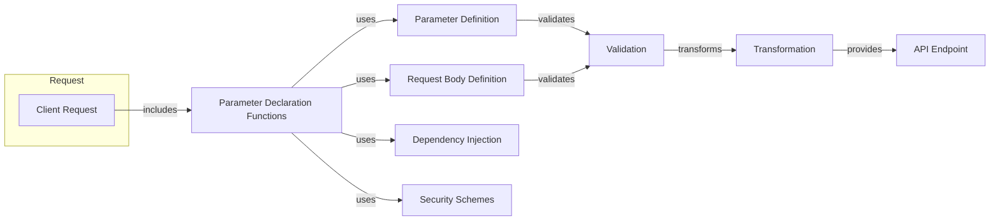

## Request Parameter Handling

This component focuses on extracting, validating, and transforming request parameters in FastAPI. It handles parameters from various sources like path, query, headers, cookies, body, and files, ensuring data integrity and security.

## Components Description

- **Client Request:** Represents the incoming request from the client. It contains all the data sent by the client, including headers, body, query parameters, etc. It *includes* the parameter declarations.

- **Parameter Declaration Functions:** This component provides functions like `Path`, `Query`, `Header`, `Cookie`, `Body`, and `File` to declare request parameters. It *uses* `ParameterDefinition`, `RequestBodyDefinition`, `DependencyInjection`, and `SecuritySchemes` to define and handle parameters.
    - Relevant source files: `fastapi.param_functions`

- **Parameter Definition:** Defines the base class `Param` and its subclasses for different parameter types. It *validates* the parameters using the `Validation` component.
    - Relevant source files: `fastapi.params`

- **Request Body Definition:** Defines how request bodies, including form data and files, are handled. It *validates* the request body using the `Validation` component.
    - Relevant source files: `fastapi.params`

- **Dependency Injection:** Manages dependencies required by the API endpoint. It is *used* by `ParameterDeclaration` to inject dependencies into the endpoint.
    - Relevant source files: `fastapi.dependencies.utils`

- **Security Schemes:** Defines the security requirements for the API endpoint. It is *used* by `ParameterDeclaration` to enforce security requirements.
    - Relevant source files: `fastapi.params`

- **Validation:** Validates the extracted parameters against the defined constraints. It is *used* by `ParameterDefinition` and `RequestBodyDefinition` and *transforms* the validated parameters.

- **Transformation:** Transforms the validated parameters into the required format. It *provides* the transformed parameters to the `API Endpoint`.

- **API Endpoint:** The final endpoint that receives the processed parameters. It *receives* the parameters from the `Transformation` component.
