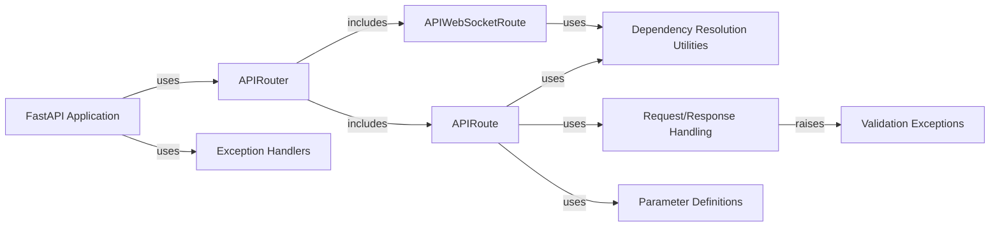

## Component Details

The Request Routing and Handling subsystem in FastAPI is responsible for directing incoming HTTP requests to the appropriate handler functions. It uses the APIRouter and APIRoute classes to define API endpoints and their associated methods. When a request comes in, FastAPI matches the request's path and method to a defined route, resolves any dependencies required by the handler function, and then executes the handler. The response from the handler is then serialized and returned to the client. This system also includes exception handling for request validation and other errors.

### FastAPI Application
The FastAPI application is the central point for defining and running the API. It initializes the application, sets up routes using APIRouter, and handles events. It also generates the OpenAPI schema for documentation.
- **Related Classes/Methods**:

['[`fastapi.fastapi.applications.FastAPI:__init__` (64:964)](https://github.com/fastapi/fastapi/blob/master/fastapi/applications.py#L64-L964)', '[`fastapi.fastapi.applications.FastAPI:setup` (998:1049)](https://github.com/fastapi/fastapi/blob/master/fastapi/applications.py#L998-L1049)', '[`fastapi.fastapi.applications.FastAPI:openapi` (966:996)](https://github.com/fastapi/fastapi/blob/master/fastapi/applications.py#L966-L996)', '[`fastapi.fastapi.applications.FastAPI:add_api_route` (1056:1113)](https://github.com/fastapi/fastapi/blob/master/fastapi/applications.py#L1056-L1113)', '[`fastapi.fastapi.applications.FastAPI:api_route` (1115:1173)](https://github.com/fastapi/fastapi/blob/master/fastapi/applications.py#L1115-L1173)', '[`fastapi.fastapi.applications.FastAPI:add_api_websocket_route` (1175:1188)](https://github.com/fastapi/fastapi/blob/master/fastapi/applications.py#L1175-L1188)', '[`fastapi.fastapi.applications.FastAPI:websocket` (1190:1253)](https://github.com/fastapi/fastapi/blob/master/fastapi/applications.py#L1190-L1253)', '[`fastapi.fastapi.applications.FastAPI:include_router` (1255:1458)](https://github.com/fastapi/fastapi/blob/master/fastapi/applications.py#L1255-L1458)', '[`fastapi.fastapi.applications.FastAPI:get` (1460:1831)](https://github.com/fastapi/fastapi/blob/master/fastapi/applications.py#L1460-L1831)', '[`fastapi.fastapi.applications.FastAPI:put` (1833:2209)](https://github.com/fastapi/fastapi/blob/master/fastapi/applications.py#L1833-L2209)', '[`fastapi.fastapi.applications.FastAPI:post` (2211:2587)](https://github.com/fastapi/fastapi/blob/master/fastapi/applications.py#L2211-L2587)', '[`fastapi.fastapi.applications.FastAPI:delete` (2589:2960)](https://github.com/fastapi/fastapi/blob/master/fastapi/applications.py#L2589-L2960)', '[`fastapi.fastapi.applications.FastAPI:options` (2962:3333)](https://github.com/fastapi/fastapi/blob/master/fastapi/applications.py#L2962-L3333)', '[`fastapi.fastapi.applications.FastAPI:head` (3335:3706)](https://github.com/fastapi/fastapi/blob/master/fastapi/applications.py#L3335-L3706)', '[`fastapi.fastapi.applications.FastAPI:patch` (3708:4084)](https://github.com/fastapi/fastapi/blob/master/fastapi/applications.py#L3708-L4084)', '[`fastapi.fastapi.applications.FastAPI:trace` (4086:4457)](https://github.com/fastapi/fastapi/blob/master/fastapi/applications.py#L4086-L4457)', '[`fastapi.fastapi.applications.FastAPI:on_event` (4476:4495)](https://github.com/fastapi/fastapi/blob/master/fastapi/applications.py#L4476-L4495)']

### APIRouter
The APIRouter is used to group related API endpoints into a modular structure. It allows defining common dependencies, prefixes, and tags for a set of routes. The APIRouter can be included in the main FastAPI application or nested within other routers.
- **Related Classes/Methods**:

['[`fastapi.fastapi.routing.APIRouter:__init__` (622:860)](https://github.com/fastapi/fastapi/blob/master/fastapi/routing.py#L622-L860)', '[`fastapi.fastapi.routing.APIRouter:add_api_route` (881:961)](https://github.com/fastapi/fastapi/blob/master/fastapi/routing.py#L881-L961)', '[`fastapi.fastapi.routing.APIRouter:api_route` (963:1023)](https://github.com/fastapi/fastapi/blob/master/fastapi/routing.py#L963-L1023)', '[`fastapi.fastapi.routing.APIRouter:add_api_websocket_route` (1025:1044)](https://github.com/fastapi/fastapi/blob/master/fastapi/routing.py#L1025-L1044)', '[`fastapi.fastapi.routing.APIRouter:websocket` (1046:1111)](https://github.com/fastapi/fastapi/blob/master/fastapi/routing.py#L1046-L1111)', '[`fastapi.fastapi.routing.APIRouter:include_router` (1122:1364)](https://github.com/fastapi/fastapi/blob/master/fastapi/routing.py#L1122-L1364)', '[`fastapi.fastapi.routing.APIRouter:get` (1366:1741)](https://github.com/fastapi/fastapi/blob/master/fastapi/routing.py#L1366-L1741)', '[`fastapi.fastapi.routing.APIRouter:put` (1743:2123)](https://github.com/fastapi/fastapi/blob/master/fastapi/routing.py#L1743-L2123)', '[`fastapi.fastapi.routing.APIRouter:post` (2125:2505)](https://github.com/fastapi/fastapi/blob/master/fastapi/routing.py#L2125-L2505)', '[`fastapi.fastapi.routing.APIRouter:delete` (2507:2882)](https://github.com/fastapi/fastapi/blob/master/fastapi/routing.py#L2507-L2882)', '[`fastapi.fastapi.routing.APIRouter:options` (2884:3259)](https://github.com/fastapi/fastapi/blob/master/fastapi/routing.py#L2884-L3259)', '[`fastapi.fastapi.routing.APIRouter:head` (3261:3641)](https://github.com/fastapi/fastapi/blob/master/fastapi/routing.py#L3261-L3641)', '[`fastapi.fastapi.routing.APIRouter:patch` (3643:4023)](https://github.com/fastapi/fastapi/blob/master/fastapi/routing.py#L3643-L4023)', '[`fastapi.fastapi.routing.APIRouter:trace` (4025:4405)](https://github.com/fastapi/fastapi/blob/master/fastapi/routing.py#L4025-L4405)']

### APIRoute
The APIRoute represents a single API endpoint, defining the path, HTTP method, endpoint function, and dependencies. It is responsible for handling request validation, dependency injection, and response serialization.
- **Related Classes/Methods**:

['[`fastapi.fastapi.routing.APIRoute:__init__` (429:569)](https://github.com/fastapi/fastapi/blob/master/fastapi/routing.py#L429-L569)', '[`fastapi.fastapi.routing.APIRoute:get_route_handler` (571:586)](https://github.com/fastapi/fastapi/blob/master/fastapi/routing.py#L571-L586)']

### APIWebSocketRoute
The APIWebSocketRoute represents a WebSocket endpoint, handling WebSocket connections and communication. It defines the route for WebSocket connections and manages the communication between the client and server.
- **Related Classes/Methods**:

['[`fastapi.fastapi.routing.APIWebSocketRoute:__init__` (389:419)](https://github.com/fastapi/fastapi/blob/master/fastapi/routing.py#L389-L419)']

### Dependency Resolution Utilities
This component provides utility functions for resolving dependencies required by endpoint functions. It analyzes parameters, gets dependencies, solves dependencies, and converts request parameters to arguments that can be passed to the handler function.
- **Related Classes/Methods**:

['[`fastapi.fastapi.dependencies.utils:get_param_sub_dependant` (118:132)](https://github.com/fastapi/fastapi/blob/master/fastapi/dependencies/utils.py#L118-L132)', '[`fastapi.fastapi.dependencies.utils:get_parameterless_sub_dependant` (135:139)](https://github.com/fastapi/fastapi/blob/master/fastapi/dependencies/utils.py#L135-L139)', '[`fastapi.fastapi.dependencies.utils:get_sub_dependant` (142:171)](https://github.com/fastapi/fastapi/blob/master/fastapi/dependencies/utils.py#L142-L171)', '[`fastapi.fastapi.dependencies.utils:get_flat_dependant` (177:209)](https://github.com/fastapi/fastapi/blob/master/fastapi/dependencies/utils.py#L177-L209)', '[`fastapi.fastapi.dependencies.utils:_get_flat_fields_from_params` (212:219)](https://github.com/fastapi/fastapi/blob/master/fastapi/dependencies/utils.py#L212-L219)', '[`fastapi.fastapi.dependencies.utils:get_flat_params` (222:228)](https://github.com/fastapi/fastapi/blob/master/fastapi/dependencies/utils.py#L222-L228)', '[`fastapi.fastapi.dependencies.utils:get_typed_signature` (231:244)](https://github.com/fastapi/fastapi/blob/master/fastapi/dependencies/utils.py#L231-L244)', '[`fastapi.fastapi.dependencies.utils:get_typed_return_annotation` (254:262)](https://github.com/fastapi/fastapi/blob/master/fastapi/dependencies/utils.py#L254-L262)', '[`fastapi.fastapi.dependencies.utils:get_dependant` (265:314)](https://github.com/fastapi/fastapi/blob/master/fastapi/dependencies/utils.py#L265-L314)', '[`fastapi.fastapi.dependencies.utils:analyze_param` (348:511)](https://github.com/fastapi/fastapi/blob/master/fastapi/dependencies/utils.py#L348-L511)', '[`fastapi.fastapi.dependencies.utils:solve_generator` (553:560)](https://github.com/fastapi/fastapi/blob/master/fastapi/dependencies/utils.py#L553-L560)', '[`fastapi.fastapi.dependencies.utils:solve_dependencies` (572:695)](https://github.com/fastapi/fastapi/blob/master/fastapi/dependencies/utils.py#L572-L695)', '[`fastapi.fastapi.dependencies.utils:_validate_value_with_model_field` (698:713)](https://github.com/fastapi/fastapi/blob/master/fastapi/dependencies/utils.py#L698-L713)', '[`fastapi.fastapi.dependencies.utils:_get_multidict_value` (716:737)](https://github.com/fastapi/fastapi/blob/master/fastapi/dependencies/utils.py#L716-L737)', '[`fastapi.fastapi.dependencies.utils:request_params_to_args` (740:816)](https://github.com/fastapi/fastapi/blob/master/fastapi/dependencies/utils.py#L740-L816)', '[`fastapi.fastapi.dependencies.utils:_extract_form_body` (841:881)](https://github.com/fastapi/fastapi/blob/master/fastapi/dependencies/utils.py#L841-L881)', '[`fastapi.fastapi.dependencies.utils:request_body_to_args` (884:927)](https://github.com/fastapi/fastapi/blob/master/fastapi/dependencies/utils.py#L884-L927)', '[`fastapi.fastapi.dependencies.utils:get_body_field` (930:980)](https://github.com/fastapi/fastapi/blob/master/fastapi/dependencies/utils.py#L930-L980)']

### Request/Response Handling
This component handles the processing of incoming requests and the preparation of responses. It includes functions for getting the request handler, serializing the response data, and preparing the response content to be sent back to the client.
- **Related Classes/Methods**:

['[`fastapi.fastapi.routing:get_request_handler` (217:357)](https://github.com/fastapi/fastapi/blob/master/fastapi/routing.py#L217-L357)', '[`fastapi.fastapi.routing:serialize_response` (143:201)](https://github.com/fastapi/fastapi/blob/master/fastapi/routing.py#L143-L201)', '[`fastapi.fastapi.routing:_prepare_response_content` (79:123)](https://github.com/fastapi/fastapi/blob/master/fastapi/routing.py#L79-L123)', '[`fastapi.fastapi.routing:get_websocket_app` (360:385)](https://github.com/fastapi/fastapi/blob/master/fastapi/routing.py#L360-L385)']

### Exception Handlers
This component defines exception handlers for different types of exceptions that can occur during request processing, such as HTTP exceptions, request validation exceptions, and WebSocket request validation exceptions. These handlers ensure that appropriate error responses are returned to the client.
- **Related Classes/Methods**:

['[`fastapi.fastapi.exception_handlers:http_exception_handler` (11:17)](https://github.com/fastapi/fastapi/blob/master/fastapi/exception_handlers.py#L11-L17)', '[`fastapi.fastapi.exception_handlers:request_validation_exception_handler` (20:26)](https://github.com/fastapi/fastapi/blob/master/fastapi/exception_handlers.py#L20-L26)', '[`fastapi.fastapi.exception_handlers:websocket_request_validation_exception_handler` (29:34)](https://github.com/fastapi/fastapi/blob/master/fastapi/exception_handlers.py#L29-L34)']

### Parameter Definitions
This component defines classes for different types of parameters that can be used in endpoint functions, such as Path, Query, Header, Cookie, Form, File, and Security. These classes are used to define the parameters of the endpoint functions and to validate the incoming request data.
- **Related Classes/Methods**:

['[`fastapi.fastapi.params.Path:__init__` (142:222)](https://github.com/fastapi/fastapi/blob/master/fastapi/params.py#L142-L222)', '[`fastapi.fastapi.params.Query:__init__` (228:306)](https://github.com/fastapi/fastapi/blob/master/fastapi/params.py#L228-L306)', '[`fastapi.fastapi.params.Header:__init__` (312:392)](https://github.com/fastapi/fastapi/blob/master/fastapi/params.py#L312-L392)', '[`fastapi.fastapi.params.Cookie:__init__` (398:476)](https://github.com/fastapi/fastapi/blob/master/fastapi/params.py#L398-L476)', '[`fastapi.fastapi.params.Form:__init__` (597:677)](https://github.com/fastapi/fastapi/blob/master/fastapi/params.py#L597-L677)', '[`fastapi.fastapi.params.File:__init__` (681:761)](https://github.com/fastapi/fastapi/blob/master/fastapi/params.py#L681-L761)', '[`fastapi.fastapi.params.Security:__init__` (778:786)](https://github.com/fastapi/fastapi/blob/master/fastapi/params.py#L778-L786)']

### Validation Exceptions
This component defines exception classes for request and response validation errors. These exceptions are raised when the request or response data does not conform to the expected schema, indicating that the data is invalid.
- **Related Classes/Methods**:

['[`fastapi.fastapi.exceptions.RequestValidationError:__init__` (158:160)](https://github.com/fastapi/fastapi/blob/master/fastapi/exceptions.py#L158-L160)', '[`fastapi.fastapi.exceptions.ResponseValidationError:__init__` (168:170)](https://github.com/fastapi/fastapi/blob/master/fastapi/exceptions.py#L168-L170)']