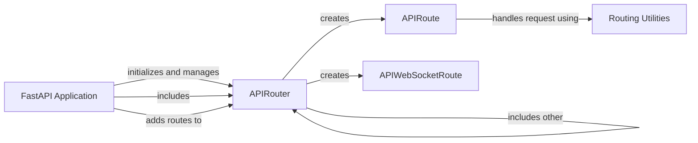

## Component Details

The request routing mechanism in FastAPI is responsible for mapping incoming HTTP requests to the appropriate handler functions. It uses the APIRouter to define and group routes, and it manages the execution of route handlers. The process involves defining routes using decorators or methods on the FastAPI application or APIRouter instances, which associate a path and HTTP method with a specific function. When a request is received, FastAPI matches the request path and method to the defined routes and then executes the corresponding handler function. This includes request validation, dependency injection, and response serialization.

### FastAPI Application
The FastAPI class is the core of the framework. It's responsible for creating the application instance, setting up the routes, and handling requests. It initializes the API with configurations, includes routers, and sets up the OpenAPI schema.
- **Related Classes/Methods**:

- <a href="https://github.com/fastapi/fastapi/blob/master/fastapi/applications.py#L64-L964" target="_blank" rel="noopener noreferrer">`fastapi.fastapi.applications.FastAPI:__init__` (64:964)</a>
- <a href="https://github.com/fastapi/fastapi/blob/master/fastapi/applications.py#L966-L996" target="_blank" rel="noopener noreferrer">`fastapi.fastapi.applications.FastAPI:openapi` (966:996)</a>
- <a href="https://github.com/fastapi/fastapi/blob/master/fastapi/applications.py#L998-L1049" target="_blank" rel="noopener noreferrer">`fastapi.fastapi.applications.FastAPI:setup` (998:1049)</a>
- <a href="https://github.com/fastapi/fastapi/blob/master/fastapi/applications.py#L1056-L1113" target="_blank" rel="noopener noreferrer">`fastapi.fastapi.applications.FastAPI:add_api_route` (1056:1113)</a>
- <a href="https://github.com/fastapi/fastapi/blob/master/fastapi/applications.py#L1115-L1173" target="_blank" rel="noopener noreferrer">`fastapi.fastapi.applications.FastAPI:api_route` (1115:1173)</a>
- <a href="https://github.com/fastapi/fastapi/blob/master/fastapi/applications.py#L1175-L1188" target="_blank" rel="noopener noreferrer">`fastapi.fastapi.applications.FastAPI:add_api_websocket_route` (1175:1188)</a>
- <a href="https://github.com/fastapi/fastapi/blob/master/fastapi/applications.py#L1190-L1253" target="_blank" rel="noopener noreferrer">`fastapi.fastapi.applications.FastAPI:websocket` (1190:1253)</a>
- <a href="https://github.com/fastapi/fastapi/blob/master/fastapi/applications.py#L1255-L1458" target="_blank" rel="noopener noreferrer">`fastapi.fastapi.applications.FastAPI:include_router` (1255:1458)</a>
- <a href="https://github.com/fastapi/fastapi/blob/master/fastapi/applications.py#L1460-L1831" target="_blank" rel="noopener noreferrer">`fastapi.fastapi.applications.FastAPI:get` (1460:1831)</a>
- <a href="https://github.com/fastapi/fastapi/blob/master/fastapi/applications.py#L1833-L2209" target="_blank" rel="noopener noreferrer">`fastapi.fastapi.applications.FastAPI:put` (1833:2209)</a>
- <a href="https://github.com/fastapi/fastapi/blob/master/fastapi/applications.py#L2211-L2587" target="_blank" rel="noopener noreferrer">`fastapi.fastapi.applications.FastAPI:post` (2211:2587)</a>
- <a href="https://github.com/fastapi/fastapi/blob/master/fastapi/applications.py#L2589-L2960" target="_blank" rel="noopener noreferrer">`fastapi.fastapi.applications.FastAPI:delete` (2589:2960)</a>
- <a href="https://github.com/fastapi/fastapi/blob/master/fastapi/applications.py#L2962-L3333" target="_blank" rel="noopener noreferrer">`fastapi.fastapi.applications.FastAPI:options` (2962:3333)</a>
- <a href="https://github.com/fastapi/fastapi/blob/master/fastapi/applications.py#L3335-L3706" target="_blank" rel="noopener noreferrer">`fastapi.fastapi.applications.FastAPI:head` (3335:3706)</a>
- <a href="https://github.com/fastapi/fastapi/blob/master/fastapi/applications.py#L3708-L4084" target="_blank" rel="noopener noreferrer">`fastapi.fastapi.applications.FastAPI:patch` (3708:4084)</a>
- <a href="https://github.com/fastapi/fastapi/blob/master/fastapi/applications.py#L4086-L4457" target="_blank" rel="noopener noreferrer">`fastapi.fastapi.applications.FastAPI:trace` (4086:4457)</a>
- <a href="https://github.com/fastapi/fastapi/blob/master/fastapi/applications.py#L4476-L4495" target="_blank" rel="noopener noreferrer">`fastapi.fastapi.applications.FastAPI:on_event` (4476:4495)</a>

### APIRouter
The APIRouter class is used to create modular sets of routes. It allows grouping related endpoints and defining common configurations for them. It handles adding routes, including other routers, and managing event handlers.
- **Related Classes/Methods**:

- <a href="https://github.com/fastapi/fastapi/blob/master/fastapi/routing.py#L622-L860" target="_blank" rel="noopener noreferrer">`fastapi.fastapi.routing.APIRouter:__init__` (622:860)</a>
- <a href="https://github.com/fastapi/fastapi/blob/master/fastapi/routing.py#L881-L961" target="_blank" rel="noopener noreferrer">`fastapi.fastapi.routing.APIRouter:add_api_route` (881:961)</a>
- <a href="https://github.com/fastapi/fastapi/blob/master/fastapi/routing.py#L963-L1023" target="_blank" rel="noopener noreferrer">`fastapi.fastapi.routing.APIRouter:api_route` (963:1023)</a>
- <a href="https://github.com/fastapi/fastapi/blob/master/fastapi/routing.py#L1025-L1044" target="_blank" rel="noopener noreferrer">`fastapi.fastapi.routing.APIRouter:add_api_websocket_route` (1025:1044)</a>
- <a href="https://github.com/fastapi/fastapi/blob/master/fastapi/routing.py#L1046-L1111" target="_blank" rel="noopener noreferrer">`fastapi.fastapi.routing.APIRouter:websocket` (1046:1111)</a>
- <a href="https://github.com/fastapi/fastapi/blob/master/fastapi/routing.py#L1122-L1364" target="_blank" rel="noopener noreferrer">`fastapi.fastapi.routing.APIRouter:include_router` (1122:1364)</a>
- <a href="https://github.com/fastapi/fastapi/blob/master/fastapi/routing.py#L1366-L1741" target="_blank" rel="noopener noreferrer">`fastapi.fastapi.routing.APIRouter:get` (1366:1741)</a>
- <a href="https://github.com/fastapi/fastapi/blob/master/fastapi/routing.py#L1743-L2123" target="_blank" rel="noopener noreferrer">`fastapi.fastapi.routing.APIRouter:put` (1743:2123)</a>
- <a href="https://github.com/fastapi/fastapi/blob/master/fastapi/routing.py#L2125-L2505" target="_blank" rel="noopener noreferrer">`fastapi.fastapi.routing.APIRouter:post` (2125:2505)</a>
- <a href="https://github.com/fastapi/fastapi/blob/master/fastapi/routing.py#L2507-L2882" target="_blank" rel="noopener noreferrer">`fastapi.fastapi.routing.APIRouter:delete` (2507:2882)</a>
- <a href="https://github.com/fastapi/fastapi/blob/master/fastapi/routing.py#L2884-L3259" target="_blank" rel="noopener noreferrer">`fastapi.fastapi.routing.APIRouter:options` (2884:3259)</a>
- <a href="https://github.com/fastapi/fastapi/blob/master/fastapi/routing.py#L3261-L3641" target="_blank" rel="noopener noreferrer">`fastapi.fastapi.routing.APIRouter:head` (3261:3641)</a>
- <a href="https://github.com/fastapi/fastapi/blob/master/fastapi/routing.py#L3643-L4023" target="_blank" rel="noopener noreferrer">`fastapi.fastapi.routing.APIRouter:patch` (3643:4023)</a>
- <a href="https://github.com/fastapi/fastapi/blob/master/fastapi/routing.py#L4025-L4405" target="_blank" rel="noopener noreferrer">`fastapi.fastapi.routing.APIRouter:trace` (4025:4405)</a>

### APIRoute
The APIRoute class represents a single API endpoint. It's responsible for defining the route's path, HTTP methods, endpoint function, and dependencies. It also handles request validation and response serialization.
- **Related Classes/Methods**:

- <a href="https://github.com/fastapi/fastapi/blob/master/fastapi/routing.py#L429-L569" target="_blank" rel="noopener noreferrer">`fastapi.fastapi.routing.APIRoute:__init__` (429:569)</a>
- <a href="https://github.com/fastapi/fastapi/blob/master/fastapi/routing.py#L571-L586" target="_blank" rel="noopener noreferrer">`fastapi.fastapi.routing.APIRoute:get_route_handler` (571:586)</a>

### APIWebSocketRoute
The APIWebSocketRoute class represents a WebSocket endpoint. It's responsible for handling WebSocket connections and communication.
- **Related Classes/Methods**:

- <a href="https://github.com/fastapi/fastapi/blob/master/fastapi/routing.py#L389-L419" target="_blank" rel="noopener noreferrer">`fastapi.fastapi.routing.APIWebSocketRoute:__init__` (389:419)</a>

### Routing Utilities
These functions handle the core logic of processing requests and generating responses. `get_request_handler` is responsible for dependency injection, request validation, running the endpoint function, and serializing the response. `get_websocket_app` handles dependency injection for WebSocket endpoints.
- **Related Classes/Methods**:

- <a href="https://github.com/fastapi/fastapi/blob/master/fastapi/routing.py#L217-L357" target="_blank" rel="noopener noreferrer">`fastapi.fastapi.routing:get_request_handler` (217:357)</a>
- <a href="https://github.com/fastapi/fastapi/blob/master/fastapi/routing.py#L360-L385" target="_blank" rel="noopener noreferrer">`fastapi.fastapi.routing:get_websocket_app` (360:385)</a>
- <a href="https://github.com/fastapi/fastapi/blob/master/fastapi/routing.py#L143-L201" target="_blank" rel="noopener noreferrer">`fastapi.fastapi.routing:serialize_response` (143:201)</a>
- <a href="https://github.com/fastapi/fastapi/blob/master/fastapi/routing.py#L79-L123" target="_blank" rel="noopener noreferrer">`fastapi.fastapi.routing:_prepare_response_content` (79:123)</a>