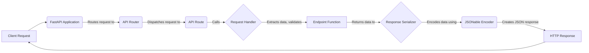

## Request and Response Handling in FastAPI

This section describes the flow of request processing and response generation within a FastAPI application. The diagram illustrates how incoming requests are handled, processed by the application logic, and transformed into appropriate responses.

### Component Descriptions:

- **Client Request**: Represents the initial HTTP request sent by a client to the API.
   - *Purpose*: Initiates the API interaction.
   - *Interaction*: Sends the request to the FastAPI Application.
   - *Relevant source files*: N/A

- **FastAPI Application**: The core application instance that receives the request and orchestrates the handling process.
    - *Purpose*: Manages the API's overall operation, including routing, middleware, and exception handling.
    - *Interaction*: Routes the request to the appropriate API Router.
    - *Relevant source files*: `fastapi.applications.FastAPI`

- **API Router**: A modular routing component that groups related path operations.
    - *Purpose*: Organizes and structures the API endpoints.
    - *Interaction*: Dispatches the request to the corresponding API Route.
    - *Relevant source files*: `fastapi.routing.APIRouter`

- **API Route**: Represents a single endpoint within the API.
    - *Purpose*: Encapsulates the path, HTTP methods, dependencies, and the route handler function.
    - *Interaction*: Calls the Request Handler to process the request.
    - *Relevant source files*: `fastapi.routing.APIRoute`

- **Request Handler**: Generates a callable that processes incoming requests.
    - *Purpose*: Extracts data, validates input, resolves dependencies, and executes the endpoint function.
    - *Interaction*: Calls the Endpoint Function with the processed data.
    - *Relevant source files*: `fastapi.routing.get_request_handler`

- **Endpoint Function**: The user-defined function that implements the business logic for the endpoint.
    - *Purpose*: Processes the request and returns data.
    - *Interaction*: Returns data to the Response Serializer.
    - *Relevant source files*: User defined

- **Response Serializer**: Serializes the response data and validates the response model.
    - *Purpose*: Ensures the response conforms to the API's defined schema.
    - *Interaction*: Encodes the data using the JSONable Encoder.
    - *Relevant source files*: `fastapi.routing.serialize_response`

- **JSONable Encoder**: Encodes Python objects into JSON-compatible data types.
    - *Purpose*: Converts complex objects into a format suitable for API responses.
    - *Interaction*: Creates a JSON response.
    - *Relevant source files*: `fastapi.encoders.jsonable_encoder`

- **HTTP Response**: The final HTTP response sent back to the client.
    - *Purpose*: Delivers the API's response to the client.
    - *Interaction*: Sends the response to the Client.
    - *Relevant source files*: N/A
