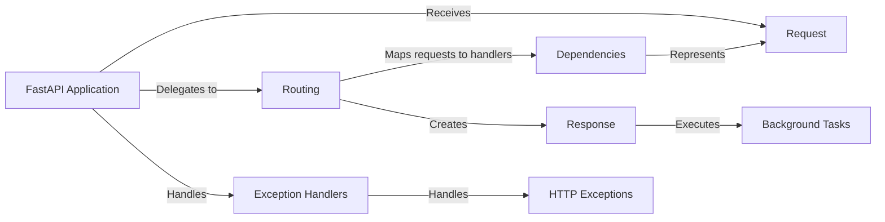

## Component Details

The Request and Response Handling subsystem in FastAPI is responsible for managing the lifecycle of HTTP requests from the moment they are received until a response is sent back to the client. It involves parsing incoming request data, validating it, and then constructing appropriate responses, including setting headers, cookies, and status codes. This system ensures that the application can effectively communicate with clients by correctly interpreting their requests and providing well-formatted responses.

### Request
Represents an incoming HTTP request. It provides access to request parameters, headers, body, and other relevant information. It handles parsing and validation of the request data.
- **Related Classes/Methods**: `fastapi/requests.py`

### Response
Represents an HTTP response. It allows setting status codes, headers, cookies, and the response body. It also supports different response types like JSON, HTML, File, and Streaming responses.
- **Related Classes/Methods**: `fastapi/responses.py`

### FastAPI Application
The core application instance that manages the overall lifecycle, including routing, middleware, and exception handling. It receives the request and delegates it to the appropriate route.
- **Related Classes/Methods**: `fastapi/fastapi.applications.FastAPI`

### Routing
The routing component maps incoming HTTP requests to the appropriate handler functions based on the HTTP method and path. It receives the request from the FastAPI application and prepares the response using the Response component.
- **Related Classes/Methods**: `fastapi/routing.APIRoute`, `fastapi/routing.APIRouter`

### Dependencies
Manages the resolution and injection of dependencies into route handler functions. It extracts parameters from the request and passes them as arguments to the handler.
- **Related Classes/Methods**: `fastapi/dependencies.utils`

### Exception Handlers
Provides centralized handling of exceptions that occur during request processing, including HTTP exceptions and validation errors. It generates appropriate error responses.
- **Related Classes/Methods**: `fastapi/exception_handlers`

### HTTP Exceptions
A set of predefined exceptions for common HTTP error status codes, such as 404 Not Found or 403 Forbidden. These exceptions are handled by the Exception Handlers.
- **Related Classes/Methods**: `fastapi/exceptions.HTTPException`

### Background Tasks
Allows the execution of tasks after a response has been sent to the client, without blocking the request-response cycle. These tasks are executed after the Response has been sent.
- **Related Classes/Methods**: `fastapi/background.BackgroundTasks`
