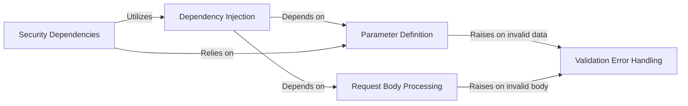

## Details

Synthesized component structure for the `Request Handling & Validation` subsystem of FastAPI.

### Parameter Definition
Provides the declarative interface for extracting and validating data from request paths, query strings, headers, and cookies. It uses a factory pattern (`Param`) to create specialized parameter definitions.

**Related Classes/Methods**:

- <a href="https://github.com/fastapi/fastapi/blob/master/fastapi/params.py#L24-L135" target="_blank" rel="noopener noreferrer">`fastapi.params.Param` (24:135)</a>
- <a href="https://github.com/fastapi/fastapi/blob/master/fastapi/params.py#L138-L221" target="_blank" rel="noopener noreferrer">`fastapi.params.Path` (138:221)</a>
- <a href="https://github.com/fastapi/fastapi/blob/master/fastapi/params.py#L224-L305" target="_blank" rel="noopener noreferrer">`fastapi.params.Query` (224:305)</a>
- <a href="https://github.com/fastapi/fastapi/blob/master/fastapi/params.py#L308-L391" target="_blank" rel="noopener noreferrer">`fastapi.params.Header` (308:391)</a>
- <a href="https://github.com/fastapi/fastapi/blob/master/fastapi/params.py#L394-L475" target="_blank" rel="noopener noreferrer">`fastapi.params.Cookie` (394:475)</a>

### Request Body Processing
Defines and validates the structure of the request body. This component is responsible for parsing incoming data (e.g., JSON, form data, file uploads) and mapping it to Pydantic models.

**Related Classes/Methods**:

- <a href="https://github.com/fastapi/fastapi/blob/master/fastapi/params.py#L478-L592" target="_blank" rel="noopener noreferrer">`fastapi.params.Body` (478:592)</a>
- <a href="https://github.com/fastapi/fastapi/blob/master/fastapi/params.py#L595-L676" target="_blank" rel="noopener noreferrer">`fastapi.params.Form` (595:676)</a>
- <a href="https://github.com/fastapi/fastapi/blob/master/fastapi/params.py#L679-L760" target="_blank" rel="noopener noreferrer">`fastapi.params.File` (679:760)</a>

### Dependency Injection [[Expand]](./Dependency_Injection.md)
Implements the core dependency injection system. It allows path operation functions to declare dependencies on other functions or callables, promoting code reuse and separation of concerns.

**Related Classes/Methods**:

- <a href="https://github.com/fastapi/fastapi/blob/master/fastapi/params.py#L763-L773" target="_blank" rel="noopener noreferrer">`fastapi.params.Depends` (763:773)</a>

### Security Dependencies
A specialized layer on top of the dependency injection system focused on authentication and authorization. It integrates security schemes (e.g., OAuth2, API Keys) into the request lifecycle.

**Related Classes/Methods**:

- `fastapi.security.Security`

### Validation Error Handling
Centralizes the response mechanism for all data validation failures. It captures Pydantic validation errors and translates them into a standardized HTTP 422 response for the client.

**Related Classes/Methods**:

- <a href="https://github.com/fastapi/fastapi/blob/master/fastapi/exceptions.py#L156-L159" target="_blank" rel="noopener noreferrer">`fastapi.exceptions.RequestValidationError` (156:159)</a>
- <a href="https://github.com/fastapi/fastapi/blob/master/fastapi/exceptions.py#L148-L153" target="_blank" rel="noopener noreferrer">`fastapi.exceptions.ValidationException` (148:153)</a>

### [FAQ](https://github.com/CodeBoarding/GeneratedOnBoardings/tree/main?tab=readme-ov-file#faq)