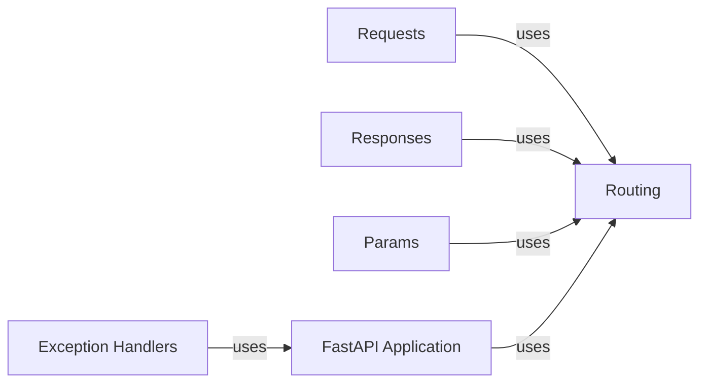

## Details

Handles the processing of incoming requests and the generation of outgoing responses. This includes parsing request data, validating parameters, serializing response data, and managing HTTP status codes.

### Requests
Provides access to incoming request data, including headers, query parameters, body, and cookies. It encapsulates the incoming HTTP request.

**Related Classes/Methods**: _None_

### Responses
Defines the structure and content of API responses, including status codes, headers, and response bodies.

**Related Classes/Methods**: _None_

### Params
Defines and validates request parameters, including query parameters, path parameters, headers, cookies, and request body.

**Related Classes/Methods**: _None_

### Routing [[Expand]](./Routing.md)
Responsible for mapping URL paths and HTTP methods to specific endpoint functions (callables).

**Related Classes/Methods**: _None_

### FastAPI Application
The core application instance that handles request routing, middleware integration, and exception management. It's the central point for configuring and running the API.

**Related Classes/Methods**: _None_

### Exception Handlers
Handles exceptions raised during request processing, converting them into appropriate HTTP responses.

**Related Classes/Methods**: _None_

### [FAQ](https://github.com/CodeBoarding/GeneratedOnBoardings/tree/main?tab=readme-ov-file#faq)