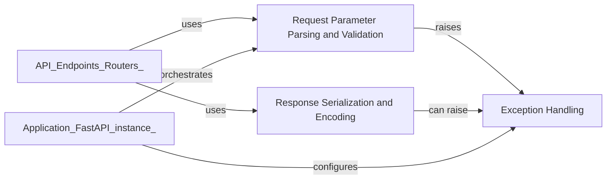

## Details

This subsystem is crucial for managing the entire data flow between the client and the server. It ensures that incoming requests are correctly interpreted and validated, and outgoing responses are properly formatted and delivered. It also provides robust mechanisms for handling errors that occur during this process.

### Request Parameter Parsing and Validation
This component is responsible for defining, extracting, parsing, and validating various types of incoming request parameters (e.g., path, query, header, cookie, body, form, file). It leverages Pydantic for data validation and type coercion, ensuring that the input data conforms to the expected structure and types defined by the API.

**Related Classes/Methods**:

- <a href="https://github.com/fastapi/fastapi/fastapi/params.py#L24-L135" target="_blank" rel="noopener noreferrer">`fastapi.params.Param` (24:135)</a>
- <a href="https://github.com/fastapi/fastapi/fastapi/params.py#L224-L305" target="_blank" rel="noopener noreferrer">`fastapi.params.Query` (224:305)</a>
- <a href="https://github.com/fastapi/fastapi/fastapi/params.py#L138-L221" target="_blank" rel="noopener noreferrer">`fastapi.params.Path` (138:221)</a>
- <a href="https://github.com/fastapi/fastapi/fastapi/params.py#L308-L391" target="_blank" rel="noopener noreferrer">`fastapi.params.Header` (308:391)</a>
- <a href="https://github.com/fastapi/fastapi/fastapi/params.py#L394-L475" target="_blank" rel="noopener noreferrer">`fastapi.params.Cookie` (394:475)</a>
- <a href="https://github.com/fastapi/fastapi/fastapi/params.py#L478-L592" target="_blank" rel="noopener noreferrer">`fastapi.params.Body` (478:592)</a>
- <a href="https://github.com/fastapi/fastapi/fastapi/params.py#L595-L676" target="_blank" rel="noopener noreferrer">`fastapi.params.Form` (595:676)</a>
- <a href="https://github.com/fastapi/fastapi/fastapi/params.py#L679-L760" target="_blank" rel="noopener noreferrer">`fastapi.params.File` (679:760)</a>
- <a href="https://github.com/fastapi/fastapi/fastapi/exceptions.py#L156-L159" target="_blank" rel="noopener noreferrer">`fastapi.exceptions.RequestValidationError` (156:159)</a>

### Response Serialization and Encoding
This component handles the conversion of Python objects (especially Pydantic models and other data structures) into the appropriate outgoing response format, primarily JSON. It ensures that the data sent back to the client is correctly formatted and encoded according to the API's specifications and OpenAPI schema, making it consumable by various client applications.

**Related Classes/Methods**:

- <a href="https://github.com/fastapi/fastapi/fastapi/encoders.py#L101-L342" target="_blank" rel="noopener noreferrer">`fastapi.encoders.jsonable_encoder` (101:342)</a>
- <a href="https://github.com/fastapi/fastapi/fastapi/responses.py#L0-L0" target="_blank" rel="noopener noreferrer">`fastapi.responses.Response` (0:0)</a>

### Exception Handling
This component provides a robust and centralized mechanism for catching and processing various exceptions that may occur during the request processing lifecycle. It defines custom exception types (like HTTPException for standard HTTP errors) and offers default and customizable handlers to transform errors into standardized HTTP responses (e.g., 400 Bad Request, 404 Not Found, 500 Internal Server Error), significantly improving API robustness and providing clear feedback to clients.

**Related Classes/Methods**:

- <a href="https://github.com/fastapi/fastapi/fastapi/exceptions.py#L8-L64" target="_blank" rel="noopener noreferrer">`fastapi.exceptions.HTTPException` (8:64)</a>
- <a href="https://github.com/fastapi/fastapi/fastapi/exceptions.py#L156-L159" target="_blank" rel="noopener noreferrer">`fastapi.exceptions.RequestValidationError` (156:159)</a>
- <a href="https://github.com/fastapi/fastapi/fastapi/exception_handlers.py#L10-L16" target="_blank" rel="noopener noreferrer">`fastapi.exception_handlers.http_exception_handler` (10:16)</a>
- <a href="https://github.com/fastapi/fastapi/fastapi/exception_handlers.py#L19-L25" target="_blank" rel="noopener noreferrer">`fastapi.exception_handlers.request_validation_exception_handler` (19:25)</a>

### [FAQ](https://github.com/CodeBoarding/GeneratedOnBoardings/tree/main?tab=readme-ov-file#faq)