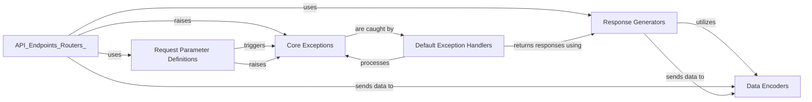

## Details

Component Overview: Request/Response Handling. This component is fundamental to how FastAPI processes incoming HTTP requests and generates outgoing HTTP responses. It ensures data integrity, proper formatting, and robust error handling throughout the API lifecycle.

### Request Parameter Definitions
This component is responsible for defining and extracting various types of input parameters from an incoming HTTP request. It allows developers to declare expected data types, default values, and dependencies for path, query, header, cookie, and request body parameters. It leverages Pydantic for automatic data validation and parsing.

**Related Classes/Methods**:

- `Param` (0:0)
- `Query` (0:0)
- `Header` (0:0)
- `Path` (0:0)
- `Cookie` (0:0)
- `Body` (0:0)
- `Form` (0:0)
- `File` (0:0)
- `Depends` (0:0)

### Response Generators
This component provides a set of classes for constructing and sending various types of HTTP responses back to the client. It handles different content types (e.g., JSON, HTML, plain text), streaming data, and file downloads, ensuring that the output is correctly formatted and includes appropriate HTTP status codes and headers.

**Related Classes/Methods**:

- `Response` (0:0)
- `JSONResponse` (0:0)
- `HTMLResponse` (0:0)
- `PlainTextResponse` (0:0)
- `RedirectResponse` (0:0)
- `StreamingResponse` (0:0)
- `FileResponse` (0:0)

### Data Encoders
This component specializes in converting complex Python data structures, including Pydantic models, into JSON-compatible formats. It handles the serialization of various data types (e.g., `datetime`, `UUID`, `Enum`) into a format suitable for HTTP responses, particularly JSON.

**Related Classes/Methods**:

- `jsonable_encoder` (0:0)

### Core Exceptions
This component defines the standard exception types used within FastAPI to signal errors during request processing. These include general HTTP errors (e.g., 404 Not Found, 401 Unauthorized) and specific validation errors for both incoming requests and outgoing responses.

**Related Classes/Methods**:

- `HTTPException` (0:0)
- `RequestValidationError` (0:0)
- `ResponseValidationError` (0:0)

### Default Exception Handlers
This component provides built-in functions that automatically catch and process specific exceptions raised within FastAPI applications. It converts these exceptions (e.g., `HTTPException`, `RequestValidationError`) into standardized HTTP error responses, often including structured error details for clients.

**Related Classes/Methods**:

- `http_exception_handler` (0:0)
- `request_validation_exception_handler` (0:0)

### [FAQ](https://github.com/CodeBoarding/GeneratedOnBoardings/tree/main?tab=readme-ov-file#faq)