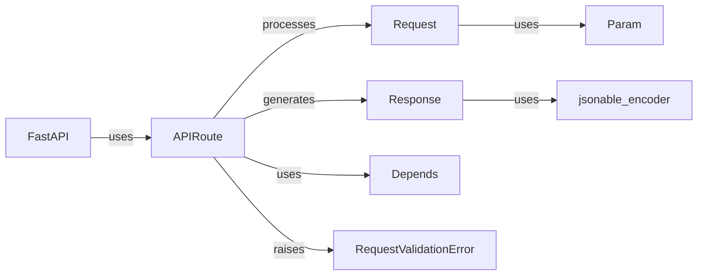

## Details

Refined component breakdown for Request/Response Handling in FastAPI

### Request
Represents an incoming HTTP request. Provides access to headers, query parameters, body, and other request-related information.

**Related Classes/Methods**: _None_

### Response
Represents the outgoing HTTP response. Allows setting the status code, headers, and body of the response.

**Related Classes/Methods**: _None_

### APIRoute
A class that represents a route in the API. It's responsible for associating a path with a specific function (endpoint) that handles requests to that path.

**Related Classes/Methods**: _None_

### FastAPI
The main application class. It inherits from `APIRouter` and is responsible for configuring and running the API.

**Related Classes/Methods**: _None_

### Depends
Used for dependency injection. It allows you to declare dependencies that will be resolved and injected into your endpoint functions.

**Related Classes/Methods**: _None_

### RequestValidationError
An exception raised when request data fails validation (e.g., using Pydantic models).

**Related Classes/Methods**: _None_

### jsonable_encoder
A utility function that converts Python objects into JSON-compatible data types.

**Related Classes/Methods**: _None_

### Param
Classes used to define and validate request parameters (query parameters, path parameters, headers, and cookies).

**Related Classes/Methods**: _None_

### [FAQ](https://github.com/CodeBoarding/GeneratedOnBoardings/tree/main?tab=readme-ov-file#faq)