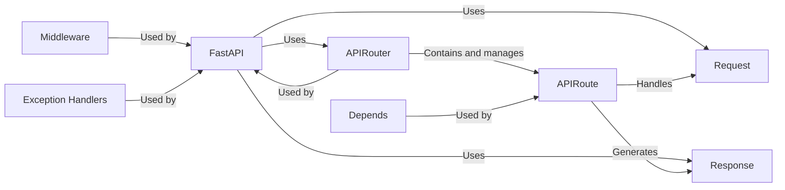

## Details

Manages the lifecycle of incoming HTTP requests and the generation of corresponding HTTP responses within the FastAPI application.

### FastAPI
The core application class, inheriting from `APIRouter`. It's the central point for creating API instances, handling routing, middleware, and exception handling. It orchestrates the request/response lifecycle.

**Related Classes/Methods**: _None_

### APIRouter
A class for creating modular, reusable API route collections. It groups related API endpoints.

**Related Classes/Methods**: _None_

### APIRoute
Represents a single API endpoint, associating a path, HTTP method, and handler function. It's responsible for processing a request and generating a response.

**Related Classes/Methods**: _None_

### Request
Represents an incoming HTTP request. Provides access to request data like headers, body, and query parameters.

**Related Classes/Methods**: _None_

### Response
Represents an HTTP response. Allows setting the response body, status code, and headers.

**Related Classes/Methods**: _None_

### Depends
Used for dependency injection. It allows injecting dependencies into route handlers.

**Related Classes/Methods**: _None_

### Middleware
Provides a way to process requests and responses globally. It can modify requests before they reach the route handler or modify responses before they are sent to the client.

**Related Classes/Methods**: _None_

### Exception Handlers
Handles exceptions raised during request processing. It converts exceptions into appropriate HTTP responses.

**Related Classes/Methods**: _None_

### [FAQ](https://github.com/CodeBoarding/GeneratedOnBoardings/tree/main?tab=readme-ov-file#faq)