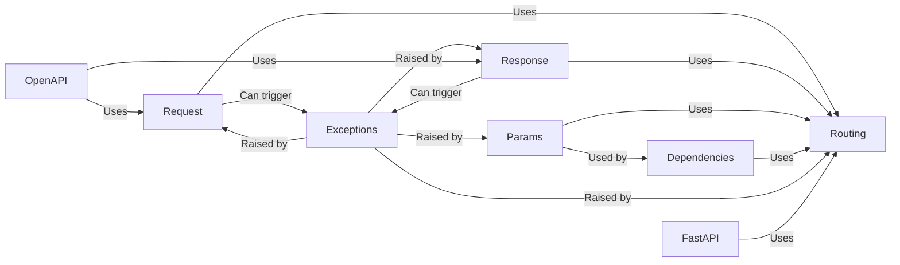

## Details

These components are fundamental because they represent the core elements of how FastAPI handles incoming requests, processes them, and generates responses. `Request`, `Response`, and `Params` are the building blocks for defining API endpoints. `Routing` connects these building blocks together, while `Dependencies` provides a flexible way to manage dependencies and modify request data. `Exceptions` provides a standardized way to handle errors. `FastAPI` ties everything together into a cohesive application. Finally, `OpenAPI` allows for automatic API documentation.

### Request
Represents an incoming HTTP request. Provides access to headers, body, query parameters, and other request-related information.

**Related Classes/Methods**: _None_

### Response
Represents an outgoing HTTP response. Includes data to be sent back to the client, status code, headers, and media type.

**Related Classes/Methods**: _None_

### Params
Defines parameter types for route handlers (Query, Path, Body, Header, Cookie). Used to declare and validate request parameters.

**Related Classes/Methods**: _None_

### Routing
Maps incoming requests to the appropriate handler functions (API endpoints). Handles parameter parsing and validation.

**Related Classes/Methods**: _None_

### Dependencies
Manages dependency injection. Dependencies can modify or validate request data before it reaches the handler function.

**Related Classes/Methods**: _None_

### Exceptions
Defines custom exception classes used within FastAPI, especially for validation errors (`RequestValidationError`, `ResponseValidationError`).

**Related Classes/Methods**: _None_

### FastAPI
The core FastAPI application class. It inherits from `APIRouter`.

**Related Classes/Methods**: _None_

### OpenAPI
Generates OpenAPI schemas for request and response data.

**Related Classes/Methods**: _None_

### [FAQ](https://github.com/CodeBoarding/GeneratedOnBoardings/tree/main?tab=readme-ov-file#faq)