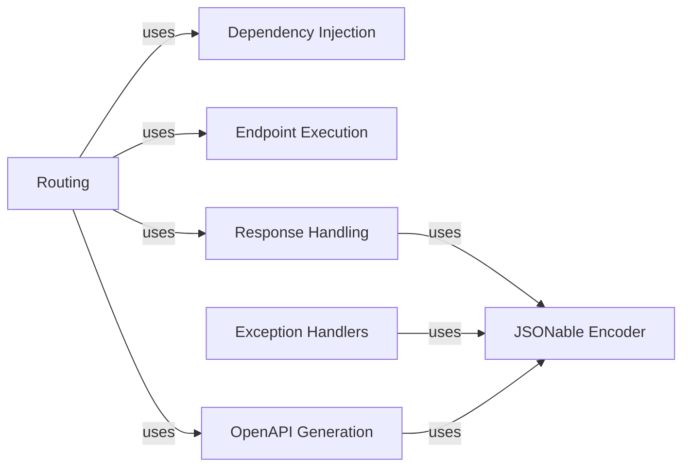

## Component Details

The FastAPI application architecture revolves around handling incoming requests, processing them through a series of components, and generating appropriate responses. The core flow involves routing requests to the correct endpoint, resolving dependencies, executing the endpoint logic, serializing the response, and handling any exceptions that may occur. OpenAPI generation provides a way to document the API and its endpoints.

### Routing
This component is responsible for receiving incoming HTTP requests and directing them to the appropriate endpoint function based on the URL path and HTTP method. It uses a routing table to match the request to the correct handler. It also orchestrates the process of dependency resolution, endpoint execution, and response handling.
- **Related Classes/Methods**:

- <a href="https://github.com/fastapi/fastapi/blob/master/fastapi/routing.py#L217-L357" target="_blank" rel="noopener noreferrer">`fastapi.routing.APIRoute.get_request_handler` (217:357)</a>
- <a href="https://github.com/fastapi/fastapi/blob/master/fastapi/routing.py#L143-L201" target="_blank" rel="noopener noreferrer">`fastapi.routing.serialize_response` (143:201)</a>
- <a href="https://github.com/fastapi/fastapi/blob/master/fastapi/routing.py#L79-L123" target="_blank" rel="noopener noreferrer">`fastapi.routing._prepare_response_content` (79:123)</a>

### Dependency Injection
This component manages the resolution and injection of dependencies into endpoint functions. It uses type hints to determine the dependencies required by each endpoint and resolves them using configured providers. It ensures that the necessary dependencies are available when the endpoint is executed.
- **Related Classes/Methods**:

- <a href="https://github.com/fastapi/fastapi/blob/master/fastapi/dependencies/utils.py#L572-L695" target="_blank" rel="noopener noreferrer">`fastapi.dependencies.utils.solve_dependencies` (572:695)</a>

### Endpoint Execution
This component is responsible for executing the endpoint function after dependencies have been resolved. It calls the endpoint function with the resolved dependencies as arguments and returns the result. It handles any exceptions that may occur during endpoint execution.
- **Related Classes/Methods**:

- <a href="https://github.com/fastapi/fastapi/blob/master/fastapi/routing.py#L217-L357" target="_blank" rel="noopener noreferrer">`fastapi.routing.APIRoute.get_request_handler` (217:357)</a>

### Response Handling
This component handles the serialization of responses, converting Python objects into JSON or other formats suitable for sending back to the client. It uses the jsonable_encoder function to encode data and manages response validation, ensuring that the data returned to the client is correctly formatted and adheres to the expected schema.
- **Related Classes/Methods**:

- <a href="https://github.com/fastapi/fastapi/blob/master/fastapi/encoders.py#L102-L343" target="_blank" rel="noopener noreferrer">`fastapi.encoders.jsonable_encoder` (102:343)</a>

### Exception Handlers
This component provides handlers for exceptions that occur during request processing, such as request validation errors. These handlers format the exception information into appropriate response structures, often using the JSONable encoder to serialize the error details.
- **Related Classes/Methods**:

- <a href="https://github.com/fastapi/fastapi/blob/master/fastapi/exception_handlers.py#L20-L26" target="_blank" rel="noopener noreferrer">`fastapi.exception_handlers.request_validation_exception_handler` (20:26)</a>
- <a href="https://github.com/fastapi/fastapi/blob/master/fastapi/exception_handlers.py#L29-L34" target="_blank" rel="noopener noreferrer">`fastapi.exception_handlers.websocket_request_validation_exception_handler` (29:34)</a>

### OpenAPI Generation
This component is responsible for generating the OpenAPI schema for the FastAPI application. It collects information about the API endpoints, their parameters, request bodies, and responses, and constructs the OpenAPI specification. It uses the dependency injection information to generate schemas for request parameters and bodies.
- **Related Classes/Methods**:

- <a href="https://github.com/fastapi/fastapi/blob/master/fastapi/openapi/utils.py#L477-L569" target="_blank" rel="noopener noreferrer">`fastapi.openapi.utils.get_openapi` (477:569)</a>
- <a href="https://github.com/fastapi/fastapi/blob/master/fastapi/openapi/utils.py#L78-L92" target="_blank" rel="noopener noreferrer">`fastapi.openapi.utils.get_openapi_security_definitions` (78:92)</a>
- <a href="https://github.com/fastapi/fastapi/blob/master/fastapi/openapi/utils.py#L95-L167" target="_blank" rel="noopener noreferrer">`fastapi.openapi.utils._get_openapi_operation_parameters` (95:167)</a>
- <a href="https://github.com/fastapi/fastapi/blob/master/fastapi/openapi/utils.py#L170-L204" target="_blank" rel="noopener noreferrer">`fastapi.openapi.utils.get_openapi_operation_request_body` (170:204)</a>

### JSONable Encoder
This component is responsible for encoding Python objects into JSON-compatible data structures. It handles various data types, including Pydantic models, datetime objects, and other common types, converting them into representations that can be serialized to JSON. It is used throughout the framework for serializing request and response data.
- **Related Classes/Methods**:

- <a href="https://github.com/fastapi/fastapi/blob/master/fastapi/encoders.py#L102-L343" target="_blank" rel="noopener noreferrer">`fastapi.encoders.jsonable_encoder` (102:343)</a>