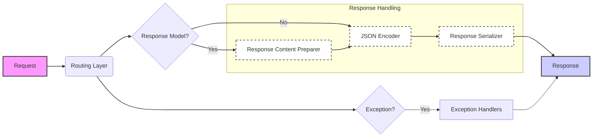

## Response Handling Overview

This section describes the flow of response handling in FastAPI, focusing on how data is serialized and returned to the client. The process involves several components that work together to ensure the response is correctly formatted and adheres to the defined response model.

### Component Descriptions

**1. Routing Layer**
   - *Description*: Directs the incoming request to the appropriate endpoint function. It determines whether a response model is defined for the endpoint.
   - *Interaction*: Receives the request and forwards it to the response handling components based on whether a response model is defined.
   - *Relevant Source Files*: `fastapi.routing`

**2. Response Content Preparer**
   - *Description*: Prepares the response content by converting Pydantic models, lists, and dictionaries into a suitable format for serialization, handling exclude_unset, exclude_defaults, and exclude_none options.
   - *Interaction*: Receives data from the Routing Layer when a response model is defined and prepares it for the JSON Encoder.
   - *Relevant Source Files*: `fastapi.routing._prepare_response_content`

**3. JSON Encoder**
   - *Description*: Encodes Python objects into JSON-compatible data types, handling various data structures like Pydantic models, dataclasses, enums, and standard Python types.
   - *Interaction*: Receives data from the Response Content Preparer or directly from the Routing Layer (if no response model is defined) and encodes it into JSON format.
   - *Relevant Source Files*: `fastapi.encoders.jsonable_encoder`

**4. Response Serializer**
   - *Description*: Serializes the response content before sending it to the client. It validates the data against the response model and encodes it using the JSON encoder.
   - *Interaction*: Receives the JSON-encoded data from the JSON Encoder and serializes it into a response that can be sent to the client.
   - *Relevant Source Files*: `fastapi.routing.serialize_response`

**5. Exception Handlers**
   - *Description*: Handles exceptions that occur during request processing, such as validation errors. These handlers format the errors into appropriate responses.
   - *Interaction*: Receives exceptions from the Routing Layer and formats them into JSON responses.
   - *Relevant Source Files*: `fastapi.exception_handlers.request_validation_exception_handler`, `fastapi.exception_handlers.websocket_request_validation_exception_handler`

**6. Response**
   - *Description*: The final JSON response sent back to the client.
   - *Interaction*: Receives the serialized response from the Response Serializer or the Exception Handlers.
