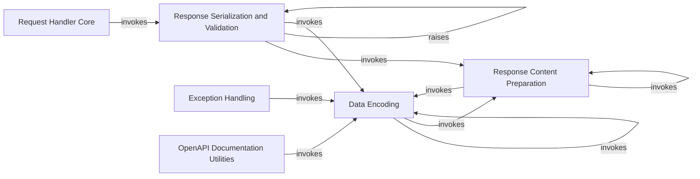

## Component Details

This graph illustrates the core components involved in handling HTTP responses within FastAPI, focusing on the serialization and encoding process. The main flow starts with the `Request Handler Core` which processes the request and passes the raw response to `Response Serialization and Validation`. This component then leverages `Response Content Preparation` to format the data and `Data Encoding` for the final JSON conversion. `Exception Handling` and `OpenAPI Documentation Utilities` also interact with `Data Encoding` for their specific needs.

### Data Encoding
This component is responsible for converting various Python objects, including Pydantic models, Enums, and other data structures, into JSON-compatible formats. It handles recursive encoding for nested structures like lists and dictionaries.

**Related Classes/Methods**:

- <a href="https://github.com/fastapi/fastapi/blob/master/fastapi/encoders.py#L102-L343" target="_blank" rel="noopener noreferrer">`fastapi.encoders.jsonable_encoder` (102:343)</a>
- `fastapi._compat._model_dump` (full file reference)

### Response Content Preparation
This component prepares the raw response content before it is serialized. It recursively processes Pydantic models, lists, and dictionaries to ensure they are in a suitable format for serialization, potentially handling ORM mode for Pydantic models.

**Related Classes/Methods**:

- <a href="https://github.com/fastapi/fastapi/blob/master/fastapi/routing.py#L79-L123" target="_blank" rel="noopener noreferrer">`fastapi.routing._prepare_response_content` (79:123)</a>
- `fastapi._compat._get_model_config` (full file reference)
- `fastapi._compat._model_dump` (full file reference)

### Response Serialization and Validation
This component is responsible for serializing the prepared response content into a final format, typically JSON. It also performs validation against a defined response model and raises `ResponseValidationError` if the content does not conform to the model. It leverages the Data Encoding component for the final JSON conversion.

**Related Classes/Methods**:

- <a href="https://github.com/fastapi/fastapi/blob/master/fastapi/routing.py#L143-L201" target="_blank" rel="noopener noreferrer">`fastapi.routing.serialize_response` (143:201)</a>
- <a href="https://github.com/fastapi/fastapi/blob/master/fastapi/exceptions.py#L167-L176" target="_blank" rel="noopener noreferrer">`fastapi.exceptions.ResponseValidationError` (167:176)</a>
- `fastapi._compat._normalize_errors` (full file reference)

### Request Handler Core
This is a central component that orchestrates the processing of incoming requests. It handles parsing request bodies, resolving dependencies, executing the endpoint function, and then passing the raw response to the Response Serialization and Validation component. It also manages background tasks and handles request validation errors.

**Related Classes/Methods**:

- <a href="https://github.com/fastapi/fastapi/blob/master/fastapi/routing.py#L217-L357" target="_blank" rel="noopener noreferrer">`fastapi.routing.get_request_handler` (217:357)</a>

### Exception Handling
This component provides handlers for specific types of exceptions that can occur during request processing, such as validation errors for both standard HTTP requests and WebSocket requests. It uses the Data Encoding component to serialize error details into a JSON-compatible format.

**Related Classes/Methods**:

- <a href="https://github.com/fastapi/fastapi/blob/master/fastapi/exception_handlers.py#L20-L26" target="_blank" rel="noopener noreferrer">`fastapi.exception_handlers.request_validation_exception_handler` (20:26)</a>
- <a href="https://github.com/fastapi/fastapi/blob/master/fastapi/exception_handlers.py#L29-L34" target="_blank" rel="noopener noreferrer">`fastapi.exception_handlers.websocket_request_validation_exception_handler` (29:34)</a>

### OpenAPI Documentation Utilities
This component provides various utility functions for generating parts of the OpenAPI schema, including security definitions, operation parameters, and request bodies. It relies on the Data Encoding component to handle the serialization of data structures within the OpenAPI schema generation process.

**Related Classes/Methods**:

- <a href="https://github.com/fastapi/fastapi/blob/master/fastapi/openapi/docs.py#L26-L158" target="_blank" rel="noopener noreferrer">`fastapi.openapi.docs.get_swagger_ui_html` (26:158)</a>
- <a href="https://github.com/fastapi/fastapi/blob/master/fastapi/openapi/utils.py#L78-L92" target="_blank" rel="noopener noreferrer">`fastapi.openapi.utils.get_openapi_security_definitions` (78:92)</a>
- <a href="https://github.com/fastapi/fastapi/blob/master/fastapi/openapi/utils.py#L95-L167" target="_blank" rel="noopener noreferrer">`fastapi.openapi.utils._get_openapi_operation_parameters` (95:167)</a>
- <a href="https://github.com/fastapi/fastapi/blob/master/fastapi/openapi/utils.py#L170-L204" target="_blank" rel="noopener noreferrer">`fastapi.openapi.utils.get_openapi_operation_request_body` (170:204)</a>
- <a href="https://github.com/fastapi/fastapi/blob/master/fastapi/openapi/utils.py#L477-L569" target="_blank" rel="noopener noreferrer">`fastapi.openapi.utils.get_openapi` (477:569)</a>

### [FAQ](https://github.com/CodeBoarding/GeneratedOnBoardings/tree/main?tab=readme-ov-file#faq)