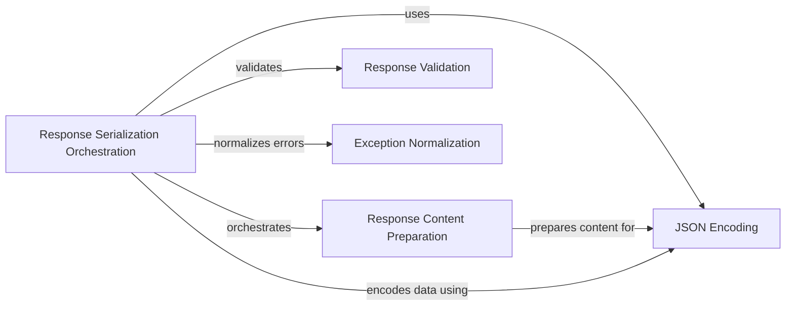

## Component Details

The Response Serialization and Management subsystem in FastAPI is responsible for converting Python objects into a format suitable for transmission over HTTP, typically JSON. It orchestrates the serialization process, handles content preparation, encodes data, validates responses against defined schemas, and normalizes exceptions to ensure consistent error handling. This system ensures that the data sent back to the client is correctly formatted, adheres to the expected schema, and provides informative error messages when issues arise.

### Response Serialization Orchestration
This component orchestrates the entire response serialization process. It determines the appropriate media type, prepares the response content, and applies the necessary encoding. It acts as the central coordinator for converting Python objects into HTTP responses.
- **Related Classes/Methods**:

['[`fastapi.fastapi.routing:serialize_response` (143:201)](https://github.com/fastapi/fastapi/blob/master/fastapi/routing.py#L143-L201)']

### Response Content Preparation
This component prepares the response content by converting it into a format suitable for serialization. It handles different data types and ensures that the data is compatible with the chosen media type. It transforms the raw data into a structure that can be easily serialized.
- **Related Classes/Methods**:

['[`fastapi.fastapi.routing:_prepare_response_content` (79:123)](https://github.com/fastapi/fastapi/blob/master/fastapi/routing.py#L79-L123)']

### JSON Encoding
This component is responsible for encoding Python objects into JSON format. It handles a variety of data types and provides a consistent way to serialize data to JSON. It ensures that Python data structures are correctly converted into JSON strings.
- **Related Classes/Methods**:

['[`fastapi.fastapi.encoders:jsonable_encoder` (102:343)](https://github.com/fastapi/fastapi/blob/master/fastapi/encoders.py#L102-L343)']

### Response Validation
This component validates the serialized response against a defined schema, ensuring that the data being sent back to the client conforms to the expected structure and data types. This helps to prevent errors and ensures data integrity.
- **Related Classes/Methods**:

['[`fastapi.exceptions.ResponseValidationError` (167:176)](https://github.com/fastapi/fastapi/blob/master/fastapi/exceptions.py#L167-L176)']

### Exception Normalization
This component normalizes exceptions to a standard format, making it easier to handle errors consistently throughout the application. It ensures that error messages are clear and informative, aiding in debugging and troubleshooting.
- **Related Classes/Methods**:

['[`fastapi._compat._normalize_errors` (full file reference)](https://github.com/fastapi/fastapi/blob/master/fastapi/_compat.py#LNone-LNone)']