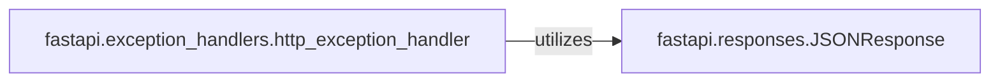

## Details

The Response & Exception Handling subsystem in FastAPI is responsible for the structured serialization of application data into HTTP responses and the consistent management and formatting of various errors, including built-in HTTP exceptions and data validation errors. It ensures that the application communicates effectively with clients by providing well-formed responses and informative error messages, adhering to HTTP standards and the framework's architectural patterns.

### fastapi.responses.JSONResponse
A core response class responsible for serializing Python data (typically dictionaries or Pydantic models) into JSON formatted HTTP responses. It sets the Content-Type header to application/json and manages the HTTP status code and additional headers.

**Related Classes/Methods**:

- <a href="https://github.com/fastapi/fastapi/blob/master/fastapi/responses.py" target="_blank" rel="noopener noreferrer">`fastapi.responses.JSONResponse`</a>

### fastapi.exception_handlers.http_exception_handler
An asynchronous function that serves as the default exception handler for HTTPException instances. It determines the appropriate HTTP response based on the exception's status code, potentially returning an empty response for status codes that do not allow a body, or a JSONResponse with error details.

**Related Classes/Methods**:

- <a href="https://github.com/fastapi/fastapi/blob/master/fastapi/exception_handlers.py#L11-L17" target="_blank" rel="noopener noreferrer">`fastapi.exception_handlers.http_exception_handler`:11-17</a>

### [FAQ](https://github.com/CodeBoarding/GeneratedOnBoardings/tree/main?tab=readme-ov-file#faq)