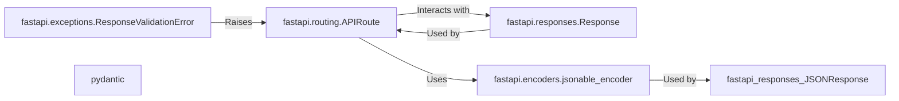

## Details

This component is responsible for taking the data returned by endpoint functions (views) and converting it into a valid HTTP response. This includes setting the appropriate status code, headers (like `Content-Type`), and serializing the data (typically to JSON). It also handles validation of the response against defined schemas.

### fastapi.routing.APIRoute
Represents a single route in the API. It's the core of how FastAPI connects a URL path and HTTP method to a specific function. It's responsible for calling the endpoint function and handling its return value.

**Related Classes/Methods**: _None_

### fastapi.responses.Response
Base class for all response types. Allows setting headers, status codes, and the response body. Subclasses provide specific content types (JSON, HTML, etc.) and handle serialization.

**Related Classes/Methods**: _None_

### fastapi.encoders.jsonable_encoder
A utility function that converts Python data structures into JSON-compatible data types. This is essential for serializing data before it's sent in a JSON response.

**Related Classes/Methods**: _None_

### fastapi.exceptions.ResponseValidationError
An exception raised when the data returned by an endpoint doesn't conform to the declared response model (schema).

**Related Classes/Methods**: _None_

### pydantic
Provides data validation and serialization.

**Related Classes/Methods**: _None_

### [FAQ](https://github.com/CodeBoarding/GeneratedOnBoardings/tree/main?tab=readme-ov-file#faq)