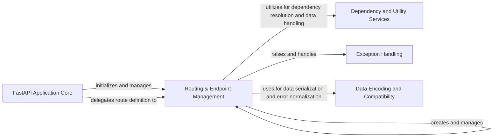

## Component Details

The Routing & Endpoint Management component in FastAPI is responsible for defining, matching, and dispatching API routes for both HTTP and WebSocket requests. It processes incoming requests, extracts necessary parameters, and invokes the appropriate endpoint functions. This component also handles the serialization of responses and integrates with dependency resolution and exception handling mechanisms to ensure a robust request-response lifecycle.

### Routing & Endpoint Management
Manages the definition, matching, and dispatching of API routes (HTTP and WebSocket). It processes incoming requests, extracts parameters, invokes the appropriate endpoint function, and prepares the response. It also handles the mapping of URL paths to endpoint functions, processes incoming requests, and prepares responses, often involving dependency resolution and data serialization.

**Related Classes/Methods**:

- <a href="https://github.com/fastapi/fastapi/blob/master/fastapi/routing.py#L595-L4439" target="_blank" rel="noopener noreferrer">`fastapi.routing.APIRouter` (595:4439)</a>
- <a href="https://github.com/fastapi/fastapi/blob/master/fastapi/routing.py#L622-L860" target="_blank" rel="noopener noreferrer">`fastapi.routing.APIRouter:__init__` (622:860)</a>
- <a href="https://github.com/fastapi/fastapi/blob/master/fastapi/routing.py#L881-L961" target="_blank" rel="noopener noreferrer">`fastapi.routing.APIRouter:add_api_route` (881:961)</a>
- <a href="https://github.com/fastapi/fastapi/blob/master/fastapi/routing.py#L963-L1023" target="_blank" rel="noopener noreferrer">`fastapi.routing.APIRouter:api_route` (963:1023)</a>
- <a href="https://github.com/fastapi/fastapi/blob/master/fastapi/routing.py#L1025-L1044" target="_blank" rel="noopener noreferrer">`fastapi.routing.APIRouter:add_api_websocket_route` (1025:1044)</a>
- <a href="https://github.com/fastapi/fastapi/blob/master/fastapi/routing.py#L1046-L1111" target="_blank" rel="noopener noreferrer">`fastapi.routing.APIRouter:websocket` (1046:1111)</a>
- <a href="https://github.com/fastapi/fastapi/blob/master/fastapi/routing.py#L1122-L1364" target="_blank" rel="noopener noreferrer">`fastapi.routing.APIRouter:include_router` (1122:1364)</a>
- <a href="https://github.com/fastapi/fastapi/blob/master/fastapi/routing.py#L1366-L1741" target="_blank" rel="noopener noreferrer">`fastapi.routing.APIRouter:get` (1366:1741)</a>
- <a href="https://github.com/fastapi/fastapi/blob/master/fastapi/routing.py#L1743-L2123" target="_blank" rel="noopener noreferrer">`fastapi.routing.APIRouter:put` (1743:2123)</a>
- <a href="https://github.com/fastapi/fastapi/blob/master/fastapi/routing.py#L2125-L2505" target="_blank" rel="noopener noreferrer">`fastapi.routing.APIRouter:post` (2125:2505)</a>
- <a href="https://github.com/fastapi/fastapi/blob/master/fastapi/routing.py#L2507-L2882" target="_blank" rel="noopener noreferrer">`fastapi.routing.APIRouter:delete` (2507:2882)</a>
- <a href="https://github.com/fastapi/fastapi/blob/master/fastapi/routing.py#L2884-L3259" target="_blank" rel="noopener noreferrer">`fastapi.routing.APIRouter:options` (2884:3259)</a>
- <a href="https://github.com/fastapi/fastapi/blob/master/fastapi/routing.py#L3261-L3641" target="_blank" rel="noopener noreferrer">`fastapi.routing.APIRouter:head` (3261:3641)</a>
- <a href="https://github.com/fastapi/fastapi/blob/master/fastapi/routing.py#L3643-L4023" target="_blank" rel="noopener noreferrer">`fastapi.routing.APIRouter:patch` (3643:4023)</a>
- <a href="https://github.com/fastapi/fastapi/blob/master/fastapi/routing.py#L4025-L4405" target="_blank" rel="noopener noreferrer">`fastapi.routing.APIRouter:trace` (4025:4405)</a>
- <a href="https://github.com/fastapi/fastapi/blob/master/fastapi/routing.py#L4415-L4439" target="_blank" rel="noopener noreferrer">`fastapi.routing.APIRouter:on_event` (4415:4439)</a>
- <a href="https://github.com/fastapi/fastapi/blob/master/fastapi/routing.py#L428-L592" target="_blank" rel="noopener noreferrer">`fastapi.routing.APIRoute` (428:592)</a>
- <a href="https://github.com/fastapi/fastapi/blob/master/fastapi/routing.py#L429-L569" target="_blank" rel="noopener noreferrer">`fastapi.routing.APIRoute:__init__` (429:569)</a>
- <a href="https://github.com/fastapi/fastapi/blob/master/fastapi/routing.py#L571-L586" target="_blank" rel="noopener noreferrer">`fastapi.routing.APIRoute:get_route_handler` (571:586)</a>
- <a href="https://github.com/fastapi/fastapi/blob/master/fastapi/routing.py#L388-L425" target="_blank" rel="noopener noreferrer">`fastapi.routing.APIWebSocketRoute` (388:425)</a>
- <a href="https://github.com/fastapi/fastapi/blob/master/fastapi/routing.py#L389-L419" target="_blank" rel="noopener noreferrer">`fastapi.routing.APIWebSocketRoute:__init__` (389:419)</a>
- <a href="https://github.com/fastapi/fastapi/blob/master/fastapi/routing.py#L79-L123" target="_blank" rel="noopener noreferrer">`fastapi.routing._prepare_response_content` (79:123)</a>
- <a href="https://github.com/fastapi/fastapi/blob/master/fastapi/routing.py#L143-L201" target="_blank" rel="noopener noreferrer">`fastapi.routing.serialize_response` (143:201)</a>
- <a href="https://github.com/fastapi/fastapi/blob/master/fastapi/routing.py#L217-L357" target="_blank" rel="noopener noreferrer">`fastapi.routing.get_request_handler` (217:357)</a>
- <a href="https://github.com/fastapi/fastapi/blob/master/fastapi/routing.py#L204-L214" target="_blank" rel="noopener noreferrer">`fastapi.routing.run_endpoint_function` (204:214)</a>
- <a href="https://github.com/fastapi/fastapi/blob/master/fastapi/routing.py#L360-L385" target="_blank" rel="noopener noreferrer">`fastapi.routing.get_websocket_app` (360:385)</a>
- <a href="https://github.com/fastapi/fastapi/blob/master/fastapi/routing.py#L126-L140" target="_blank" rel="noopener noreferrer">`fastapi.routing._merge_lifespan_context` (126:140)</a>

### FastAPI Application Core
The main application class that serves as the central entry point for defining and managing API routes, middleware, exception handlers, and generating OpenAPI documentation. It orchestrates the overall application behavior and delegates specific tasks to other components.

**Related Classes/Methods**:

- <a href="https://github.com/fastapi/fastapi/blob/master/fastapi/applications.py#L48-L4585" target="_blank" rel="noopener noreferrer">`fastapi.applications.FastAPI` (48:4585)</a>
- <a href="https://github.com/fastapi/fastapi/blob/master/fastapi/applications.py#L64-L964" target="_blank" rel="noopener noreferrer">`fastapi.applications.FastAPI:__init__` (64:964)</a>
- <a href="https://github.com/fastapi/fastapi/blob/master/fastapi/applications.py#L1056-L1113" target="_blank" rel="noopener noreferrer">`fastapi.applications.FastAPI:add_api_route` (1056:1113)</a>
- <a href="https://github.com/fastapi/fastapi/blob/master/fastapi/applications.py#L1115-L1173" target="_blank" rel="noopener noreferrer">`fastapi.applications.FastAPI:api_route` (1115:1173)</a>
- <a href="https://github.com/fastapi/fastapi/blob/master/fastapi/applications.py#L1175-L1188" target="_blank" rel="noopener noreferrer">`fastapi.applications.FastAPI:add_api_websocket_route` (1175:1188)</a>
- <a href="https://github.com/fastapi/fastapi/blob/master/fastapi/applications.py#L1190-L1253" target="_blank" rel="noopener noreferrer">`fastapi.applications.FastAPI:websocket` (1190:1253)</a>
- <a href="https://github.com/fastapi/fastapi/blob/master/fastapi/applications.py#L1255-L1458" target="_blank" rel="noopener noreferrer">`fastapi.applications.FastAPI:include_router` (1255:1458)</a>
- <a href="https://github.com/fastapi/fastapi/blob/master/fastapi/applications.py#L1460-L1831" target="_blank" rel="noopener noreferrer">`fastapi.applications.FastAPI:get` (1460:1831)</a>
- <a href="https://github.com/fastapi/fastapi/blob/master/fastapi/applications.py#L1833-L2209" target="_blank" rel="noopener noreferrer">`fastapi.applications.FastAPI:put` (1833:2209)</a>
- <a href="https://github.com/fastapi/fastapi/blob/master/fastapi/applications.py#L2211-L2587" target="_blank" rel="noopener noreferrer">`fastapi.applications.FastAPI:post` (2211:2587)</a>
- <a href="https://github.com/fastapi/fastapi/blob/master/fastapi/applications.py#L2589-L2960" target="_blank" rel="noopener noreferrer">`fastapi.applications.FastAPI:delete` (2589:2960)</a>
- <a href="https://github.com/fastapi/fastapi/blob/master/fastapi/applications.py#L2962-L3333" target="_blank" rel="noopener noreferrer">`fastapi.applications.FastAPI:options` (2962:3333)</a>
- <a href="https://github.com/fastapi/fastapi/blob/master/fastapi/applications.py#L3335-L3706" target="_blank" rel="noopener noreferrer">`fastapi.applications.FastAPI:head` (3335:3706)</a>
- <a href="https://github.com/fastapi/fastapi/blob/master/fastapi/applications.py#L3708-L4084" target="_blank" rel="noopener noreferrer">`fastapi.applications.FastAPI:patch` (3708:4084)</a>
- <a href="https://github.com/fastapi/fastapi/blob/master/fastapi/applications.py#L4086-L4457" target="_blank" rel="noopener noreferrer">`fastapi.applications.FastAPI:trace` (4086:4457)</a>
- <a href="https://github.com/fastapi/fastapi/blob/master/fastapi/applications.py#L4476-L4495" target="_blank" rel="noopener noreferrer">`fastapi.applications.FastAPI:on_event` (4476:4495)</a>
- <a href="https://github.com/fastapi/fastapi/blob/master/fastapi/applications.py#L998-L1049" target="_blank" rel="noopener noreferrer">`fastapi.applications.FastAPI.setup` (998:1049)</a>

### Dependency and Utility Services
This component provides foundational utilities for dependency injection, handling default values, and other general-purpose helper functions used across the FastAPI framework. It supports the core routing and application setup by resolving dependencies and assisting with data model creation and validation.

**Related Classes/Methods**:

- <a href="https://github.com/fastapi/fastapi/blob/master/fastapi/datastructures.py#L197-L204" target="_blank" rel="noopener noreferrer">`fastapi.datastructures.Default` (197:204)</a>
- <a href="https://github.com/fastapi/fastapi/blob/master/fastapi/dependencies/utils.py#L572-L695" target="_blank" rel="noopener noreferrer">`fastapi.dependencies.utils.solve_dependencies` (572:695)</a>
- <a href="https://github.com/fastapi/fastapi/blob/master/fastapi/dependencies/utils.py#L265-L314" target="_blank" rel="noopener noreferrer">`fastapi.dependencies.utils.get_dependant` (265:314)</a>
- <a href="https://github.com/fastapi/fastapi/blob/master/fastapi/dependencies/utils.py#L135-L139" target="_blank" rel="noopener noreferrer">`fastapi.dependencies.utils.get_parameterless_sub_dependant` (135:139)</a>
- <a href="https://github.com/fastapi/fastapi/blob/master/fastapi/dependencies/utils.py#L177-L209" target="_blank" rel="noopener noreferrer">`fastapi.dependencies.utils.get_flat_dependant` (177:209)</a>
- <a href="https://github.com/fastapi/fastapi/blob/master/fastapi/dependencies/utils.py#L819-L838" target="_blank" rel="noopener noreferrer">`fastapi.dependencies.utils._should_embed_body_fields` (819:838)</a>
- <a href="https://github.com/fastapi/fastapi/blob/master/fastapi/dependencies/utils.py#L930-L980" target="_blank" rel="noopener noreferrer">`fastapi.dependencies.utils.get_body_field` (930:980)</a>
- <a href="https://github.com/fastapi/fastapi/blob/master/fastapi/dependencies/utils.py#L254-L262" target="_blank" rel="noopener noreferrer">`fastapi.dependencies.utils.get_typed_return_annotation` (254:262)</a>
- <a href="https://github.com/fastapi/fastapi/blob/master/fastapi/utils.py#L205-L220" target="_blank" rel="noopener noreferrer">`fastapi.utils.get_value_or_default` (205:220)</a>
- <a href="https://github.com/fastapi/fastapi/blob/master/fastapi/utils.py#L42-L56" target="_blank" rel="noopener noreferrer">`fastapi.utils.is_body_allowed_for_status_code` (42:56)</a>
- <a href="https://github.com/fastapi/fastapi/blob/master/fastapi/utils.py#L63-L106" target="_blank" rel="noopener noreferrer">`fastapi.utils.create_model_field` (63:106)</a>
- <a href="https://github.com/fastapi/fastapi/blob/master/fastapi/utils.py#L109-L161" target="_blank" rel="noopener noreferrer">`fastapi.utils.create_cloned_field` (109:161)</a>
- <a href="https://github.com/fastapi/fastapi/blob/master/fastapi/utils.py#L179-L184" target="_blank" rel="noopener noreferrer">`fastapi.utils.generate_unique_id` (179:184)</a>

### Exception Handling
This component defines and manages various exceptions that can occur within a FastAPI application, such as validation errors for requests and responses, and general HTTP errors. It provides the necessary classes for raising and handling these exceptions gracefully.

**Related Classes/Methods**:

- <a href="https://github.com/fastapi/fastapi/blob/master/fastapi/exceptions.py#L143-L146" target="_blank" rel="noopener noreferrer">`fastapi.exceptions.FastAPIError` (143:146)</a>
- <a href="https://github.com/fastapi/fastapi/blob/master/fastapi/exceptions.py#L157-L160" target="_blank" rel="noopener noreferrer">`fastapi.exceptions.RequestValidationError` (157:160)</a>
- <a href="https://github.com/fastapi/fastapi/blob/master/fastapi/exceptions.py#L167-L176" target="_blank" rel="noopener noreferrer">`fastapi.exceptions.ResponseValidationError` (167:176)</a>
- <a href="https://github.com/fastapi/fastapi/blob/master/fastapi/exceptions.py#L163-L164" target="_blank" rel="noopener noreferrer">`fastapi.exceptions.WebSocketRequestValidationError` (163:164)</a>
- <a href="https://github.com/fastapi/fastapi/blob/master/fastapi/exceptions.py#L9-L65" target="_blank" rel="noopener noreferrer">`fastapi.exceptions.HTTPException` (9:65)</a>
- <a href="https://github.com/fastapi/fastapi/blob/master/fastapi/exceptions.py#L153-L154" target="_blank" rel="noopener noreferrer">`fastapi.exceptions.ValidationException.errors` (153:154)</a>

### Data Encoding and Compatibility
This component handles the encoding of data, particularly for JSON serialization, and provides compatibility utilities for different Python versions or underlying libraries like Pydantic. It ensures data is correctly formatted for responses and errors.

**Related Classes/Methods**:

- <a href="https://github.com/fastapi/fastapi/blob/master/fastapi/encoders.py#L102-L343" target="_blank" rel="noopener noreferrer">`fastapi.encoders.jsonable_encoder` (102:343)</a>
- `fastapi._compat._get_model_config` (full file reference)
- `fastapi._compat._model_dump` (full file reference)
- `fastapi._compat._normalize_errors` (full file reference)

### [FAQ](https://github.com/CodeBoarding/GeneratedOnBoardings/tree/main?tab=readme-ov-file#faq)