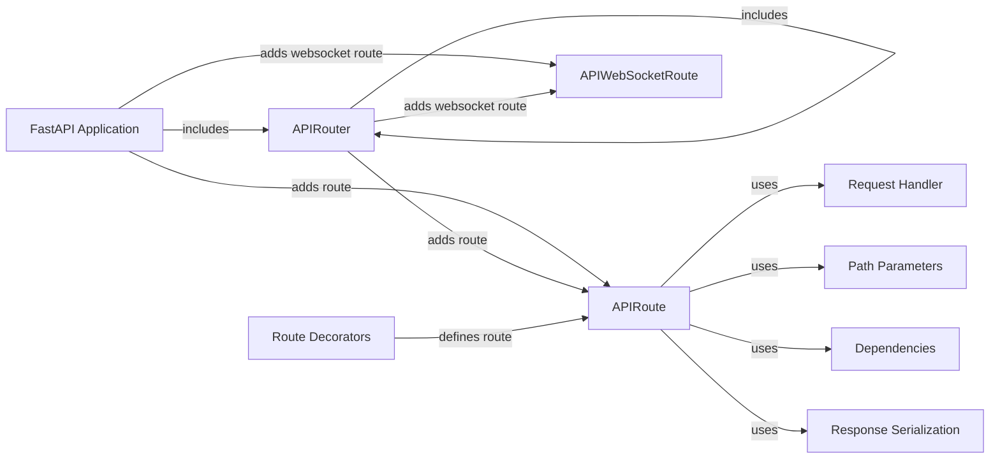

## Component Details

The routing and endpoints component in FastAPI is responsible for mapping incoming HTTP requests to the appropriate handler functions. It defines the API endpoints, supports various HTTP methods, and manages path parameters and dependencies. The component uses decorators to simplify route definitions and automatically serializes responses using Pydantic models. It provides a modular design through routers, which can be nested and included in the main application.

### FastAPI Application
The core application class, inheriting from Starlette, serves as the central point for defining API endpoints, middleware, and configurations. It manages the application lifecycle and request handling.
- **Related Classes/Methods**: `fastapi/fastapi.py`

### APIRouter
A class for grouping API endpoints and applying common configurations like prefix, tags, and dependencies. Routers can be included in other routers or the main FastAPI application, enabling modular API design.
- **Related Classes/Methods**: `fastapi/routing.py`

### APIRoute
Represents a standard HTTP route, associating a path, HTTP methods, and a handler function. It's responsible for processing incoming requests and returning responses.
- **Related Classes/Methods**: `fastapi/routing.py`

### APIWebSocketRoute
Represents a WebSocket route, handling WebSocket connections and communication. It manages the WebSocket lifecycle and message exchange.
- **Related Classes/Methods**: `fastapi/routing.py`

### Request Handler
The callable (function or method) that is executed when a matching route is found for an incoming HTTP request. It processes the request data, performs the necessary operations, and returns a response.
- **Related Classes/Methods**: _None_

### Route Decorators
Convenience decorators (e.g., `@app.get()`, `@router.post()`) that simplify the process of defining API endpoints. They internally call the `add_api_route` method to register the route with the application or router.
- **Related Classes/Methods**: `fastapi/routing.py`

### Path Parameters
Variables defined within a route path (e.g., `/items/{item_id}`). FastAPI automatically extracts and validates these parameters, passing them as arguments to the request handler.
- **Related Classes/Methods**: _None_

### Dependencies
Functions or classes that are executed before the request handler to provide dependencies (e.g., database connections, authentication). FastAPI's dependency injection system automatically resolves and injects these dependencies.
- **Related Classes/Methods**: _None_

### Response Serialization
The process of converting the response data (e.g., Python objects) into a format suitable for transmission over HTTP (e.g., JSON). FastAPI automatically handles response serialization using Pydantic models.
- **Related Classes/Methods**: _None_
