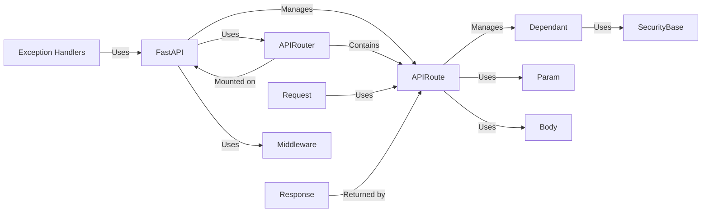

## Details

One paragraph explaining the functionality which is represented by this graph. What the main flow is and what is its purpose.

### FastAPI
The core application class, inheriting from `APIRouter`. It's the central point for configuring and running the API, managing routing, middleware, exception handling, and the overall application lifecycle. It inherits from `APIRouter`, effectively making the entire application a router itself.

**Related Classes/Methods**: _None_

### APIRouter
A class for creating modular sets of routes. It allows grouping related endpoints and mounting them on the main `FastAPI` application or other `APIRouter` instances. This promotes modularity and organization in larger applications.

**Related Classes/Methods**: _None_

### APIRoute
Represents a single route (endpoint) in the API. It associates a path, HTTP method, and handler function. It's the fundamental unit of routing, defining how the API responds to specific requests.

**Related Classes/Methods**: _None_

### Dependant
Represents a dependency that needs to be resolved before a route handler can be executed. This includes dependencies injected via `Depends`, security requirements, and parameter validation. It ensures that the necessary resources and conditions are met before a route is processed.

**Related Classes/Methods**: _None_

### Param
Base class for defining request parameters (query, path, header, cookie). It provides a standardized way to access and validate parameters passed in the request.

**Related Classes/Methods**: _None_

### Body
Class for defining request body parameters. It handles the data sent in the body of a request, often used for POST and PUT requests.

**Related Classes/Methods**: _None_

### Request
Represents an incoming HTTP request. It provides access to headers, query parameters, body, and other request-related information.

**Related Classes/Methods**: _None_

### Response
Represents the HTTP response that will be sent back to the client. It allows setting headers, status codes, and the response body.

**Related Classes/Methods**: _None_

### SecurityBase
Base class for security schemes. It defines the interface for implementing different authentication and authorization mechanisms.

**Related Classes/Methods**: _None_

### Exception Handlers
Functions responsible for handling exceptions raised during request processing. They provide a way to gracefully handle errors and return appropriate error responses to the client.

**Related Classes/Methods**: _None_

### [FAQ](https://github.com/CodeBoarding/GeneratedOnBoardings/tree/main?tab=readme-ov-file#faq)