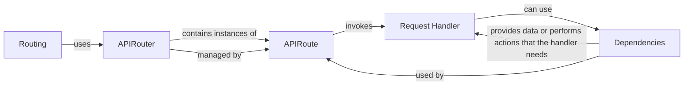

## Details

The `Routing` component is responsible for mapping incoming HTTP requests to the appropriate handler functions within the application. It defines the API's URL structure, supported HTTP methods, and any associated dependencies or middleware. It uses FastAPI's `APIRouter` and related classes to organize and manage API endpoints.

### APIRouter
A class from `fastapi` used to create modular sets of API routes. It groups related endpoints under a common prefix and allows for applying shared dependencies or middleware.

**Related Classes/Methods**: _None_

### APIRoute
Represents a single API endpoint, defining the path, HTTP methods (GET, POST, etc.), the handler function (the code to execute when the endpoint is called), and any dependencies.

**Related Classes/Methods**: _None_

### Request Handler
A function that processes an incoming HTTP request and returns a response. It's the actual code that gets executed when an endpoint is called.

**Related Classes/Methods**: _None_

### Dependencies
Functions that are executed before the request handler. They can be used for authentication, authorization, data validation, or other pre-processing tasks.

**Related Classes/Methods**: _None_

### [FAQ](https://github.com/CodeBoarding/GeneratedOnBoardings/tree/main?tab=readme-ov-file#faq)