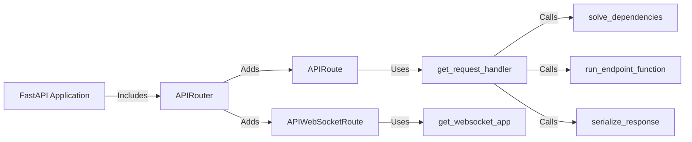

## Components Description

**FastAPI Application**
*Description*: The main application, serving as the entry point for the API. It includes routers and handles global configurations.
*Interaction*: Includes `APIRouter` instances to define API endpoints.
*Source Files*: `fastapi.applications.FastAPI`

**APIRouter**
*Description*: Declares API routes and groups them into modular components. It allows for organizing endpoints into logical sections.
*Interaction*: Adds `APIRoute` and `APIWebSocketRoute` instances. Included by `FastAPI`.
*Source Files*: `fastapi.routing.APIRouter`

**APIRoute**
*Description*: Represents a single API endpoint, handling request processing and response serialization.
*Interaction*: Uses `get_request_handler` to process incoming requests.
*Source Files*: `fastapi.routing.APIRoute`

**APIWebSocketRoute**
*Description*: Represents a WebSocket endpoint, handling WebSocket connections.
*Interaction*: Uses `get_websocket_app` to manage WebSocket connections.
*Source Files*: `fastapi.routing.APIWebSocketRoute`

**get_request_handler**
*Description*: Creates a request handler callable that manages dependency resolution, endpoint execution, and response serialization.
*Interaction*: Calls `solve_dependencies`, `run_endpoint_function`, and `serialize_response`.
*Source Files*: `fastapi.routing.get_request_handler`

**get_websocket_app**
*Description*: Creates a WebSocket application to handle WebSocket connections.
*Interaction*: Used by `APIWebSocketRoute`.
*Source Files*: `fastapi.routing.get_websocket_app`

**solve_dependencies**
*Description*: Resolves dependencies for a given endpoint.
*Interaction*: Called by `get_request_handler`.
*Source Files*: `fastapi.dependencies.utils.solve_dependencies`

**run_endpoint_function**
*Description*: Executes the endpoint function.
*Interaction*: Called by `get_request_handler`.
*Source Files*: `fastapi.routing.run_endpoint_function`

**serialize_response**
*Description*: Serializes the response from the endpoint function.
*Interaction*: Called by `get_request_handler`.
*Source Files*: `fastapi.routing.serialize_response`