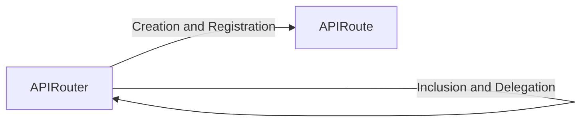

## Details

One paragraph explaining the functionality which is represented by this graph. What the main flow is and what is its purpose.

### APIRouter
Acts as a high-level route orchestrator and factory. It provides the primary interface for developers to define, group, and organize path operations using decorators (e.g., @router.get). It manages shared configurations like prefixes, tags, and dependencies for a set of routes and can embed other APIRouter instances to create a modular application structure.

**Related Classes/Methods**:

- <a href="https://github.com/fastapi/fastapi/blob/master/fastapi/routing.py#L1366-L1741" target="_blank" rel="noopener noreferrer">`fastapi.routing.APIRouter.get` (1366:1741)</a>
- <a href="https://github.com/fastapi/fastapi/blob/master/fastapi/routing.py#L881-L961" target="_blank" rel="noopener noreferrer">`fastapi.routing.APIRouter.add_api_route` (881:961)</a>
- <a href="https://github.com/fastapi/fastapi/blob/master/fastapi/routing.py#L1122-L1364" target="_blank" rel="noopener noreferrer">`fastapi.routing.APIRouter.include_router` (1122:1364)</a>

### APIRoute
Represents a single, executable API endpoint. It encapsulates all metadata for a path operation, including the URL path, HTTP method, the endpoint handler function, dependencies, and response models. This class is responsible for handling the request, managing dependency injection for the endpoint function, and processing the response. It is the fundamental unit managed by APIRouter.

**Related Classes/Methods**:

- <a href="https://github.com/fastapi/fastapi/blob/master/fastapi/routing.py#L428-L592" target="_blank" rel="noopener noreferrer">`fastapi.routing.APIRoute` (428:592)</a>

### [FAQ](https://github.com/CodeBoarding/GeneratedOnBoardings/tree/main?tab=readme-ov-file#faq)