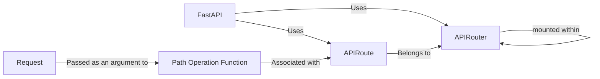

## Details

One paragraph explaining the functionality which is represented by this graph. What the main flow is and what is its purpose.

### FastAPI
The core application instance that inherits from Starlette and provides the main entry point for defining and running the API. It's responsible for initializing the routing mechanism and handling incoming requests.

**Related Classes/Methods**: _None_

### APIRoute
Represents a single route (endpoint) in the API. It associates a path, HTTP method (GET, POST, etc.), and a handler function (the "path operation function") that will be executed when a request matches the route. It also handles dependencies.

**Related Classes/Methods**: _None_

### APIRouter
A container for grouping related `APIRoute` instances. It allows applying a common prefix, tags, and dependencies to a set of routes, promoting organization and reusability.

**Related Classes/Methods**: _None_

### Request
Represents an incoming HTTP request. It provides access to request headers, query parameters, body, and other request-related information.

**Related Classes/Methods**: _None_

### Path Operation Function
The user-defined function that handles the logic for a specific endpoint. It receives the `Request` object and any dependencies, processes the request, and returns a response.

**Related Classes/Methods**: _None_

### [FAQ](https://github.com/CodeBoarding/GeneratedOnBoardings/tree/main?tab=readme-ov-file#faq)