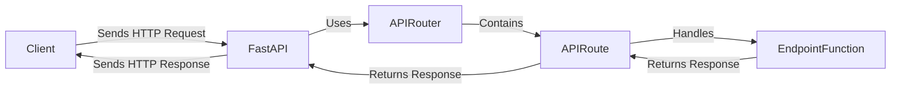

## Routing Component Overview

The Routing component in FastAPI is responsible for mapping incoming HTTP requests to the appropriate handler functions. It uses URL paths and HTTP methods to determine the correct endpoint to invoke. The core classes involved are `FastAPI`, `APIRouter`, and `APIRoute`.

### Data Flow Diagram

### Component Descriptions

*   **Client**: The user or system that initiates the HTTP request.
    *   **Interaction**: Sends HTTP requests to the FastAPI application and receives HTTP responses.
    *   **Source Files**: N/A (External Component)

*   **FastAPI**: The main application instance that receives the request and orchestrates the routing process.
    *   **Functionality**: Receives HTTP requests, uses the APIRouter to find the matching APIRoute, and sends the response back to the client.
    *   **Interaction**: Uses APIRouter to map the request to a specific APIRoute.
    *   **Source Files**: `fastapi.applications.FastAPI`

*   **APIRouter**: Groups related API routes and applies common configurations.
    *   **Functionality**: Contains a list of APIRoutes and provides methods for adding new routes. It is included in the FastAPI application to register its routes.
    *   **Interaction**: Contains APIRoutes and is used by FastAPI to find the appropriate route for a given request.
    *   **Source Files**: `fastapi.routing.APIRouter`

*   **APIRoute**: Represents a single API endpoint with its path, HTTP methods, and handler function.
    *   **Functionality**: Encapsulates the route's logic, including parameter parsing, dependency injection, and response generation. It handles incoming requests and generates responses.
    *   **Interaction**: Handles requests and calls the Endpoint Function. Returns the response to FastAPI.
    *   **Source Files**: `fastapi.routing.APIRoute`

*   **EndpointFunction**: The actual function that is executed when a route is matched.
    *   **Functionality**: Contains the application logic for a specific endpoint.
    *   **Interaction**: Called by APIRoute to process the request and return a response.
    *   **Source Files**: User-defined
