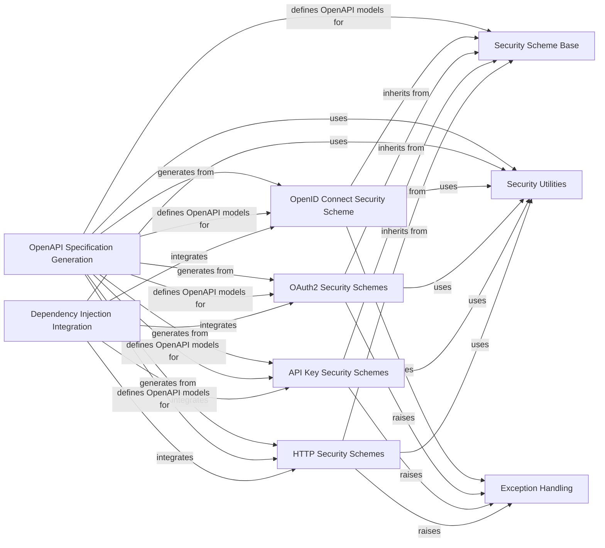

## Component Details

The Security & Authentication subsystem in FastAPI provides a comprehensive set of tools and classes for implementing various authentication and authorization mechanisms. It defines abstract and concrete security schemes (like HTTP Basic, Bearer, API Key, OAuth2, and OpenID Connect), integrates them seamlessly into FastAPI's dependency injection system, handles security-related exceptions, and ensures proper documentation of security requirements in the OpenAPI specification. The core flow involves defining a security scheme, applying it as a dependency to path operations, and then FastAPI automatically handles credential extraction, validation, and error reporting, while also generating the corresponding OpenAPI security definitions.

### Security Scheme Base
Provides the foundational abstract class `SecurityBase` for all security schemes in FastAPI. It defines the common interface and properties (like `model` and `scheme_name`) that concrete security schemes must implement.

**Related Classes/Methods**:

- <a href="https://github.com/fastapi/fastapi/blob/master/fastapi/security/base.py#L4-L6" target="_blank" rel="noopener noreferrer">`fastapi.security.base.SecurityBase` (4:6)</a>

### HTTP Security Schemes
Implements various HTTP-based authentication mechanisms such as Basic, Bearer, and Digest. These classes handle the extraction and initial validation of credentials from HTTP headers.

**Related Classes/Methods**:

- <a href="https://github.com/fastapi/fastapi/blob/master/fastapi/security/http.py#L69-L94" target="_blank" rel="noopener noreferrer">`fastapi.security.http.HTTPBase` (69:94)</a>
- <a href="https://github.com/fastapi/fastapi/blob/master/fastapi/security/http.py#L97-L217" target="_blank" rel="noopener noreferrer">`fastapi.security.http.HTTPBasic` (97:217)</a>
- <a href="https://github.com/fastapi/fastapi/blob/master/fastapi/security/http.py#L220-L321" target="_blank" rel="noopener noreferrer">`fastapi.security.http.HTTPBearer` (220:321)</a>
- <a href="https://github.com/fastapi/fastapi/blob/master/fastapi/security/http.py#L324-L423" target="_blank" rel="noopener noreferrer">`fastapi.security.http.HTTPDigest` (324:423)</a>
- <a href="https://github.com/fastapi/fastapi/blob/master/fastapi/security/http.py#L29-L66" target="_blank" rel="noopener noreferrer">`fastapi.security.http.HTTPAuthorizationCredentials` (29:66)</a>
- <a href="https://github.com/fastapi/fastapi/blob/master/fastapi/security/http.py#L16-L26" target="_blank" rel="noopener noreferrer">`fastapi.security.http.HTTPBasicCredentials` (16:26)</a>

### API Key Security Schemes
Provides classes for API key authentication via query parameters, headers, or cookies. These components are responsible for extracting the API key from the request based on its configured location.

**Related Classes/Methods**:

- <a href="https://github.com/fastapi/fastapi/blob/master/fastapi/security/api_key.py#L11-L20" target="_blank" rel="noopener noreferrer">`fastapi.security.api_key.APIKeyBase` (11:20)</a>
- <a href="https://github.com/fastapi/fastapi/blob/master/fastapi/security/api_key.py#L23-L112" target="_blank" rel="noopener noreferrer">`fastapi.security.api_key.APIKeyQuery` (23:112)</a>
- <a href="https://github.com/fastapi/fastapi/blob/master/fastapi/security/api_key.py#L115-L200" target="_blank" rel="noopener noreferrer">`fastapi.security.api_key.APIKeyHeader` (115:200)</a>
- <a href="https://github.com/fastapi/fastapi/blob/master/fastapi/security/api_key.py#L203-L288" target="_blank" rel="noopener noreferrer">`fastapi.security.api_key.APIKeyCookie` (203:288)</a>

### OAuth2 Security Schemes
Implements various OAuth2 authentication flows, including Password and Authorization Code. These classes define how OAuth2 tokens are obtained and validated, and how scopes are managed.

**Related Classes/Methods**:

- <a href="https://github.com/fastapi/fastapi/blob/master/fastapi/security/oauth2.py#L308-L388" target="_blank" rel="noopener noreferrer">`fastapi.security.oauth2.OAuth2` (308:388)</a>
- <a href="https://github.com/fastapi/fastapi/blob/master/fastapi/security/oauth2.py#L391-L485" target="_blank" rel="noopener noreferrer">`fastapi.security.oauth2.OAuth2PasswordBearer` (391:485)</a>
- <a href="https://github.com/fastapi/fastapi/blob/master/fastapi/security/oauth2.py#L488-L595" target="_blank" rel="noopener noreferrer">`fastapi.security.oauth2.OAuth2AuthorizationCodeBearer` (488:595)</a>
- <a href="https://github.com/fastapi/fastapi/blob/master/fastapi/security/oauth2.py#L16-L149" target="_blank" rel="noopener noreferrer">`fastapi.security.oauth2.OAuth2PasswordRequestForm` (16:149)</a>
- <a href="https://github.com/fastapi/fastapi/blob/master/fastapi/security/oauth2.py#L152-L305" target="_blank" rel="noopener noreferrer">`fastapi.security.oauth2.OAuth2PasswordRequestFormStrict` (152:305)</a>

### OpenID Connect Security Scheme
Provides support for OpenID Connect authentication, handling the integration with an OpenID Connect provider.

**Related Classes/Methods**:

- <a href="https://github.com/fastapi/fastapi/blob/master/fastapi/security/open_id_connect_url.py#L11-L84" target="_blank" rel="noopener noreferrer">`fastapi.security.open_id_connect_url.OpenIdConnect` (11:84)</a>

### Security Utilities
Contains helper functions and data models used across different security schemes, such as extracting authorization scheme parameters and defining security requirements.

**Related Classes/Methods**:

- <a href="https://github.com/fastapi/fastapi/blob/master/fastapi/security/utils.py#L4-L10" target="_blank" rel="noopener noreferrer">`fastapi.security.utils.get_authorization_scheme_param` (4:10)</a>
- <a href="https://github.com/fastapi/fastapi/blob/master/fastapi/security/oauth2.py#L598-L638" target="_blank" rel="noopener noreferrer">`fastapi.security.oauth2.SecurityScopes` (598:638)</a>
- <a href="https://github.com/fastapi/fastapi/blob/master/fastapi/dependencies/models.py#L9-L11" target="_blank" rel="noopener noreferrer">`fastapi.dependencies.models.SecurityRequirement` (9:11)</a>

### Dependency Injection Integration
Manages the integration of security schemes into FastAPI's dependency injection system, allowing them to be declared as dependencies in path operations and resolved during request processing. This component is crucial for applying security to specific endpoints.

**Related Classes/Methods**:

- <a href="https://github.com/fastapi/fastapi/blob/master/fastapi/param_functions.py#L2280-L2360" target="_blank" rel="noopener noreferrer">`fastapi.param_functions.Security` (2280:2360)</a>
- <a href="https://github.com/fastapi/fastapi/blob/master/fastapi/params.py#L777-L786" target="_blank" rel="noopener noreferrer">`fastapi.params.Security` (777:786)</a>
- <a href="https://github.com/fastapi/fastapi/blob/master/fastapi/params.py#L764-L774" target="_blank" rel="noopener noreferrer">`fastapi.params.Depends` (764:774)</a>
- <a href="https://github.com/fastapi/fastapi/blob/master/fastapi/dependencies/utils.py#L572-L695" target="_blank" rel="noopener noreferrer">`fastapi.dependencies.utils.solve_dependencies` (572:695)</a>
- <a href="https://github.com/fastapi/fastapi/blob/master/fastapi/dependencies/utils.py#L265-L314" target="_blank" rel="noopener noreferrer">`fastapi.dependencies.utils.get_dependant` (265:314)</a>

### Exception Handling
Provides mechanisms for raising and handling HTTP exceptions related to authentication and authorization failures, ensuring proper error responses are returned to the client.

**Related Classes/Methods**:

- <a href="https://github.com/fastapi/fastapi/blob/master/fastapi/exceptions.py#L9-L65" target="_blank" rel="noopener noreferrer">`fastapi.exceptions.HTTPException` (9:65)</a>

### OpenAPI Specification Generation
Responsible for defining the data models and utility functions that represent security schemes and flows within the OpenAPI specification, enabling the automatic generation of interactive API documentation (e.g., Swagger UI).

**Related Classes/Methods**:

- <a href="https://github.com/fastapi/fastapi/blob/master/fastapi/openapi/models.py#L338-L340" target="_blank" rel="noopener noreferrer">`fastapi.openapi.models.SecurityBase` (338:340)</a>
- <a href="https://github.com/fastapi/fastapi/blob/master/fastapi/openapi/models.py#L355-L357" target="_blank" rel="noopener noreferrer">`fastapi.openapi.models.HTTPBase` (355:357)</a>
- <a href="https://github.com/fastapi/fastapi/blob/master/fastapi/openapi/models.py#L360-L362" target="_blank" rel="noopener noreferrer">`fastapi.openapi.models.HTTPBearer` (360:362)</a>
- <a href="https://github.com/fastapi/fastapi/blob/master/fastapi/openapi/models.py#L349-L352" target="_blank" rel="noopener noreferrer">`fastapi.openapi.models.APIKey` (349:352)</a>
- <a href="https://github.com/fastapi/fastapi/blob/master/fastapi/openapi/models.py#L399-L403" target="_blank" rel="noopener noreferrer">`fastapi.openapi.models.OpenIdConnect` (399:403)</a>
- <a href="https://github.com/fastapi/fastapi/blob/master/fastapi/openapi/models.py#L394-L396" target="_blank" rel="noopener noreferrer">`fastapi.openapi.models.OAuth2` (394:396)</a>
- <a href="https://github.com/fastapi/fastapi/blob/master/fastapi/openapi/models.py#L387-L391" target="_blank" rel="noopener noreferrer">`fastapi.openapi.models.OAuthFlows` (387:391)</a>
- <a href="https://github.com/fastapi/fastapi/blob/master/fastapi/openapi/utils.py#L78-L92" target="_blank" rel="noopener noreferrer">`fastapi.openapi.utils.get_openapi_security_definitions` (78:92)</a>

### [FAQ](https://github.com/CodeBoarding/GeneratedOnBoardings/tree/main?tab=readme-ov-file#faq)