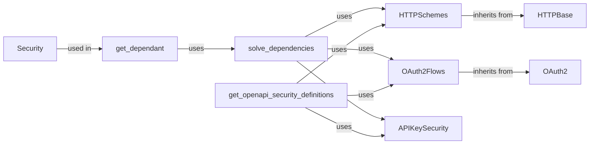

## Component Details

The Security Features component in FastAPI provides a comprehensive suite of tools for securing API endpoints through authentication and authorization. It supports various security schemes, including HTTP Basic, Bearer, and Digest authentication, as well as OAuth2 flows and API key authentication methods. The component integrates with FastAPI's dependency injection system to validate and authenticate requests based on defined security requirements, ensuring that only authorized users can access protected resources. It also facilitates the generation of OpenAPI documentation for security schemes, making it easier to understand and implement security measures in API development.

### HTTPBase
Abstract base class for HTTP authentication schemes, defining common functionalities for handling HTTP credentials. It serves as a foundation for specific HTTP authentication implementations.
- **Related Classes/Methods**: `fastapi/security/http.py`

### HTTPSchemes
Concrete implementations of HTTP authentication schemes, including Basic, Bearer, and Digest. These classes inherit from HTTPBase and provide specific logic for handling different HTTP authentication methods.
- **Related Classes/Methods**: `fastapi/security/http.py`

### OAuth2
Base class for OAuth2 security schemes, providing a foundation for implementing different OAuth2 flows. It defines the common structure and interfaces for OAuth2-based authentication.
- **Related Classes/Methods**: `fastapi/security/oauth2.py`

### OAuth2Flows
Implementations of specific OAuth2 flows, such as Password and Authorization Code. These classes inherit from OAuth2 and provide the logic for handling different OAuth2 grant types.
- **Related Classes/Methods**: `fastapi/security/oauth2.py`

### APIKeySecurity
Implementations for API key authentication via query parameter, header, or cookie. These classes allow clients to authenticate by providing an API key in different ways.
- **Related Classes/Methods**: `fastapi/security/api_key.py`

### Security
A parameter type used to declare security requirements for a path operation. It allows developers to specify which security schemes are required for a particular endpoint.
- **Related Classes/Methods**: `fastapi/params.py`

### get_dependant
Analyzes the dependencies of a callable, including security requirements, and returns a Dependant object. It's a core utility for resolving dependencies for FastAPI endpoints.
- **Related Classes/Methods**: `fastapi/dependencies/utils.py`

### solve_dependencies
Solves the dependencies for a path operation, including security requirements. It uses the security schemes defined to validate and authenticate requests.
- **Related Classes/Methods**: `fastapi/dependencies/utils.py`

### get_openapi_security_definitions
Extracts security definitions from security schemes for OpenAPI documentation. It ensures that the security schemes used in the application are properly documented in the OpenAPI specification.
- **Related Classes/Methods**: `fastapi/openapi/utils.py`
