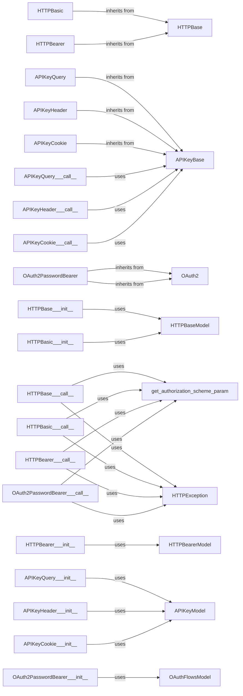

## Component Details

The Security and Authentication Mechanisms component in FastAPI provides a set of tools and classes for implementing various authentication and authorization schemes. It supports HTTP-based authentication (Basic, Bearer), API key authentication (via query parameters, headers, or cookies), and OAuth2 flows. The component integrates with FastAPI's dependency injection system, allowing developers to easily secure their API endpoints by defining dependencies that enforce authentication and authorization requirements. It uses Pydantic models to define the structure of authentication data and provides utility functions for extracting authentication credentials from HTTP requests. The component also includes exception handling for authentication failures, raising HTTP exceptions with appropriate status codes and error messages.

### HTTPBase
Abstract base class for HTTP security schemes. It defines the basic structure for HTTP-based authentication, initializing with an HTTPBase model and providing a common interface for handling HTTP authentication schemes.
- **Related Classes/Methods**:

['[`fastapi.fastapi.security.http.HTTPBase:__init__` (70:80)](https://github.com/fastapi/fastapi/blob/master/fastapi/security/http.py#L70-L80)', '[`fastapi.fastapi.security.http.HTTPBase:__call__` (82:94)](https://github.com/fastapi/fastapi/blob/master/fastapi/security/http.py#L82-L94)', '[`fastapi.openapi.models.HTTPBase` (355:357)](https://github.com/fastapi/fastapi/blob/master/fastapi/openapi/models.py#L355-L357)']

### HTTPBasic
Implements HTTP Basic authentication. It inherits from `HTTPBase` and provides a specific implementation for handling Basic authentication credentials. It extracts the username and password from the Authorization header and validates them.
- **Related Classes/Methods**:

['[`fastapi.fastapi.security.http.HTTPBasic:__init__` (130:185)](https://github.com/fastapi/fastapi/blob/master/fastapi/security/http.py#L130-L185)', '[`fastapi.fastapi.security.http.HTTPBasic:__call__` (187:217)](https://github.com/fastapi/fastapi/blob/master/fastapi/security/http.py#L187-L217)', '[`fastapi.openapi.models.HTTPBase` (355:357)](https://github.com/fastapi/fastapi/blob/master/fastapi/openapi/models.py#L355-L357)']

### HTTPBearer
Implements HTTP Bearer authentication. It inherits from `HTTPBase` and is used for handling Bearer token authentication. It extracts the token from the Authorization header and validates it.
- **Related Classes/Methods**:

['[`fastapi.fastapi.security.http.HTTPBearer:__init__` (252:299)](https://github.com/fastapi/fastapi/blob/master/fastapi/security/http.py#L252-L299)', '[`fastapi.fastapi.security.http.HTTPBearer:__call__` (301:321)](https://github.com/fastapi/fastapi/blob/master/fastapi/security/http.py#L301-L321)', '[`fastapi.openapi.models.HTTPBearer` (360:362)](https://github.com/fastapi/fastapi/blob/master/fastapi/openapi/models.py#L360-L362)']

### APIKeyBase
Abstract base class for API key security schemes. It provides a common interface for checking API keys. It defines the basic structure for API key-based authentication.
- **Related Classes/Methods**:

['[`fastapi.fastapi.security.api_key.APIKeyBase.check_api_key` (13:20)](https://github.com/fastapi/fastapi/blob/master/fastapi/security/api_key.py#L13-L20)']

### APIKeyQuery
Handles API key authentication via query parameters. It inherits from `APIKeyBase` and retrieves the API key from the query string. It then validates the API key.
- **Related Classes/Methods**:

['[`fastapi.fastapi.security.api_key.APIKeyQuery:__init__` (55:108)](https://github.com/fastapi/fastapi/blob/master/fastapi/security/api_key.py#L55-L108)', '[`fastapi.fastapi.security.api_key.APIKeyQuery:__call__` (110:112)](https://github.com/fastapi/fastapi/blob/master/fastapi/security/api_key.py#L110-L112)', '[`fastapi.openapi.models.APIKey` (349:352)](https://github.com/fastapi/fastapi/blob/master/fastapi/openapi/models.py#L349-L352)']

### APIKeyHeader
Handles API key authentication via HTTP headers. It inherits from `APIKeyBase` and retrieves the API key from a specified header. It then validates the API key.
- **Related Classes/Methods**:

['[`fastapi.fastapi.security.api_key.APIKeyHeader:__init__` (147:196)](https://github.com/fastapi/fastapi/blob/master/fastapi/security/api_key.py#L147-L196)', '[`fastapi.fastapi.security.api_key.APIKeyHeader:__call__` (198:200)](https://github.com/fastapi/fastapi/blob/master/fastapi/security/api_key.py#L198-L200)', '[`fastapi.openapi.models.APIKey` (349:352)](https://github.com/fastapi/fastapi/blob/master/fastapi/openapi/models.py#L349-L352)']

### APIKeyCookie
Handles API key authentication via cookies. It inherits from `APIKeyBase` and retrieves the API key from a specified cookie. It then validates the API key.
- **Related Classes/Methods**:

['[`fastapi.fastapi.security.api_key.APIKeyCookie:__init__` (235:284)](https://github.com/fastapi/fastapi/blob/master/fastapi/security/api_key.py#L235-L284)', '[`fastapi.fastapi.security.api_key.APIKeyCookie:__call__` (286:288)](https://github.com/fastapi/fastapi/blob/master/fastapi/security/api_key.py#L286-L288)', '[`fastapi.openapi.models.APIKey` (349:352)](https://github.com/fastapi/fastapi/blob/master/fastapi/openapi/models.py#L349-L352)']

### OAuth2PasswordBearer
Implements the OAuth2 password flow. It inherits from `OAuth2` and is used for handling password-based OAuth2 token retrieval. It retrieves the token from the request body and validates it.
- **Related Classes/Methods**:

['[`fastapi.fastapi.security.oauth2.OAuth2PasswordBearer:__init__` (400:471)](https://github.com/fastapi/fastapi/blob/master/fastapi/security/oauth2.py#L400-L471)', '[`fastapi.fastapi.security.oauth2.OAuth2PasswordBearer:__call__` (473:485)](https://github.com/fastapi/fastapi/blob/master/fastapi/security/oauth2.py#L473-L485)', '[`fastapi.openapi.models.OAuthFlows` (387:391)](https://github.com/fastapi/fastapi/blob/master/fastapi/openapi/models.py#L387-L391)']

### get_authorization_scheme_param
Utility function to extract the authorization scheme and parameter from the Authorization header. It parses the Authorization header and returns the scheme and the parameter.
- **Related Classes/Methods**:

['[`fastapi.security.utils.get_authorization_scheme_param` (4:10)](https://github.com/fastapi/fastapi/blob/master/fastapi/security/utils.py#L4-L10)']

### HTTPException
Exception class for raising HTTP exceptions with specific status codes and details. It is used to raise exceptions when authentication or authorization fails.
- **Related Classes/Methods**:

['[`fastapi.exceptions.HTTPException` (9:65)](https://github.com/fastapi/fastapi/blob/master/fastapi/exceptions.py#L9-L65)']