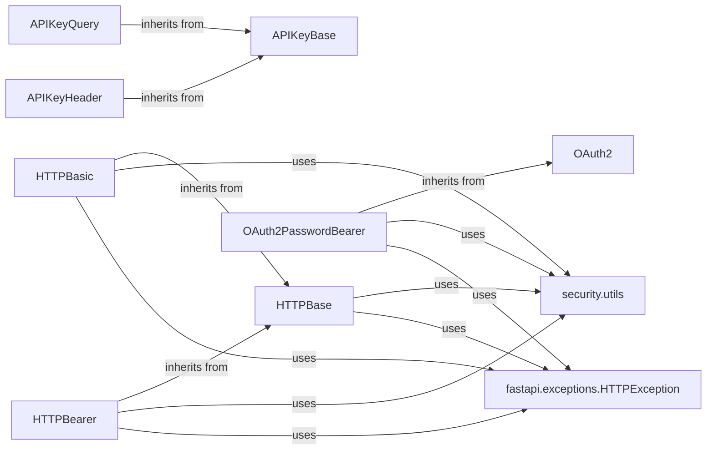

## Component Details

The Security and Authentication component in FastAPI provides mechanisms for securing API endpoints by verifying the identity and authorization of incoming requests. It offers various authentication schemes, including HTTP-based authentication (Basic, Bearer), API key authentication (via query parameters, headers, or cookies), and OAuth2 password flow. These schemes ensure that only authenticated and authorized users can access protected resources, enhancing the overall security of the application.

### HTTPBase
Abstract base class for HTTP security schemes. It defines the base functionality for HTTP authentication, including extracting the scheme and parameter from the Authorization header. It uses `get_authorization_scheme_param` to parse the authorization header and raises an `HTTPException` if authentication fails.
- **Related Classes/Methods**:

- <a href="https://github.com/fastapi/fastapi/blob/master/fastapi/security/http.py#L69-L94" target="_blank" rel="noopener noreferrer">`fastapi.fastapi.security.http.HTTPBase` (69:94)</a>
- <a href="https://github.com/fastapi/fastapi/blob/master/fastapi/openapi/models.py#L355-L357" target="_blank" rel="noopener noreferrer">`fastapi.openapi.models.HTTPBase` (355:357)</a>

### HTTPBasic
Implements HTTP Basic authentication. It inherits from `HTTPBase` and provides a specific implementation for handling Basic authentication credentials. It extracts the username and password from the Authorization header using `get_authorization_scheme_param` and raises an `HTTPException` if authentication fails.
- **Related Classes/Methods**:

- <a href="https://github.com/fastapi/fastapi/blob/master/fastapi/security/http.py#L97-L217" target="_blank" rel="noopener noreferrer">`fastapi.fastapi.security.http.HTTPBasic` (97:217)</a>
- <a href="https://github.com/fastapi/fastapi/blob/master/fastapi/security/http.py#L16-L26" target="_blank" rel="noopener noreferrer">`fastapi.fastapi.security.http.HTTPBasicCredentials` (16:26)</a>

### HTTPBearer
Implements HTTP Bearer authentication. It inherits from `HTTPBase` and provides a specific implementation for handling Bearer authentication credentials (e.g., JWT tokens). It extracts the token from the Authorization header using `get_authorization_scheme_param` and raises an `HTTPException` if authentication fails.
- **Related Classes/Methods**:

- <a href="https://github.com/fastapi/fastapi/blob/master/fastapi/security/http.py#L220-L321" target="_blank" rel="noopener noreferrer">`fastapi.fastapi.security.http.HTTPBearer` (220:321)</a>
- <a href="https://github.com/fastapi/fastapi/blob/master/fastapi/security/http.py#L29-L66" target="_blank" rel="noopener noreferrer">`fastapi.fastapi.security.http.HTTPAuthorizationCredentials` (29:66)</a>

### APIKeyBase
Abstract base class for API key security schemes. It provides a common interface for checking API keys.
- **Related Classes/Methods**:

- <a href="https://github.com/fastapi/fastapi/blob/master/fastapi/security/api_key.py#L11-L20" target="_blank" rel="noopener noreferrer">`fastapi.fastapi.security.api_key.APIKeyBase` (11:20)</a>
- <a href="https://github.com/fastapi/fastapi/blob/master/fastapi/openapi/models.py#L349-L352" target="_blank" rel="noopener noreferrer">`fastapi.openapi.models.APIKey` (349:352)</a>

### APIKeyQuery
Implements API key authentication via query parameter. It inherits from `APIKeyBase` and retrieves the API key from the query parameters of the request.
- **Related Classes/Methods**:

- <a href="https://github.com/fastapi/fastapi/blob/master/fastapi/security/api_key.py#L23-L112" target="_blank" rel="noopener noreferrer">`fastapi.fastapi.security.api_key.APIKeyQuery` (23:112)</a>

### APIKeyHeader
Implements API key authentication via HTTP header. It inherits from `APIKeyBase` and retrieves the API key from a specified HTTP header.
- **Related Classes/Methods**:

- <a href="https://github.com/fastapi/fastapi/blob/master/fastapi/security/api_key.py#L115-L200" target="_blank" rel="noopener noreferrer">`fastapi.fastapi.security.api_key.APIKeyHeader` (115:200)</a>

### OAuth2PasswordBearer
Implements the OAuth2 password flow using a bearer token. It inherits from `OAuth2` and provides a specific implementation for handling password-based authentication with bearer tokens. It extracts the token from the Authorization header using `get_authorization_scheme_param` and raises an `HTTPException` if authentication fails.
- **Related Classes/Methods**:

- <a href="https://github.com/fastapi/fastapi/blob/master/fastapi/security/oauth2.py#L391-L485" target="_blank" rel="noopener noreferrer">`fastapi.fastapi.security.oauth2.OAuth2PasswordBearer` (391:485)</a>

### security.utils
Utility functions for security features, such as extracting the authorization scheme and parameter from the Authorization header. The main function is `get_authorization_scheme_param`.
- **Related Classes/Methods**:

- <a href="https://github.com/fastapi/fastapi/blob/master/fastapi/security/utils.py#L4-L10" target="_blank" rel="noopener noreferrer">`fastapi.security.utils.get_authorization_scheme_param` (4:10)</a>

### fastapi.exceptions.HTTPException
Exception class for raising HTTP exceptions with specific status codes and details. It's used by the authentication schemes to signal authentication failures.
- **Related Classes/Methods**:

- <a href="https://github.com/fastapi/fastapi/blob/master/fastapi/exceptions.py#L9-L65" target="_blank" rel="noopener noreferrer">`fastapi.exceptions.HTTPException` (9:65)</a>