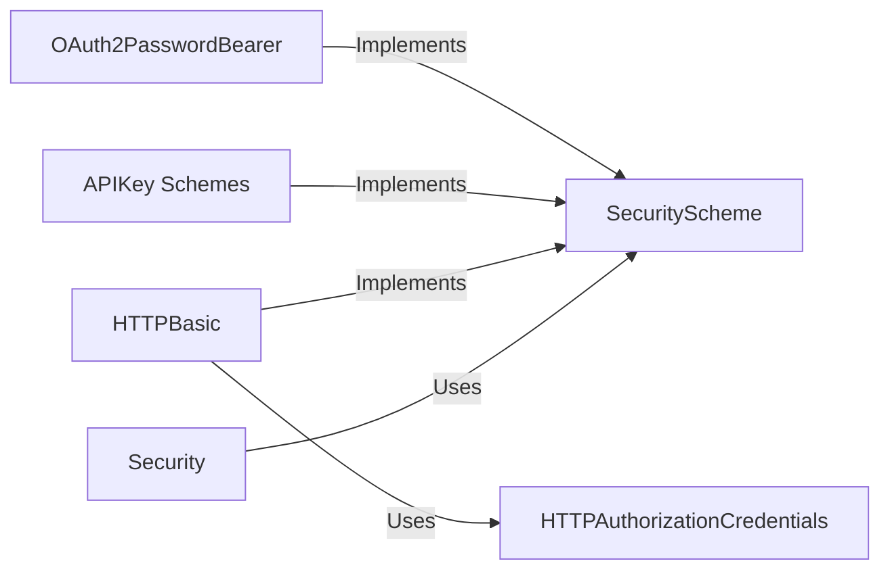

## Details

Refined analysis of the `fastapi.security` subsystem.

### SecurityScheme
An abstract base class that defines the common interface for all security scheme implementations. It establishes the contract that concrete schemes must adhere to, making them interchangeable and recognizable by FastAPI's dependency injection system. It is not used directly but is the foundation of the subsystem.

**Related Classes/Methods**:

- `fastapi.security.base.SecurityScheme`

### OAuth2PasswordBearer
A concrete security scheme that implements the OAuth2 "password" flow. Its primary responsibility is to extract a bearer token from the `Authorization` header of an incoming request. It is one of the most common and ready-to-use security components for token-based authentication.

**Related Classes/Methods**:

- <a href="https://github.com/fastapi/fastapi/blob/master/fastapi/security/oauth2.py#L390-L499" target="_blank" rel="noopener noreferrer">`fastapi.security.oauth2.OAuth2PasswordBearer` (390:499)</a>

### APIKey Schemes
A set of concrete classes that handle authentication using API keys. Each class provides a specific strategy for extracting the key from different parts of the request: `APIKeyHeader` (from headers), `APIKeyQuery` (from URL query parameters), and `APIKeyCookie` (from cookies).

**Related Classes/Methods**:

- <a href="https://github.com/fastapi/fastapi/blob/master/fastapi/security/api_key.py#L114-L199" target="_blank" rel="noopener noreferrer">`fastapi.security.api_key.APIKeyHeader` (114:199)</a>
- <a href="https://github.com/fastapi/fastapi/blob/master/fastapi/security/api_key.py#L22-L111" target="_blank" rel="noopener noreferrer">`fastapi.security.api_key.APIKeyQuery` (22:111)</a>
- <a href="https://github.com/fastapi/fastapi/blob/master/fastapi/security/api_key.py#L202-L287" target="_blank" rel="noopener noreferrer">`fastapi.security.api_key.APIKeyCookie` (202:287)</a>

### HTTPBasic
A concrete class that implements the HTTP Basic Authentication scheme. It is responsible for parsing the `Authorization` header for a `Basic` token, decoding the Base64-encoded credentials, and returning them in a structured `HTTPAuthorizationCredentials` model.

**Related Classes/Methods**:

- <a href="https://github.com/fastapi/fastapi/blob/master/fastapi/security/http.py#L96-L216" target="_blank" rel="noopener noreferrer">`fastapi.security.http.HTTPBasic` (96:216)</a>

### HTTPAuthorizationCredentials
A Pydantic model that acts as a data container for the username and password extracted by the `HTTPBasic` scheme. It provides a structured way to access the decoded credentials.

**Related Classes/Methods**:

- <a href="https://github.com/fastapi/fastapi/blob/master/fastapi/security/http.py#L28-L65" target="_blank" rel="noopener noreferrer">`fastapi.security.http.HTTPAuthorizationCredentials` (28:65)</a>

### Security [[Expand]](./Security.md)
A specialized dependency utility that wraps a security scheme instance (e.g., an instance of `OAuth2PasswordBearer`). While behaving like `Depends`, it additionally signals to FastAPI that this dependency is for security, which allows for correct configuration of the OpenAPI documentation (e.g., defining `securitySchemes`). It acts as the primary integration point between a specific security scheme and the framework's dependency injection system.

**Related Classes/Methods**:

- `fastapi.security.utils.Security`

### [FAQ](https://github.com/CodeBoarding/GeneratedOnBoardings/tree/main?tab=readme-ov-file#faq)