```mermaid
graph LR
    Application["Application"]
    Routing["Routing"]
    Parameters["Parameters"]
    Dependency_Resolution["Dependency Resolution"]
    Security_Authentication["Security & Authentication"]
    OpenAPI_Specification_Generator["OpenAPI Specification Generator"]
    OpenAPI_Models["OpenAPI Models"]
    Data_Encoding["Data Encoding"]
    Exception_Handlers["Exception Handlers"]
    Application -- "uses" --> Routing
    Application -- "uses" --> Security_Authentication
    Routing -- "uses" --> Parameters
    Routing -- "uses" --> Dependency_Resolution
    Parameters -- "uses" --> Dependency_Resolution
    Parameters -- "contributes to" --> OpenAPI_Specification_Generator
    Dependency_Resolution -- "uses" --> Security_Authentication
    Dependency_Resolution -- "provides services to" --> Routing
    Security_Authentication -- "integrates with" --> Dependency_Resolution
    Security_Authentication -- "defines models for" --> OpenAPI_Models
    OpenAPI_Specification_Generator -- "uses" --> OpenAPI_Models
    OpenAPI_Specification_Generator -- "consumes" --> Security_Authentication
    OpenAPI_Models -- "defines schema for" --> OpenAPI_Specification_Generator
    Data_Encoding -- "is used by" --> Application
    Data_Encoding -- "is used by" --> Exception_Handlers
    Exception_Handlers -- "is used by" --> Application
    Exception_Handlers -- "uses" --> Data_Encoding
    click Routing href "https://github.com/CodeBoarding/GeneratedOnBoardings/blob/main/fastapi/Routing.md" "Details"
    click Security_Authentication href "https://github.com/CodeBoarding/GeneratedOnBoardings/blob/main/fastapi/Security_Authentication.md" "Details"
```

## Details

Abstract Components Overview of a FastAPI application

### Application
The central orchestrator of a FastAPI application, responsible for initializing the web server, registering routes, and integrating all other components to form a functional API. It's the entry point for defining and running the API.

**Related Classes/Methods**:

- <a href="https://github.com/fastapi/fastapi/fastapi/applications.py#L1-L1" target="_blank" rel="noopener noreferrer">`fastapi.applications` (1:1)</a>

### Routing [[Expand]](./Routing.md)
Manages the mapping of incoming HTTP requests (based on URL paths and HTTP methods) to specific handler functions (path operations). It forms the backbone of how an API responds to different client requests.

**Related Classes/Methods**:

- <a href="https://github.com/fastapi/fastapi/fastapi/routing.py#L1-L1" target="_blank" rel="noopener noreferrer">`fastapi.routing` (1:1)</a>

### Parameters
Provides mechanisms for declaring and validating various types of input parameters for API endpoints, including path, query, header, cookie, and request body parameters. It enables FastAPI's automatic data validation and documentation.

**Related Classes/Methods**:

- <a href="https://github.com/fastapi/fastapi/fastapi/params.py#L1-L1" target="_blank" rel="noopener noreferrer">`fastapi.params` (1:1)</a>
- <a href="https://github.com/fastapi/fastapi/fastapi/param_functions.py#L1-L1" target="_blank" rel="noopener noreferrer">`fastapi.param_functions` (1:1)</a>

### Dependency Resolution
Implements FastAPI's powerful dependency injection system, allowing functions and classes to declare their dependencies. This promotes modularity, reusability, and testability by automatically providing required resources (e.g., database sessions, security checks) to path operations.

**Related Classes/Methods**:

- <a href="https://github.com/fastapi/fastapi/fastapi/dependencies/utils.py#L1-L1" target="_blank" rel="noopener noreferrer">`fastapi.dependencies.utils` (1:1)</a>
- <a href="https://github.com/fastapi/fastapi/fastapi/dependencies/models.py#L1-L1" target="_blank" rel="noopener noreferrer">`fastapi.dependencies.models` (1:1)</a>

### Security & Authentication [[Expand]](./Security_Authentication.md)
The `Security & Authentication` component in FastAPI provides a robust and extensible framework for implementing various security schemes, including API Keys (e.g., `APIKeyHeader`, `APIKeyQuery`), HTTP authentication (e.g., `HTTPBasic`, `HTTPBearer`), and OAuth2 (e.g., `OAuth2PasswordBearer`). It defines foundational classes like `SecurityBase` from which specific schemes inherit, ensuring a consistent interface. This component is designed to integrate seamlessly with FastAPI's dependency injection system, allowing developers to declaratively enforce authentication and authorization policies on API endpoints. Furthermore, it plays a critical role in generating the security definitions within the OpenAPI specification, making API security requirements discoverable and enabling automated client generation.

**Related Classes/Methods**:

- <a href="https://github.com/fastapi/fastapi/fastapi/security/api_key.py#L1-L1" target="_blank" rel="noopener noreferrer">`fastapi.security.api_key` (1:1)</a>
- <a href="https://github.com/fastapi/fastapi/fastapi/security/base.py#L1-L1" target="_blank" rel="noopener noreferrer">`fastapi.security.base` (1:1)</a>
- <a href="https://github.com/fastapi/fastapi/fastapi/security/http.py#L1-L1" target="_blank" rel="noopener noreferrer">`fastapi.security.http` (1:1)</a>
- <a href="https://github.com/fastapi/fastapi/fastapi/security/oauth2.py#L1-L1" target="_blank" rel="noopener noreferrer">`fastapi.security.oauth2` (1:1)</a>
- <a href="https://github.com/fastapi/fastapi/fastapi/security/open_id_connect_url.py#L1-L1" target="_blank" rel="noopener noreferrer">`fastapi.security.open_id_connect_url` (1:1)</a>
- <a href="https://github.com/fastapi/fastapi/fastapi/security/utils.py#L1-L1" target="_blank" rel="noopener noreferrer">`fastapi.security.utils` (1:1)</a>

### OpenAPI Specification Generator
Automatically generates the OpenAPI (Swagger) specification for the API, providing machine-readable documentation of all endpoints, parameters, responses, and security schemes. This is vital for API discoverability, client generation, and interactive documentation (e.g., Swagger UI, ReDoc).

**Related Classes/Methods**:

- <a href="https://github.com/fastapi/fastapi/fastapi/openapi/utils.py#L1-L1" target="_blank" rel="noopener noreferrer">`fastapi.openapi.utils` (1:1)</a>
- <a href="https://github.com/fastapi/fastapi/fastapi/openapi/constants.py#L1-L1" target="_blank" rel="noopener noreferrer">`fastapi.openapi.constants` (1:1)</a>

### OpenAPI Models
Defines the Pydantic models that represent the structure of the OpenAPI specification itself. These models are used by the OpenAPI Specification Generator to construct the final API documentation, ensuring adherence to the OpenAPI standard.

**Related Classes/Methods**:

- <a href="https://github.com/fastapi/fastapi/fastapi/openapi/models.py#L1-L1" target="_blank" rel="noopener noreferrer">`fastapi.openapi.models` (1:1)</a>

### Data Encoding
Handles the serialization of Python data structures (especially Pydantic models) into standard response formats, primarily JSON. This component ensures that the data returned by API endpoints is correctly formatted for clients.

**Related Classes/Methods**:

- <a href="https://github.com/fastapi/fastapi/fastapi/encoders.py#L1-L1" target="_blank" rel="noopener noreferrer">`fastapi.encoders` (1:1)</a>

### Exception Handlers
Provides mechanisms for catching and handling exceptions that occur during request processing. It allows developers to define custom error responses, ensuring that the API returns consistent and informative error messages to clients instead of raw server errors.

**Related Classes/Methods**:

- <a href="https://github.com/fastapi/fastapi/fastapi/exception_handlers.py#L1-L1" target="_blank" rel="noopener noreferrer">`fastapi.exception_handlers` (1:1)</a>

### [FAQ](https://github.com/CodeBoarding/GeneratedOnBoardings/tree/main?tab=readme-ov-file#faq)