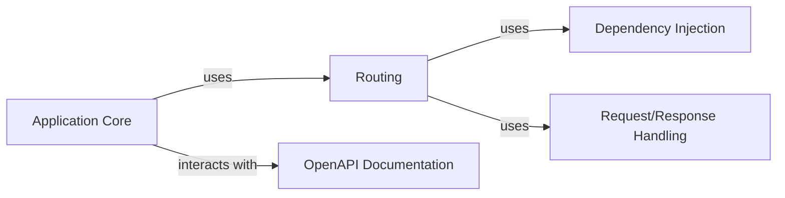

## Details

Final Architecture Analysis for `fastapi` Based on the provided information, here's a refined component breakdown for FastAPI, aiming for simplicity and clarity: 1. Application Core * Description: The central component responsible for application lifecycle management (startup, shutdown), configuration, and overall orchestration. It serves as the entry point for the FastAPI application. * Source Files: `fastapi.applications.FastAPI` * Responsibilities:     * Initialization of the FastAPI application.     * Configuration management.     * Event handling (startup, shutdown).     * Integration with the routing and OpenAPI components. 2. Routing * Description: Handles the mapping of incoming HTTP requests to the appropriate handler functions (path operations). * Source Files: `fastapi.routing.APIRouter`, `fastapi.routing.APIRoute` * Responsibilities:     * Defining API endpoints (routes).     * Associating routes with handler functions.     * Dispatching requests to the correct handler.     * Managing request methods (GET, POST, etc.). 3. Dependency Injection * Description: Manages the resolution and injection of dependencies required by path operation functions. * Source Files: `fastapi.dependencies.utils` * Responsibilities:     * Resolving dependencies for handler functions.     * Managing dependency scopes and lifecycles.     * Injecting dependencies into handler functions. 4. Request/Response Handling * Description: Handles the parsing of incoming HTTP requests and the serialization/formatting of responses. * Source Files: `fastapi.requests`, `fastapi.responses`, `fastapi.encoders`, `fastapi.params` * Responsibilities:     * Parsing request data (path, query parameters, headers, body).     * Validating request data.     * Serializing response data.     * Setting HTTP status codes and headers. 5. OpenAPI Documentation * Description: Generates the OpenAPI schema for the API, enabling documentation and client generation. * Source Files: `fastapi.openapi.utils`, `fastapi.openapi.docs` * Responsibilities:     * Generating the OpenAPI schema.     * Providing documentation endpoints (Swagger UI, ReDoc). Relationships: * Application Core uses Routing to map requests to handlers. * Application Core interacts with OpenAPI Documentation to generate API documentation. * Routing uses Dependency Injection to resolve dependencies for handlers. * Routing uses Request/Response Handling to parse requests and format responses. This simplified architecture highlights the core components and their interactions within FastAPI.

### Application Core [[Expand]](./Application_Core.md)
The central component responsible for application lifecycle management (startup, shutdown), configuration, and overall orchestration. It serves as the entry point for the FastAPI application.

**Related Classes/Methods**: _None_

### Routing [[Expand]](./Routing.md)
Handles the mapping of incoming HTTP requests to the appropriate handler functions (path operations).

**Related Classes/Methods**: _None_

### Dependency Injection [[Expand]](./Dependency_Injection.md)
Manages the resolution and injection of dependencies required by path operation functions.

**Related Classes/Methods**: _None_

### Request/Response Handling
Handles the parsing of incoming HTTP requests and the serialization/formatting of responses.

**Related Classes/Methods**: _None_

### OpenAPI Documentation [[Expand]](./OpenAPI_Documentation.md)
Generates the OpenAPI schema for the API, enabling documentation and client generation.

**Related Classes/Methods**: _None_

### [FAQ](https://github.com/CodeBoarding/GeneratedOnBoardings/tree/main?tab=readme-ov-file#faq)