```mermaid
graph LR
    API_Application_Core["API Application Core"]
    Request_Routing["Request Routing"]
    Dependency_Injection["Dependency Injection"]
    Request_Handling_and_Validation["Request Handling and Validation"]
    Response_Handling["Response Handling"]
    Exception_Management["Exception Management"]
    Security_and_Authentication["Security and Authentication"]
    OpenAPI_Documentation["OpenAPI Documentation"]
    API_Application_Core -- "Initializes and configures" --> Request_Routing
    Request_Routing -- "Handles request processing" --> Dependency_Injection
    Dependency_Injection -- "Injects dependencies into route handlers" --> Request_Handling_and_Validation
    Request_Handling_and_Validation -- "Defines and validates request parameters" --> Request_Routing
    Request_Routing -- "Serializes responses from route handlers" --> Response_Handling
    Request_Routing -- "Handles exceptions during request processing" --> Exception_Management
    API_Application_Core -- "Generates OpenAPI schema from routes" --> OpenAPI_Documentation
    Security_and_Authentication -- "Integrates with dependency injection for authentication" --> Dependency_Injection
    Request_Routing -- "Uses for authentication and authorization" --> Security_and_Authentication
    click API_Application_Core href "https://github.com/CodeBoarding/GeneratedOnBoardings/blob/main/fastapi/API Application Core.md" "Details"
    click Request_Routing href "https://github.com/CodeBoarding/GeneratedOnBoardings/blob/main/fastapi/Request Routing.md" "Details"
    click Dependency_Injection href "https://github.com/CodeBoarding/GeneratedOnBoardings/blob/main/fastapi/Dependency Injection.md" "Details"
    click Request_Handling_and_Validation href "https://github.com/CodeBoarding/GeneratedOnBoardings/blob/main/fastapi/Request Handling and Validation.md" "Details"
    click Response_Handling href "https://github.com/CodeBoarding/GeneratedOnBoardings/blob/main/fastapi/Response Handling.md" "Details"
    click Exception_Management href "https://github.com/CodeBoarding/GeneratedOnBoardings/blob/main/fastapi/Exception Management.md" "Details"
    click Security_and_Authentication href "https://github.com/CodeBoarding/GeneratedOnBoardings/blob/main/fastapi/Security and Authentication.md" "Details"
    click OpenAPI_Documentation href "https://github.com/CodeBoarding/GeneratedOnBoardings/blob/main/fastapi/OpenAPI Documentation.md" "Details"
```

## Component Details

FastAPI is a modern, high-performance web framework for building APIs with Python. The framework is built around asynchronous programming and leverages type hints for increased code clarity and validation. It provides features for request handling, routing, dependency injection, data validation, and automatic API documentation generation using OpenAPI and JSON Schema. The core flow involves receiving HTTP requests, routing them to the appropriate handler function, resolving dependencies, validating request data, processing the request, serializing the response, and returning it to the client. FastAPI also includes robust exception handling and security features.

### API Application Core
This component represents the core FastAPI application instance. It is responsible for initializing the application, configuring middleware, setting up exception handlers, and managing the overall lifecycle of the API. It serves as the central point for integrating all other components and orchestrating the request processing pipeline.
- **Related Classes/Methods**:

- <a href="https://github.com/fastapi/fastapi/blob/master/fastapi/applications.py#L64-L964" target="_blank" rel="noopener noreferrer">`fastapi.fastapi.applications.FastAPI:__init__` (64:964)</a>
- <a href="https://github.com/fastapi/fastapi/blob/master/fastapi/applications.py#L998-L1049" target="_blank" rel="noopener noreferrer">`fastapi.fastapi.applications.FastAPI:setup` (998:1049)</a>
- <a href="https://github.com/fastapi/fastapi/blob/master/fastapi/applications.py#L1255-L1458" target="_blank" rel="noopener noreferrer">`fastapi.fastapi.applications.FastAPI:include_router` (1255:1458)</a>
- <a href="https://github.com/fastapi/fastapi/blob/master/fastapi/applications.py#L1056-L1113" target="_blank" rel="noopener noreferrer">`fastapi.fastapi.applications.FastAPI:add_api_route` (1056:1113)</a>
- <a href="https://github.com/fastapi/fastapi/blob/master/fastapi/applications.py#L1175-L1188" target="_blank" rel="noopener noreferrer">`fastapi.fastapi.applications.FastAPI:add_api_websocket_route` (1175:1188)</a>
- <a href="https://github.com/fastapi/fastapi/blob/master/fastapi/applications.py#L1115-L1173" target="_blank" rel="noopener noreferrer">`fastapi.fastapi.applications.FastAPI:api_route` (1115:1173)</a>
- <a href="https://github.com/fastapi/fastapi/blob/master/fastapi/applications.py#L1190-L1253" target="_blank" rel="noopener noreferrer">`fastapi.fastapi.applications.FastAPI:websocket` (1190:1253)</a>
- <a href="https://github.com/fastapi/fastapi/blob/master/fastapi/applications.py#L4476-L4495" target="_blank" rel="noopener noreferrer">`fastapi.fastapi.applications.FastAPI:on_event` (4476:4495)</a>
- <a href="https://github.com/fastapi/fastapi/blob/master/fastapi/applications.py#L966-L996" target="_blank" rel="noopener noreferrer">`fastapi.fastapi.applications.FastAPI:openapi` (966:996)</a>

### Request Routing
This component is responsible for mapping incoming HTTP requests to the appropriate handler functions based on the request path and HTTP method. It uses the APIRouter to define and group routes, and it manages the execution of route handlers. It also handles the serialization of responses and the generation of OpenAPI documentation.
- **Related Classes/Methods**:

- <a href="https://github.com/fastapi/fastapi/blob/master/fastapi/routing.py#L622-L860" target="_blank" rel="noopener noreferrer">`fastapi.fastapi.routing.APIRouter:__init__` (622:860)</a>
- <a href="https://github.com/fastapi/fastapi/blob/master/fastapi/routing.py#L881-L961" target="_blank" rel="noopener noreferrer">`fastapi.fastapi.routing.APIRouter:add_api_route` (881:961)</a>
- <a href="https://github.com/fastapi/fastapi/blob/master/fastapi/routing.py#L963-L1023" target="_blank" rel="noopener noreferrer">`fastapi.fastapi.routing.APIRouter:api_route` (963:1023)</a>
- <a href="https://github.com/fastapi/fastapi/blob/master/fastapi/routing.py#L1025-L1044" target="_blank" rel="noopener noreferrer">`fastapi.fastapi.routing.APIRouter:add_api_websocket_route` (1025:1044)</a>
- <a href="https://github.com/fastapi/fastapi/blob/master/fastapi/routing.py#L1046-L1111" target="_blank" rel="noopener noreferrer">`fastapi.fastapi.routing.APIRouter:websocket` (1046:1111)</a>
- <a href="https://github.com/fastapi/fastapi/blob/master/fastapi/routing.py#L1122-L1364" target="_blank" rel="noopener noreferrer">`fastapi.fastapi.routing.APIRouter:include_router` (1122:1364)</a>
- <a href="https://github.com/fastapi/fastapi/blob/master/fastapi/routing.py#L429-L569" target="_blank" rel="noopener noreferrer">`fastapi.fastapi.routing.APIRoute:__init__` (429:569)</a>
- <a href="https://github.com/fastapi/fastapi/blob/master/fastapi/routing.py#L571-L586" target="_blank" rel="noopener noreferrer">`fastapi.fastapi.routing.APIRoute:get_route_handler` (571:586)</a>
- <a href="https://github.com/fastapi/fastapi/blob/master/fastapi/routing.py#L389-L419" target="_blank" rel="noopener noreferrer">`fastapi.fastapi.routing.APIWebSocketRoute:__init__` (389:419)</a>
- <a href="https://github.com/fastapi/fastapi/blob/master/fastapi/routing.py#L143-L201" target="_blank" rel="noopener noreferrer">`fastapi.fastapi.routing:serialize_response` (143:201)</a>
- <a href="https://github.com/fastapi/fastapi/blob/master/fastapi/routing.py#L79-L123" target="_blank" rel="noopener noreferrer">`fastapi.fastapi.routing:_prepare_response_content` (79:123)</a>

### Dependency Injection
This component implements the dependency injection system, which allows developers to declare dependencies for their API endpoints. It resolves these dependencies and injects them into the handler functions, managing their lifecycle. This promotes code reusability, testability, and maintainability.
- **Related Classes/Methods**:

- <a href="https://github.com/fastapi/fastapi/blob/master/fastapi/dependencies/utils.py#L265-L314" target="_blank" rel="noopener noreferrer">`fastapi.fastapi.dependencies.utils:get_dependant` (265:314)</a>
- <a href="https://github.com/fastapi/fastapi/blob/master/fastapi/dependencies/utils.py#L572-L695" target="_blank" rel="noopener noreferrer">`fastapi.fastapi.dependencies.utils:solve_dependencies` (572:695)</a>
- <a href="https://github.com/fastapi/fastapi/blob/master/fastapi/dependencies/utils.py#L553-L560" target="_blank" rel="noopener noreferrer">`fastapi.fastapi.dependencies.utils:solve_generator` (553:560)</a>

### Request Handling and Validation
This component is responsible for processing incoming HTTP requests, including parsing request parameters, validating data, and handling request bodies. It uses Pydantic models for data validation and provides mechanisms for defining and validating request parameters using Path, Query, Header, Cookie, and Body parameters.
- **Related Classes/Methods**:

- <a href="https://github.com/fastapi/fastapi/blob/master/fastapi/params.py#L142-L222" target="_blank" rel="noopener noreferrer">`fastapi.fastapi.params.Path:__init__` (142:222)</a>
- <a href="https://github.com/fastapi/fastapi/blob/master/fastapi/params.py#L228-L306" target="_blank" rel="noopener noreferrer">`fastapi.fastapi.params.Query:__init__` (228:306)</a>
- <a href="https://github.com/fastapi/fastapi/blob/master/fastapi/params.py#L312-L392" target="_blank" rel="noopener noreferrer">`fastapi.fastapi.params.Header:__init__` (312:392)</a>
- <a href="https://github.com/fastapi/fastapi/blob/master/fastapi/params.py#L398-L476" target="_blank" rel="noopener noreferrer">`fastapi.fastapi.params.Cookie:__init__` (398:476)</a>
- <a href="https://github.com/fastapi/fastapi/blob/master/fastapi/params.py#L597-L677" target="_blank" rel="noopener noreferrer">`fastapi.fastapi.params.Form:__init__` (597:677)</a>
- <a href="https://github.com/fastapi/fastapi/blob/master/fastapi/params.py#L681-L761" target="_blank" rel="noopener noreferrer">`fastapi.fastapi.params.File:__init__` (681:761)</a>

### Response Handling
This component handles the serialization of responses, converting Python objects into JSON or other formats suitable for sending back to the client. It uses the jsonable_encoder function to encode data and manages response validation, ensuring that the data returned to the client is correctly formatted and adheres to the expected schema.
- **Related Classes/Methods**:

- <a href="https://github.com/fastapi/fastapi/blob/master/fastapi/encoders.py#L102-L343" target="_blank" rel="noopener noreferrer">`fastapi.fastapi.encoders:jsonable_encoder` (102:343)</a>

### Exception Management
This component provides mechanisms for catching and handling exceptions raised during request processing. It includes default exception handlers for HTTP exceptions and request validation errors, and it allows customization of exception handling logic. This ensures that errors are handled gracefully and informative error responses are returned to the client.
- **Related Classes/Methods**:

- <a href="https://github.com/fastapi/fastapi/blob/master/fastapi/exception_handlers.py#L11-L17" target="_blank" rel="noopener noreferrer">`fastapi.fastapi.exception_handlers:http_exception_handler` (11:17)</a>
- <a href="https://github.com/fastapi/fastapi/blob/master/fastapi/exception_handlers.py#L20-L26" target="_blank" rel="noopener noreferrer">`fastapi.fastapi.exception_handlers:request_validation_exception_handler` (20:26)</a>
- <a href="https://github.com/fastapi/fastapi/blob/master/fastapi/exceptions.py#L158-L160" target="_blank" rel="noopener noreferrer">`fastapi.fastapi.exceptions.RequestValidationError:__init__` (158:160)</a>
- <a href="https://github.com/fastapi/fastapi/blob/master/fastapi/exceptions.py#L168-L170" target="_blank" rel="noopener noreferrer">`fastapi.fastapi.exceptions.ResponseValidationError:__init__` (168:170)</a>

### Security and Authentication
This component provides security features, including authentication and authorization mechanisms. It includes classes for API key authentication, HTTP authentication (Basic, Bearer), and OAuth2. It integrates with the dependency injection system to enforce security requirements, ensuring that only authorized users can access protected resources.
- **Related Classes/Methods**:

- <a href="https://github.com/fastapi/fastapi/blob/master/fastapi/security/http.py#L70-L80" target="_blank" rel="noopener noreferrer">`fastapi.fastapi.security.http.HTTPBase:__init__` (70:80)</a>
- <a href="https://github.com/fastapi/fastapi/blob/master/fastapi/security/http.py#L82-L94" target="_blank" rel="noopener noreferrer">`fastapi.fastapi.security.http.HTTPBase:__call__` (82:94)</a>
- <a href="https://github.com/fastapi/fastapi/blob/master/fastapi/security/http.py#L130-L185" target="_blank" rel="noopener noreferrer">`fastapi.fastapi.security.http.HTTPBasic:__init__` (130:185)</a>
- <a href="https://github.com/fastapi/fastapi/blob/master/fastapi/security/http.py#L187-L217" target="_blank" rel="noopener noreferrer">`fastapi.fastapi.security.http.HTTPBasic:__call__` (187:217)</a>
- <a href="https://github.com/fastapi/fastapi/blob/master/fastapi/security/http.py#L252-L299" target="_blank" rel="noopener noreferrer">`fastapi.fastapi.security.http.HTTPBearer:__init__` (252:299)</a>
- <a href="https://github.com/fastapi/fastapi/blob/master/fastapi/security/http.py#L301-L321" target="_blank" rel="noopener noreferrer">`fastapi.fastapi.security.http.HTTPBearer:__call__` (301:321)</a>
- <a href="https://github.com/fastapi/fastapi/blob/master/fastapi/security/api_key.py#L55-L108" target="_blank" rel="noopener noreferrer">`fastapi.fastapi.security.api_key.APIKeyQuery:__init__` (55:108)</a>
- <a href="https://github.com/fastapi/fastapi/blob/master/fastapi/security/api_key.py#L110-L112" target="_blank" rel="noopener noreferrer">`fastapi.fastapi.security.api_key.APIKeyQuery:__call__` (110:112)</a>
- <a href="https://github.com/fastapi/fastapi/blob/master/fastapi/security/api_key.py#L147-L196" target="_blank" rel="noopener noreferrer">`fastapi.fastapi.security.api_key.APIKeyHeader:__init__` (147:196)</a>
- <a href="https://github.com/fastapi/fastapi/blob/master/fastapi/security/api_key.py#L198-L200" target="_blank" rel="noopener noreferrer">`fastapi.fastapi.security.api_key.APIKeyHeader:__call__` (198:200)</a>
- <a href="https://github.com/fastapi/fastapi/blob/master/fastapi/security/api_key.py#L235-L284" target="_blank" rel="noopener noreferrer">`fastapi.fastapi.security.api_key.APIKeyCookie:__init__` (235:284)</a>
- <a href="https://github.com/fastapi/fastapi/blob/master/fastapi/security/api_key.py#L286-L288" target="_blank" rel="noopener noreferrer">`fastapi.fastapi.security.api_key.APIKeyCookie:__call__` (286:288)</a>
- <a href="https://github.com/fastapi/fastapi/blob/master/fastapi/security/oauth2.py#L400-L471" target="_blank" rel="noopener noreferrer">`fastapi.fastapi.security.oauth2.OAuth2PasswordBearer:__init__` (400:471)</a>
- <a href="https://github.com/fastapi/fastapi/blob/master/fastapi/security/oauth2.py#L473-L485" target="_blank" rel="noopener noreferrer">`fastapi.fastapi.security.oauth2.OAuth2PasswordBearer:__call__` (473:485)</a>

### OpenAPI Documentation
This component is responsible for generating the OpenAPI schema for the API. It extracts information about API endpoints, request parameters, and response models to generate the OpenAPI specification, which can be used for documentation and client generation. It allows developers to easily document their APIs and provide a standardized interface for clients to interact with them.
- **Related Classes/Methods**:

- <a href="https://github.com/fastapi/fastapi/blob/master/fastapi/openapi/utils.py#L477-L569" target="_blank" rel="noopener noreferrer">`fastapi.fastapi.openapi.utils:get_openapi` (477:569)</a>