## FastAPI Data Flow Overview

FastAPI is a modern, high-performance web framework for building APIs with Python. It leverages standard Python type hints to simplify development and provide automatic data validation and serialization. FastAPI is built on top of Starlette and Pydantic, offering features like asynchronous request handling, dependency injection, and automatic OpenAPI documentation.

```mermaid
graph LR
    A["Client Request"] --> B("FastAPI Application")
    B -- Receives --> C{"Routing"}
    C -- Determines Endpoint --> D["Dependency Injection"]
    D -- Resolves Dependencies --> E("Path Operation Function")
    E -- Processes Request --> F["Request and Response Handling"]
    F -- Validates & Serializes --> G("Response")
    G -- Generates --> H["OpenAPI Schema Generation"]
    H -- Provides Schema --> I("Documentation/Clients")
    F -- Sends --> B
    B -- Returns --> A

click A href "https://github.com/CodeBoarding/GeneratedOnBoardings/blob/main/fastapi//Request%20and%20Response%20Handling.md"
click B href "https://github.com/CodeBoarding/GeneratedOnBoardings/blob/main/fastapi//FastAPI%20Application.md"
click C href "https://github.com/CodeBoarding/GeneratedOnBoardings/blob/main/fastapi//Routing.md"
click D href "https://github.com/CodeBoarding/GeneratedOnBoardings/blob/main/fastapi//Dependency%20Injection.md"
click E href "https://github.com/CodeBoarding/GeneratedOnBoardings/blob/main/fastapi//Request%20and%20Response%20Handling.md"
click F href "https://github.com/CodeBoarding/GeneratedOnBoardings/blob/main/fastapi//Request%20and%20Response%20Handling.md"
click G href "https://github.com/CodeBoarding/GeneratedOnBoardings/blob/main/fastapi//OpenAPI%20Schema%20Generation.md"
click H href "https://github.com/CodeBoarding/GeneratedOnBoardings/blob/main/fastapi//OpenAPI%20Schema%20Generation.md"
click I href "https://github.com/CodeBoarding/GeneratedOnBoardings/blob/main/fastapi//OpenAPI%20Schema%20Generation.md"

```

## Component Descriptions

**1. FastAPI Application:** This is the core of the FastAPI framework. It inherits from Starlette and is responsible for managing the application's lifecycle, including startup, shutdown, and middleware configuration. It receives the initial client request and returns the final response after processing.

**2. Routing:** The routing component maps incoming HTTP requests to the appropriate path operation functions based on the URL path and HTTP method. It determines which endpoint should handle the request and passes control to the dependency injection system.

**3. Dependency Injection:** This component manages the resolution and injection of dependencies into path operation functions. It ensures that the required dependencies are available before the path operation function is executed, promoting modularity and testability. It receives the endpoint information from the Routing component and provides the resolved dependencies to the Path Operation Function.

**4. Request and Response Handling:** This component handles the processing of incoming requests and the generation of outgoing responses. It extracts and validates request data, serializes response data, and sets appropriate HTTP headers. It receives data from the Path Operation Function and sends the processed data back to the FastAPI Application.

**5. OpenAPI Schema Generation:** This component automatically generates the OpenAPI schema for the API based on the defined path operation functions and data models. This schema is used for generating interactive API documentation and client SDKs. It receives information from the Request and Response Handling component to generate the schema and provides the schema to documentation or clients.