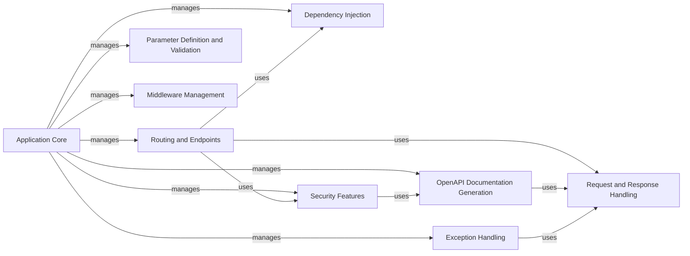

## Component Details

FastAPI is a modern, high-performance web framework for building APIs with Python. It leverages type hints to provide automatic data validation, serialization, and documentation. The framework is built on top of Starlette and Pydantic, offering a robust and efficient platform for developing web applications and APIs.

### Application Core
The central component responsible for initializing, configuring, and managing the FastAPI application. It handles the overall structure and lifecycle of the API, integrating routing, middleware, exception handling, and other core functionalities.
- **Related Classes/Methods**: `fastapi/applications.py`

### Routing and Endpoints
This component manages the routing of incoming HTTP requests to the appropriate endpoint functions. It defines the API endpoints and their associated handlers, supporting various HTTP methods, path parameters, and dependencies. It connects the incoming requests to the correct function to handle them.
- **Related Classes/Methods**: `fastapi/routing.py`

### Request and Response Handling
This component is responsible for managing incoming HTTP requests and creating HTTP responses. It includes parsing request parameters, validating request bodies, handling file uploads, setting response headers, cookies, and status codes. It ensures that requests are properly processed and responses are correctly formatted.
- **Related Classes/Methods**: `fastapi/requests.py`, `fastapi/responses.py`

### Dependency Injection
This component provides a mechanism for injecting dependencies into endpoint functions, allowing for reusable and testable code. It manages the creation and resolution of dependencies, promoting modularity and maintainability.
- **Related Classes/Methods**: `fastapi/dependencies/utils.py`, `fastapi/dependencies/models.py`

### Security Features
This component provides security features for protecting APIs, including authentication and authorization. It supports various security schemes, such as HTTP Basic, HTTP Bearer, OAuth2, and API keys, ensuring that only authorized users can access protected resources.
- **Related Classes/Methods**: `fastapi/security/base.py`, `fastapi/security/http.py`, `fastapi/security/oauth2.py`, `fastapi/security/api_key.py`, `fastapi/security/open_id_connect_url.py`

### OpenAPI Documentation Generation
This component generates OpenAPI documentation for APIs, allowing for easy discovery and testing of endpoints. It creates and serves the OpenAPI schema and Swagger UI, providing a user-friendly interface for exploring the API.
- **Related Classes/Methods**: `fastapi/openapi/utils.py`, `fastapi/openapi/docs.py`, `fastapi/openapi/models.py`

### Parameter Definition and Validation
This component defines the functions to be used when declaring parameters in path operations, like `Query`, `Path`, `Body`, etc. It also handles the validation of these parameters, ensuring that the data received by the API is valid and consistent.
- **Related Classes/Methods**: `fastapi/param_functions.py`, `fastapi/params.py`

### Exception Handling
This component handles exceptions raised during request processing, including validation errors and HTTP exceptions. It provides a mechanism for defining custom exception handlers, allowing developers to gracefully handle errors and provide informative error messages to clients.
- **Related Classes/Methods**: `fastapi/exception_handlers.py`, `fastapi/exceptions.py`

### Middleware Management
This component provides a mechanism for intercepting and processing HTTP requests and responses. It supports various middleware types, such as CORS, GZip, and HTTPS redirect, enabling developers to add custom logic to the request-response cycle.
- **Related Classes/Methods**: `fastapi/middleware/cors.py`, `fastapi/middleware/gzip.py`, `fastapi/middleware/httpsredirect.py`, `fastapi/middleware/trustedhost.py`, `fastapi/middleware/wsgi.py`, `fastapi/middleware.py`