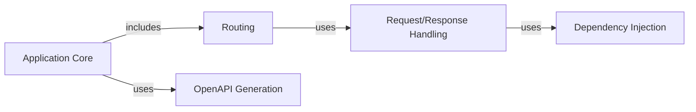

## Details

Simplified high-level overview of FastAPI's architecture.

### Application Core [[Expand]](./Application_Core.md)
The central component responsible for initializing and coordinating the entire FastAPI application. It manages the application lifecycle, includes routers, and configures middleware.

**Related Classes/Methods**: _None_

### Routing [[Expand]](./Routing.md)
Maps incoming HTTP requests to the appropriate endpoint handler functions. It defines the API's URL structure and request methods.

**Related Classes/Methods**: _None_

### Request/Response Handling [[Expand]](./Request_Response_Handling.md)
Handles the processing of incoming requests and the generation of outgoing responses. This includes parsing request data, validating parameters, serializing response data, and managing HTTP status codes.

**Related Classes/Methods**: _None_

### Dependency Injection [[Expand]](./Dependency_Injection.md)
Manages the creation and injection of dependencies into endpoint handlers. This promotes loose coupling and testability.

**Related Classes/Methods**: _None_

### OpenAPI Generation [[Expand]](./OpenAPI_Generation.md)
Automatically generates OpenAPI specifications for the API, enabling interactive documentation and client code generation.

**Related Classes/Methods**: _None_

### [FAQ](https://github.com/CodeBoarding/GeneratedOnBoardings/tree/main?tab=readme-ov-file#faq)