```mermaid
graph LR
    Application_Core["Application Core"]
    Routing_Endpoint_Management["Routing & Endpoint Management"]
    Dependency_Injection_System["Dependency Injection System"]
    Parameter_Body_Handling["Parameter & Body Handling"]
    Security_Authentication["Security & Authentication"]
    OpenAPI_Documentation_Generation["OpenAPI Documentation Generation"]
    Response_Serialization_Encoding["Response Serialization & Encoding"]
    Exception_Error_Handling["Exception & Error Handling"]
    Internal_Utilities_Compatibility["Internal Utilities & Compatibility"]
    Application_Core -- "initializes with" --> Routing_Endpoint_Management
    Application_Core -- "generates" --> OpenAPI_Documentation_Generation
    Application_Core -- "registers" --> Exception_Error_Handling
    Application_Core -- "configures" --> Security_Authentication
    Application_Core -- "uses" --> Internal_Utilities_Compatibility
    Routing_Endpoint_Management -- "contains" --> Parameter_Body_Handling
    Routing_Endpoint_Management -- "uses" --> Dependency_Injection_System
    Routing_Endpoint_Management -- "uses" --> Response_Serialization_Encoding
    Routing_Endpoint_Management -- "raises/handles" --> Exception_Error_Handling
    Routing_Endpoint_Management -- "relies on" --> Internal_Utilities_Compatibility
    Dependency_Injection_System -- "processes" --> Parameter_Body_Handling
    Dependency_Injection_System -- "integrates" --> Security_Authentication
    Dependency_Injection_System -- "provides values to" --> Routing_Endpoint_Management
    Dependency_Injection_System -- "relies on" --> Internal_Utilities_Compatibility
    Parameter_Body_Handling -- "defines inputs for" --> Dependency_Injection_System
    Parameter_Body_Handling -- "used by" --> OpenAPI_Documentation_Generation
    Parameter_Body_Handling -- "relies on" --> Internal_Utilities_Compatibility
    Security_Authentication -- "are used by" --> Dependency_Injection_System
    Security_Authentication -- "contributes to" --> OpenAPI_Documentation_Generation
    OpenAPI_Documentation_Generation -- "inspects" --> Routing_Endpoint_Management
    OpenAPI_Documentation_Generation -- "uses" --> Dependency_Injection_System
    OpenAPI_Documentation_Generation -- "uses" --> Parameter_Body_Handling
    OpenAPI_Documentation_Generation -- "uses" --> Security_Authentication
    OpenAPI_Documentation_Generation -- "relies on" --> Internal_Utilities_Compatibility
    Response_Serialization_Encoding -- "is used by" --> Routing_Endpoint_Management
    Response_Serialization_Encoding -- "is used by" --> Exception_Error_Handling
    Exception_Error_Handling -- "receives from" --> Routing_Endpoint_Management
    Exception_Error_Handling -- "uses" --> Response_Serialization_Encoding
    Internal_Utilities_Compatibility -- "supports" --> Application_Core
    Internal_Utilities_Compatibility -- "supports" --> Routing_Endpoint_Management
    Internal_Utilities_Compatibility -- "supports" --> Dependency_Injection_System
    Internal_Utilities_Compatibility -- "supports" --> Parameter_Body_Handling
    Internal_Utilities_Compatibility -- "supports" --> OpenAPI_Documentation_Generation
    Internal_Utilities_Compatibility -- "supports" --> Response_Serialization_Encoding
    Internal_Utilities_Compatibility -- "supports" --> Exception_Error_Handling
    click Application_Core href "https://github.com/CodeBoarding/GeneratedOnBoardings/blob/main/fastapi/Application Core.md" "Details"
    click Routing_Endpoint_Management href "https://github.com/CodeBoarding/GeneratedOnBoardings/blob/main/fastapi/Routing & Endpoint Management.md" "Details"
    click Dependency_Injection_System href "https://github.com/CodeBoarding/GeneratedOnBoardings/blob/main/fastapi/Dependency Injection System.md" "Details"
    click Parameter_Body_Handling href "https://github.com/CodeBoarding/GeneratedOnBoardings/blob/main/fastapi/Parameter & Body Handling.md" "Details"
    click Security_Authentication href "https://github.com/CodeBoarding/GeneratedOnBoardings/blob/main/fastapi/Security & Authentication.md" "Details"
    click OpenAPI_Documentation_Generation href "https://github.com/CodeBoarding/GeneratedOnBoardings/blob/main/fastapi/OpenAPI Documentation Generation.md" "Details"
    click Response_Serialization_Encoding href "https://github.com/CodeBoarding/GeneratedOnBoardings/blob/main/fastapi/Response Serialization & Encoding.md" "Details"
    click Exception_Error_Handling href "https://github.com/CodeBoarding/GeneratedOnBoardings/blob/main/fastapi/Exception & Error Handling.md" "Details"
    click Internal_Utilities_Compatibility href "https://github.com/CodeBoarding/GeneratedOnBoardings/blob/main/fastapi/Internal Utilities & Compatibility.md" "Details"
```

## Component Details

The FastAPI architecture is centered around the `Application Core`, which orchestrates the web application's lifecycle, routing, and global configurations. It leverages `Routing & Endpoint Management` to define and dispatch API requests, with `Dependency Injection System` handling the resolution of function parameters and `Parameter & Body Handling` managing input data. `Security & Authentication` mechanisms are integrated via the dependency system. `OpenAPI Documentation Generation` automatically creates API specifications, while `Response Serialization & Encoding` ensures proper data formatting for responses. `Exception & Error Handling` provides robust error management, and `Internal Utilities & Compatibility` offers foundational support across various components.

### Application Core
The central FastAPI application class responsible for initializing the web application, registering routes, setting up global middleware and exception handlers, and managing the application's lifecycle. It acts as the orchestrator for the entire API.

**Related Classes/Methods**:

- <a href="https://github.com/fastapi/fastapi/blob/master/fastapi/applications.py#L48-L4585" target="_blank" rel="noopener noreferrer">`fastapi.fastapi.applications.FastAPI` (48:4585)</a>
- <a href="https://github.com/fastapi/fastapi/blob/master/fastapi/applications.py#L64-L964" target="_blank" rel="noopener noreferrer">`fastapi.fastapi.applications.FastAPI.__init__` (64:964)</a>
- <a href="https://github.com/fastapi/fastapi/blob/master/fastapi/applications.py#L966-L996" target="_blank" rel="noopener noreferrer">`fastapi.fastapi.applications.FastAPI.openapi` (966:996)</a>
- <a href="https://github.com/fastapi/fastapi/blob/master/fastapi/applications.py#L998-L1049" target="_blank" rel="noopener noreferrer">`fastapi.fastapi.applications.FastAPI.setup` (998:1049)</a>
- <a href="https://github.com/fastapi/fastapi/blob/master/fastapi/applications.py#L1056-L1113" target="_blank" rel="noopener noreferrer">`fastapi.fastapi.applications.FastAPI.add_api_route` (1056:1113)</a>
- <a href="https://github.com/fastapi/fastapi/blob/master/fastapi/applications.py#L1255-L1458" target="_blank" rel="noopener noreferrer">`fastapi.fastapi.applications.FastAPI.include_router` (1255:1458)</a>
- <a href="https://github.com/fastapi/fastapi/blob/master/fastapi/applications.py#L4540-L4585" target="_blank" rel="noopener noreferrer">`fastapi.fastapi.applications.FastAPI.exception_handler` (4540:4585)</a>

### Routing & Endpoint Management
Manages the definition, matching, and dispatching of API routes (HTTP and WebSocket). It processes incoming requests, extracts parameters, invokes the appropriate endpoint function, and prepares the response.

**Related Classes/Methods**:

- <a href="https://github.com/fastapi/fastapi/blob/master/fastapi/routing.py#L595-L4439" target="_blank" rel="noopener noreferrer">`fastapi.fastapi.routing.APIRouter` (595:4439)</a>
- <a href="https://github.com/fastapi/fastapi/blob/master/fastapi/routing.py#L428-L592" target="_blank" rel="noopener noreferrer">`fastapi.fastapi.routing.APIRoute` (428:592)</a>
- <a href="https://github.com/fastapi/fastapi/blob/master/fastapi/routing.py#L388-L425" target="_blank" rel="noopener noreferrer">`fastapi.fastapi.routing.APIWebSocketRoute` (388:425)</a>
- <a href="https://github.com/fastapi/fastapi/blob/master/fastapi/routing.py#L217-L357" target="_blank" rel="noopener noreferrer">`fastapi.fastapi.routing.get_request_handler` (217:357)</a>
- <a href="https://github.com/fastapi/fastapi/blob/master/fastapi/routing.py#L360-L385" target="_blank" rel="noopener noreferrer">`fastapi.fastapi.routing.get_websocket_app` (360:385)</a>
- <a href="https://github.com/fastapi/fastapi/blob/master/fastapi/routing.py#L143-L201" target="_blank" rel="noopener noreferrer">`fastapi.fastapi.routing.serialize_response` (143:201)</a>
- <a href="https://github.com/fastapi/fastapi/blob/master/fastapi/routing.py#L79-L123" target="_blank" rel="noopener noreferrer">`fastapi.fastapi.routing._prepare_response_content` (79:123)</a>

### Dependency Injection System
Provides the core mechanism for resolving and injecting dependencies into path operations. It analyzes function parameters, retrieves values from the request, and handles complex dependency types including generators and security.

**Related Classes/Methods**:

- <a href="https://github.com/fastapi/fastapi/blob/master/fastapi/dependencies/utils.py#L572-L695" target="_blank" rel="noopener noreferrer">`fastapi.fastapi.dependencies.utils.solve_dependencies` (572:695)</a>
- <a href="https://github.com/fastapi/fastapi/blob/master/fastapi/dependencies/utils.py#L265-L314" target="_blank" rel="noopener noreferrer">`fastapi.fastapi.dependencies.utils.get_dependant` (265:314)</a>
- <a href="https://github.com/fastapi/fastapi/blob/master/fastapi/dependencies/utils.py#L348-L511" target="_blank" rel="noopener noreferrer">`fastapi.fastapi.dependencies.utils.analyze_param` (348:511)</a>
- <a href="https://github.com/fastapi/fastapi/blob/master/fastapi/dependencies/utils.py#L553-L560" target="_blank" rel="noopener noreferrer">`fastapi.fastapi.dependencies.utils.solve_generator` (553:560)</a>
- <a href="https://github.com/fastapi/fastapi/blob/master/fastapi/dependencies/models.py#L15-L37" target="_blank" rel="noopener noreferrer">`fastapi.dependencies.models.Dependant` (15:37)</a>
- <a href="https://github.com/fastapi/fastapi/blob/master/fastapi/dependencies/models.py#L9-L11" target="_blank" rel="noopener noreferrer">`fastapi.dependencies.models.SecurityRequirement` (9:11)</a>

### Parameter & Body Handling
Defines and processes various types of input parameters (Path, Query, Header, Cookie) and handles the parsing of request bodies (JSON, Form, File uploads). It validates input data against defined schemas.

**Related Classes/Methods**:

- <a href="https://github.com/fastapi/fastapi/blob/master/fastapi/params.py#L139-L222" target="_blank" rel="noopener noreferrer">`fastapi.fastapi.params.Path` (139:222)</a>
- <a href="https://github.com/fastapi/fastapi/blob/master/fastapi/params.py#L225-L306" target="_blank" rel="noopener noreferrer">`fastapi.fastapi.params.Query` (225:306)</a>
- <a href="https://github.com/fastapi/fastapi/blob/master/fastapi/params.py#L309-L392" target="_blank" rel="noopener noreferrer">`fastapi.fastapi.params.Header` (309:392)</a>
- <a href="https://github.com/fastapi/fastapi/blob/master/fastapi/params.py#L395-L476" target="_blank" rel="noopener noreferrer">`fastapi.fastapi.params.Cookie` (395:476)</a>
- <a href="https://github.com/fastapi/fastapi/blob/master/fastapi/params.py#L479-L593" target="_blank" rel="noopener noreferrer">`fastapi.fastapi.params.Body` (479:593)</a>
- <a href="https://github.com/fastapi/fastapi/blob/master/fastapi/params.py#L596-L677" target="_blank" rel="noopener noreferrer">`fastapi.fastapi.params.Form` (596:677)</a>
- <a href="https://github.com/fastapi/fastapi/blob/master/fastapi/params.py#L680-L761" target="_blank" rel="noopener noreferrer">`fastapi.fastapi.params.File` (680:761)</a>
- <a href="https://github.com/fastapi/fastapi/blob/master/fastapi/dependencies/utils.py#L740-L816" target="_blank" rel="noopener noreferrer">`fastapi.fastapi.dependencies.utils.request_params_to_args` (740:816)</a>
- <a href="https://github.com/fastapi/fastapi/blob/master/fastapi/dependencies/utils.py#L884-L927" target="_blank" rel="noopener noreferrer">`fastapi.fastapi.dependencies.utils.request_body_to_args` (884:927)</a>
- <a href="https://github.com/fastapi/fastapi/blob/master/fastapi/dependencies/utils.py#L930-L980" target="_blank" rel="noopener noreferrer">`fastapi.fastapi.dependencies.utils.get_body_field` (930:980)</a>

### Security & Authentication
Provides classes and utilities for implementing various authentication and authorization mechanisms, such as HTTP Basic, Bearer, API Key, and OAuth2 flows. These are typically integrated as dependencies.

**Related Classes/Methods**:

- <a href="https://github.com/fastapi/fastapi/blob/master/fastapi/security/oauth2.py#L391-L485" target="_blank" rel="noopener noreferrer">`fastapi.fastapi.security.oauth2.OAuth2PasswordBearer` (391:485)</a>
- <a href="https://github.com/fastapi/fastapi/blob/master/fastapi/security/oauth2.py#L308-L388" target="_blank" rel="noopener noreferrer">`fastapi.fastapi.security.oauth2.OAuth2` (308:388)</a>
- <a href="https://github.com/fastapi/fastapi/blob/master/fastapi/security/base.py#L4-L6" target="_blank" rel="noopener noreferrer">`fastapi.security.base.SecurityBase` (4:6)</a>
- <a href="https://github.com/fastapi/fastapi/blob/master/fastapi/security/oauth2.py#L598-L638" target="_blank" rel="noopener noreferrer">`fastapi.security.oauth2.SecurityScopes` (598:638)</a>

### OpenAPI Documentation Generation
Generates the OpenAPI (Swagger) specification for the API, including endpoint details, parameter schemas, response models, and security definitions. It also provides the HTML for interactive documentation UIs.

**Related Classes/Methods**:

- <a href="https://github.com/fastapi/fastapi/blob/master/fastapi/openapi/utils.py#L477-L569" target="_blank" rel="noopener noreferrer">`fastapi.openapi.utils.get_openapi` (477:569)</a>
- <a href="https://github.com/fastapi/fastapi/blob/master/fastapi/openapi/utils.py#L78-L92" target="_blank" rel="noopener noreferrer">`fastapi.openapi.utils.get_openapi_security_definitions` (78:92)</a>
- <a href="https://github.com/fastapi/fastapi/blob/master/fastapi/openapi/utils.py#L95-L167" target="_blank" rel="noopener noreferrer">`fastapi.openapi.utils._get_openapi_operation_parameters` (95:167)</a>
- <a href="https://github.com/fastapi/fastapi/blob/master/fastapi/openapi/utils.py#L170-L204" target="_blank" rel="noopener noreferrer">`fastapi.openapi.utils.get_openapi_operation_request_body` (170:204)</a>
- <a href="https://github.com/fastapi/fastapi/blob/master/fastapi/openapi/utils.py#L446-L474" target="_blank" rel="noopener noreferrer">`fastapi.openapi.utils.get_fields_from_routes` (446:474)</a>
- <a href="https://github.com/fastapi/fastapi/blob/master/fastapi/openapi/docs.py#L26-L158" target="_blank" rel="noopener noreferrer">`fastapi.openapi.docs.get_swagger_ui_html` (26:158)</a>
- <a href="https://github.com/fastapi/fastapi/blob/master/fastapi/openapi/docs.py#L161-L253" target="_blank" rel="noopener noreferrer">`fastapi.openapi.docs.get_redoc_html` (161:253)</a>

### Response Serialization & Encoding
Converts Python objects, especially Pydantic models, into JSON-compatible data structures suitable for HTTP responses. It handles various serialization options like including/excluding fields and alias mapping.

**Related Classes/Methods**:

- <a href="https://github.com/fastapi/fastapi/blob/master/fastapi/encoders.py#L102-L343" target="_blank" rel="noopener noreferrer">`fastapi.fastapi.encoders.jsonable_encoder` (102:343)</a>
- <a href="https://github.com/fastapi/fastapi/blob/master/fastapi/routing.py#L143-L201" target="_blank" rel="noopener noreferrer">`fastapi.fastapi.routing.serialize_response` (143:201)</a>

### Exception & Error Handling
Manages the application's response to various exceptions, converting them into standardized HTTP error responses (e.g., 400 Bad Request, 422 Unprocessable Entity, 500 Internal Server Error).

**Related Classes/Methods**:

- <a href="https://github.com/fastapi/fastapi/blob/master/fastapi/exception_handlers.py#L11-L17" target="_blank" rel="noopener noreferrer">`fastapi.fastapi.exception_handlers.http_exception_handler` (11:17)</a>
- <a href="https://github.com/fastapi/fastapi/blob/master/fastapi/exception_handlers.py#L20-L26" target="_blank" rel="noopener noreferrer">`fastapi.fastapi.exception_handlers.request_validation_exception_handler` (20:26)</a>
- <a href="https://github.com/fastapi/fastapi/blob/master/fastapi/exception_handlers.py#L29-L34" target="_blank" rel="noopener noreferrer">`fastapi.fastapi.exception_handlers.websocket_request_validation_exception_handler` (29:34)</a>
- <a href="https://github.com/fastapi/fastapi/blob/master/fastapi/exceptions.py#L9-L65" target="_blank" rel="noopener noreferrer">`fastapi.exceptions.HTTPException` (9:65)</a>
- <a href="https://github.com/fastapi/fastapi/blob/master/fastapi/exceptions.py#L157-L160" target="_blank" rel="noopener noreferrer">`fastapi.exceptions.RequestValidationError` (157:160)</a>
- <a href="https://github.com/fastapi/fastapi/blob/master/fastapi/exceptions.py#L163-L164" target="_blank" rel="noopener noreferrer">`fastapi.exceptions.WebSocketRequestValidationError` (163:164)</a>

### Internal Utilities & Compatibility
A collection of internal helper functions, data structures, and compatibility layers that support the core functionality of FastAPI, particularly for Pydantic model manipulation, type introspection, and general utility operations.

**Related Classes/Methods**:

- <a href="https://github.com/fastapi/fastapi/blob/master/fastapi/utils.py#L63-L106" target="_blank" rel="noopener noreferrer">`fastapi.fastapi.utils.create_model_field` (63:106)</a>
- <a href="https://github.com/fastapi/fastapi/blob/master/fastapi/utils.py#L109-L161" target="_blank" rel="noopener noreferrer">`fastapi.fastapi.utils.create_cloned_field` (109:161)</a>
- <a href="https://github.com/fastapi/fastapi/blob/master/fastapi/utils.py#L187-L202" target="_blank" rel="noopener noreferrer">`fastapi.fastapi.utils.deep_dict_update` (187:202)</a>
- <a href="https://github.com/fastapi/fastapi/blob/master/fastapi/utils.py#L205-L220" target="_blank" rel="noopener noreferrer">`fastapi.fastapi.utils.get_value_or_default` (205:220)</a>
- <a href="https://github.com/fastapi/fastapi/blob/master/fastapi/utils.py#L42-L56" target="_blank" rel="noopener noreferrer">`fastapi.utils.is_body_allowed_for_status_code` (42:56)</a>
- <a href="https://github.com/fastapi/fastapi/blob/master/fastapi/utils.py#L59-L60" target="_blank" rel="noopener noreferrer">`fastapi.utils.get_path_param_names` (59:60)</a>
- <a href="https://github.com/fastapi/fastapi/blob/master/fastapi/utils.py#L179-L184" target="_blank" rel="noopener noreferrer">`fastapi.utils.generate_unique_id` (179:184)</a>
- <a href="https://github.com/fastapi/fastapi/blob/master/fastapi/_compat.py#L1-L500" target="_blank" rel="noopener noreferrer">`fastapi._compat` (1:500)</a>

### [FAQ](https://github.com/CodeBoarding/GeneratedOnBoardings/tree/main?tab=readme-ov-file#faq)