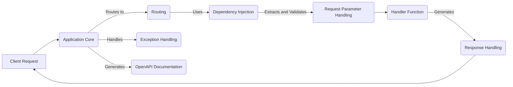

## FastAPI Data Flow Overview

FastAPI is a modern, high-performance web framework for building APIs with Python. It leverages standard Python type hints to simplify development and reduce errors, while providing automatic data validation and serialization. FastAPI is designed to be easy to use and highly efficient, making it suitable for building a wide range of applications, from simple APIs to complex web services.

### Component Descriptions

**Application Core:** This is the central component of the FastAPI application. It receives client requests, initializes the middleware stack, and orchestrates the flow of data through the application. It routes requests to the appropriate routing component and handles global exception handling. It also generates the OpenAPI documentation.

**Routing:** This component is responsible for mapping incoming HTTP requests to the appropriate handler functions based on the URL path and HTTP method. It uses the routes defined in the application to determine which handler function should be executed for a given request. It uses the Dependency Injection component to resolve dependencies for the handler function.

**Dependency Injection:** This component manages the dependencies required by handler functions. It resolves dependencies based on type hints and injects them into the handler function before execution. It is used by the Routing component to prepare the handler function for execution and by the Request Parameter Handling component to resolve parameter dependencies.

**Request Parameter Handling:** This component extracts and validates request parameters from various sources, such as the URL path, query string, headers, cookies, and request body. It ensures that the data received from the client is in the expected format and meets the defined constraints. It passes the validated parameters to the handler function.

**Response Handling:** This component serializes the response data returned by the handler function into a format suitable for transmission to the client, such as JSON. It also sets the appropriate HTTP headers for the response. It receives the data from the Handler Function and sends the formatted response back to the Application Core, which then sends it to the client.

**Exception Handling:** This component handles exceptions that occur during the request processing lifecycle. It provides a centralized mechanism for handling errors and returning appropriate error responses to the client. It is used by the Application Core to handle exceptions that occur during request processing.

**OpenAPI Documentation:** This component generates the OpenAPI schema for the API, which can be used to generate interactive API documentation and client SDKs. It is used by the Application Core to generate the OpenAPI schema for the API.