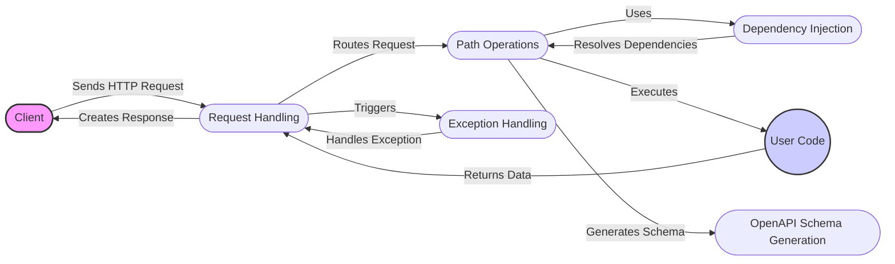

# FastAPI Data Flow Overview

FastAPI is a modern, high-performance, web framework for building APIs with Python. It leverages standard Python type hints to automatically generate API documentation and handle request validation. The framework is built on top of Starlette and Pydantic, providing a robust and efficient foundation for developing web applications.

## Data Flow Diagram

## Component Descriptions

**1. Request Handling:**
   - *Description*: The Request Handling component is the entry point for all incoming HTTP requests. It receives requests from clients, routes them to the appropriate path operation based on the URL and HTTP method, and constructs the final HTTP response to be sent back to the client. It uses the routing mechanism defined in Path Operations and triggers Exception Handling in case of errors.

**2. Path Operations:**
   - *Description*: This component defines the application's endpoints. It associates specific URL paths and HTTP methods (GET, POST, PUT, DELETE, etc.) with corresponding handler functions (User Code). It uses Dependency Injection to resolve dependencies required by these handler functions. It also generates schema information for OpenAPI Schema Generation.

**3. Dependency Injection:**
   - *Description*: The Dependency Injection component manages the dependencies required by the path operation functions. It resolves these dependencies, potentially using FastAPI's built-in dependency injection system or custom dependency providers, and injects them into the handler functions before execution. It is used by Path Operations to provide necessary resources to the handler functions.

**4. OpenAPI Schema Generation:**
   - *Description*: This component is responsible for automatically generating the OpenAPI schema for the API. It gathers information about the API endpoints, request/response models, and dependencies to create a comprehensive API documentation in the OpenAPI format. It is triggered by Path Operations when the application starts or when the OpenAPI schema is requested.

**5. Exception Handling:**
   - *Description*: The Exception Handling component intercepts exceptions raised during request processing, such as validation errors or HTTP exceptions. It uses registered exception handlers to generate appropriate error responses, ensuring that the client receives informative feedback in case of errors. It is triggered by Request Handling when an exception occurs during request processing.