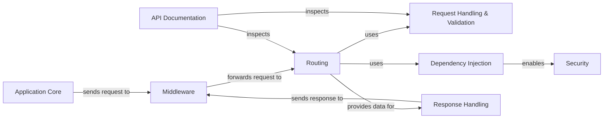

## Details

One paragraph explaining the functionality which is represented by this graph. What the main flow is and what is its purpose.

### Application Core [[Expand]](./Application_Core.md)
The central orchestrator of the framework. It initializes the application, manages the overall configuration, integrates middleware, and controls the request-response lifecycle.

**Related Classes/Methods**:

- <a href="https://github.com/fastapi/fastapi/blob/master/fastapi/applications.py#L47-L4587" target="_blank" rel="noopener noreferrer">`fastapi.applications.FastAPI` (47:4587)</a>

### Middleware [[Expand]](./Middleware.md)
Manages a chain of processors that intercept and modify requests and responses. It handles cross-cutting concerns like CORS, authentication, and GZip compression before the request reaches the core application logic.

**Related Classes/Methods**:

- `fastapi.middleware`

### Routing [[Expand]](./Routing.md)
Maps incoming HTTP requests to the appropriate path operation functions. It manages URL paths, HTTP methods, and allows for the modular organization of endpoints using `APIRouter`.

**Related Classes/Methods**:

- <a href="https://github.com/fastapi/fastapi/blob/master/fastapi/routing.py#L595-L4439" target="_blank" rel="noopener noreferrer">`fastapi.routing.APIRouter` (595:4439)</a>
- <a href="https://github.com/fastapi/fastapi/blob/master/fastapi/routing.py#L428-L592" target="_blank" rel="noopener noreferrer">`fastapi.routing.APIRoute` (428:592)</a>

### Request Handling & Validation [[Expand]](./Request_Handling_Validation.md)
Responsible for parsing, validating, and documenting request parameters from paths, queries, headers, and the request body. It uses Pydantic models for data validation and automatically generates detailed error messages for invalid data.

**Related Classes/Methods**:

- `fastapi.params`
- <a href="https://github.com/fastapi/fastapi/blob/master/fastapi/exceptions.py#L156-L159" target="_blank" rel="noopener noreferrer">`fastapi.exceptions.RequestValidationError` (156:159)</a>

### Dependency Injection [[Expand]](./Dependency_Injection.md)
A foundational component that manages and resolves dependencies for path operation functions. It is the core mechanism for reusing logic, managing resources like database connections, and implementing security.

**Related Classes/Methods**:

- <a href="https://github.com/fastapi/fastapi/blob/master/fastapi/params.py#L763-L773" target="_blank" rel="noopener noreferrer">`fastapi.params.Depends` (763:773)</a>

### Security [[Expand]](./Security.md)
A specialized layer built on the Dependency Injection system to handle authentication and authorization. It provides reusable implementations for common security schemes like OAuth2, API Keys, and HTTP Basic Auth.

**Related Classes/Methods**:

- `fastapi.security`

### Response Handling
Creates and formats the final HTTP response. This component is responsible for serializing application data (e.g., to JSON), managing response models, and handling various response types like `JSONResponse` or `HTMLResponse`.

**Related Classes/Methods**:

- `fastapi.responses`
- `fastapi.encoders`

### API Documentation [[Expand]](./API_Documentation.md)
Automatically generates interactive API documentation (Swagger UI, ReDoc) by introspecting the application's code. It creates an OpenAPI schema from routes, Pydantic models, and parameter declarations.

**Related Classes/Methods**:

- `fastapi.openapi`

### [FAQ](https://github.com/CodeBoarding/GeneratedOnBoardings/tree/main?tab=readme-ov-file#faq)