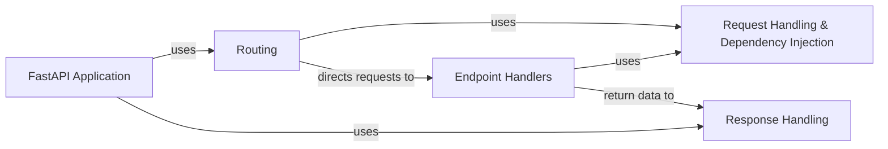

## Details

This simplified model focuses on the core request/response flow and dependency management within FastAPI.

### FastAPI Application
The central application instance, responsible for coordinating all other components, handling requests, and managing the application lifecycle.

**Related Classes/Methods**: _None_

### Routing
Maps incoming HTTP requests to the appropriate endpoint handler functions.

**Related Classes/Methods**: _None_

### Request Handling & Dependency Injection
Parses and validates incoming request data, manages dependencies, and injects them into endpoint handlers.

**Related Classes/Methods**: _None_

### Endpoint Handlers [[Expand]](./Endpoint_Handlers.md)
The functions that handle the actual business logic of the application.

**Related Classes/Methods**: _None_

### Response Handling [[Expand]](./Response_Handling.md)
Serializes the data returned by endpoint handlers into HTTP responses (JSON, etc.).

**Related Classes/Methods**: _None_

### [FAQ](https://github.com/CodeBoarding/GeneratedOnBoardings/tree/main?tab=readme-ov-file#faq)