```mermaid
graph LR
    API_Application_Core["API Application Core"]
    Request_Routing_and_Handling["Request Routing and Handling"]
    Dependency_Injection["Dependency Injection"]
    Request_Handling_and_Parameter_Parsing["Request Handling and Parameter Parsing"]
    Response_Serialization_and_Management["Response Serialization and Management"]
    Exception_Handling_and_Data_Validation["Exception Handling and Data Validation"]
    OpenAPI_Schema_Generation_and_Documentation["OpenAPI Schema Generation and Documentation"]
    Security_and_Authentication_Mechanisms["Security and Authentication Mechanisms"]
    API_Application_Core -- "Initializes and configures" --> Request_Routing_and_Handling
    Request_Routing_and_Handling -- "Handles request processing" --> Dependency_Injection
    Dependency_Injection -- "Injects dependencies into route handlers" --> Request_Handling_and_Parameter_Parsing
    Request_Handling_and_Parameter_Parsing -- "Defines and validates request parameters" --> Request_Routing_and_Handling
    Request_Routing_and_Handling -- "Serializes responses from route handlers" --> Response_Serialization_and_Management
    Request_Routing_and_Handling -- "Handles exceptions during request processing" --> Exception_Handling_and_Data_Validation
    API_Application_Core -- "Generates OpenAPI schema from routes" --> OpenAPI_Schema_Generation_and_Documentation
    Security_and_Authentication_Mechanisms -- "Integrates with dependency injection for authentication" --> Dependency_Injection
    Request_Routing_and_Handling -- "Uses for authentication and authorization" --> Security_and_Authentication_Mechanisms
    click API_Application_Core href "https://github.com/CodeBoarding/GeneratedOnBoardings/blob/main/fastapi/API Application Core.md" "Details"
    click Request_Routing_and_Handling href "https://github.com/CodeBoarding/GeneratedOnBoardings/blob/main/fastapi/Request Routing and Handling.md" "Details"
    click Dependency_Injection href "https://github.com/CodeBoarding/GeneratedOnBoardings/blob/main/fastapi/Dependency Injection.md" "Details"
    click Request_Handling_and_Parameter_Parsing href "https://github.com/CodeBoarding/GeneratedOnBoardings/blob/main/fastapi/Request Handling and Parameter Parsing.md" "Details"
    click Response_Serialization_and_Management href "https://github.com/CodeBoarding/GeneratedOnBoardings/blob/main/fastapi/Response Serialization and Management.md" "Details"
    click Exception_Handling_and_Data_Validation href "https://github.com/CodeBoarding/GeneratedOnBoardings/blob/main/fastapi/Exception Handling and Data Validation.md" "Details"
    click OpenAPI_Schema_Generation_and_Documentation href "https://github.com/CodeBoarding/GeneratedOnBoardings/blob/main/fastapi/OpenAPI Schema Generation and Documentation.md" "Details"
    click Security_and_Authentication_Mechanisms href "https://github.com/CodeBoarding/GeneratedOnBoardings/blob/main/fastapi/Security and Authentication Mechanisms.md" "Details"
```

## Component Details

FastAPI is a modern, high-performance web framework for building APIs with Python. The framework is built around asynchronous programming and leverages type hints for increased code clarity and validation. It provides features such as automatic data validation, serialization, dependency injection, and OpenAPI schema generation. The core flow involves receiving HTTP requests, routing them to the appropriate handler functions, resolving dependencies, processing request parameters, serializing responses, and handling exceptions. FastAPI aims to simplify API development and improve developer productivity.

### API Application Core
The central component responsible for initializing and configuring the FastAPI application. It manages the setup of routes, middleware, exception handlers, and the OpenAPI schema. It acts as the entry point for the application and orchestrates the interaction between other components.
- **Related Classes/Methods**:

['[`fastapi.fastapi.applications.FastAPI:__init__` (64:964)](https://github.com/fastapi/fastapi/blob/master/fastapi/applications.py#L64-L964)', '[`fastapi.fastapi.applications.FastAPI:setup` (998:1049)](https://github.com/fastapi/fastapi/blob/master/fastapi/applications.py#L998-L1049)', '[`fastapi.fastapi.applications.FastAPI:include_router` (1255:1458)](https://github.com/fastapi/fastapi/blob/master/fastapi/applications.py#L1255-L1458)', '[`fastapi.fastapi.applications.FastAPI:add_api_route` (1056:1113)](https://github.com/fastapi/fastapi/blob/master/fastapi/applications.py#L1056-L1113)', '[`fastapi.fastapi.applications.FastAPI:add_api_websocket_route` (1175:1188)](https://github.com/fastapi/fastapi/blob/master/fastapi/applications.py#L1175-L1188)', '[`fastapi.fastapi.applications.FastAPI:api_route` (1115:1173)](https://github.com/fastapi/fastapi/blob/master/fastapi/applications.py#L1115-L1173)', '[`fastapi.fastapi.applications.FastAPI:websocket` (1190:1253)](https://github.com/fastapi/fastapi/blob/master/fastapi/applications.py#L1190-L1253)', '[`fastapi.fastapi.applications.FastAPI:on_event` (4476:4495)](https://github.com/fastapi/fastapi/blob/master/fastapi/applications.py#L4476-L4495)']

### Request Routing and Handling
This component is responsible for managing the routing of incoming requests to the appropriate handler functions. It defines the structure and behavior of API endpoints, handles request processing, and ensures that requests are directed to the correct handlers based on their paths and methods.
- **Related Classes/Methods**:

['[`fastapi.fastapi.routing.APIRouter:__init__` (622:860)](https://github.com/fastapi/fastapi/blob/master/fastapi/routing.py#L622-L860)', '[`fastapi.fastapi.routing.APIRouter:add_api_route` (881:961)](https://github.com/fastapi/fastapi/blob/master/fastapi/routing.py#L881-L961)', '[`fastapi.fastapi.routing.APIRouter:api_route` (963:1023)](https://github.com/fastapi/fastapi/blob/master/fastapi/routing.py#L963-L1023)', '[`fastapi.fastapi.routing.APIRouter:add_api_websocket_route` (1025:1044)](https://github.com/fastapi/fastapi/blob/master/fastapi/routing.py#L1025-L1044)', '[`fastapi.fastapi.routing.APIRouter:websocket` (1046:1111)](https://github.com/fastapi/fastapi/blob/master/fastapi/routing.py#L1046-L1111)', '[`fastapi.fastapi.routing.APIRouter:include_router` (1122:1364)](https://github.com/fastapi/fastapi/blob/master/fastapi/routing.py#L1122-L1364)', '[`fastapi.fastapi.routing.APIRoute:__init__` (429:569)](https://github.com/fastapi/fastapi/blob/master/fastapi/routing.py#L429-L569)', '[`fastapi.fastapi.routing.APIRoute:get_route_handler` (571:586)](https://github.com/fastapi/fastapi/blob/master/fastapi/routing.py#L571-L586)', '[`fastapi.fastapi.routing.APIWebSocketRoute:__init__` (389:419)](https://github.com/fastapi/fastapi/blob/master/fastapi/routing.py#L389-L419)']

### Dependency Injection
This component manages the dependency injection system, allowing developers to declare dependencies for their API endpoints. It resolves dependencies and injects them into the handler functions, managing the lifecycle of dependencies, including generators and context managers. It ensures that the required dependencies are available when a route is executed.
- **Related Classes/Methods**:

['[`fastapi.fastapi.dependencies.utils:get_dependant` (265:314)](https://github.com/fastapi/fastapi/blob/master/fastapi/dependencies/utils.py#L265-L314)', '[`fastapi.fastapi.dependencies.utils:solve_dependencies` (572:695)](https://github.com/fastapi/fastapi/blob/master/fastapi/dependencies/utils.py#L572-L695)', '[`fastapi.fastapi.dependencies.utils:solve_generator` (553:560)](https://github.com/fastapi/fastapi/blob/master/fastapi/dependencies/utils.py#L553-L560)']

### Request Handling and Parameter Parsing
This component deals with processing incoming HTTP requests, including parameter parsing, data validation, and request body handling. It defines and validates request parameters, ensuring that the data received from the client is in the correct format and meets the required constraints.
- **Related Classes/Methods**:

['[`fastapi.fastapi.params.Path:__init__` (142:222)](https://github.com/fastapi/fastapi/blob/master/fastapi/params.py#L142-L222)', '[`fastapi.fastapi.params.Query:__init__` (228:306)](https://github.com/fastapi/fastapi/blob/master/fastapi/params.py#L228-L306)', '[`fastapi.fastapi.params.Header:__init__` (312:392)](https://github.com/fastapi/fastapi/blob/master/fastapi/params.py#L312-L392)', '[`fastapi.fastapi.params.Cookie:__init__` (398:476)](https://github.com/fastapi/fastapi/blob/master/fastapi/params.py#L398-L476)', '[`fastapi.fastapi.params.Form:__init__` (597:677)](https://github.com/fastapi/fastapi/blob/master/fastapi/params.py#L597-L677)', '[`fastapi.fastapi.params.File:__init__` (681:761)](https://github.com/fastapi/fastapi/blob/master/fastapi/params.py#L681-L761)']

### Response Serialization and Management
This component handles the serialization of responses, converting Python objects into JSON or other formats. It manages response validation and deals with custom responses and media types, ensuring that the data sent back to the client is correctly formatted and adheres to the expected schema.
- **Related Classes/Methods**:

['[`fastapi.fastapi.encoders:jsonable_encoder` (102:343)](https://github.com/fastapi/fastapi/blob/master/fastapi/encoders.py#L102-L343)', '[`fastapi.fastapi.routing:serialize_response` (143:201)](https://github.com/fastapi/fastapi/blob/master/fastapi/routing.py#L143-L201)', '[`fastapi.fastapi.routing:_prepare_response_content` (79:123)](https://github.com/fastapi/fastapi/blob/master/fastapi/routing.py#L79-L123)']

### Exception Handling and Data Validation
This component manages exception handling, providing mechanisms to catch and handle exceptions raised during request processing. It includes default exception handlers for HTTP exceptions and request validation errors, and allows customization of exception handling logic. It ensures that errors are handled gracefully and informative error responses are returned to the client.
- **Related Classes/Methods**:

['[`fastapi.fastapi.exception_handlers:http_exception_handler` (11:17)](https://github.com/fastapi/fastapi/blob/master/fastapi/exception_handlers.py#L11-L17)', '[`fastapi.fastapi.exception_handlers:request_validation_exception_handler` (20:26)](https://github.com/fastapi/fastapi/blob/master/fastapi/exception_handlers.py#L20-L26)', '[`fastapi.fastapi.exceptions.RequestValidationError:__init__` (158:160)](https://github.com/fastapi/fastapi/blob/master/fastapi/exceptions.py#L158-L160)', '[`fastapi.fastapi.exceptions.ResponseValidationError:__init__` (168:170)](https://github.com/fastapi/fastapi/blob/master/fastapi/exceptions.py#L168-L170)']

### OpenAPI Schema Generation and Documentation
This component is responsible for generating the OpenAPI schema for the API. It extracts information about API endpoints, request parameters, and response models to generate the OpenAPI specification, which can be used for documentation and client generation. It allows developers to easily document their APIs and provide a standardized interface for clients to interact with them.
- **Related Classes/Methods**:

['[`fastapi.fastapi.applications.FastAPI:openapi` (966:996)](https://github.com/fastapi/fastapi/blob/master/fastapi/applications.py#L966-L996)', '[`fastapi.fastapi.openapi.utils:get_openapi` (477:569)](https://github.com/fastapi/fastapi/blob/master/fastapi/openapi/utils.py#L477-L569)']

### Security and Authentication Mechanisms
This component provides security features, including authentication and authorization mechanisms. It includes classes for API key authentication, HTTP authentication (Basic, Bearer), and OAuth2. It integrates with the dependency injection system to enforce security requirements, ensuring that only authorized users can access protected resources.
- **Related Classes/Methods**:

['[`fastapi.fastapi.security.http.HTTPBase:__init__` (70:80)](https://github.com/fastapi/fastapi/blob/master/fastapi/security/http.py#L70-L80)', '[`fastapi.fastapi.security.http.HTTPBase:__call__` (82:94)](https://github.com/fastapi/fastapi/blob/master/fastapi/security/http.py#L82-L94)', '[`fastapi.fastapi.security.http.HTTPBasic:__init__` (130:185)](https://github.com/fastapi/fastapi/blob/master/fastapi/security/http.py#L130-L185)', '[`fastapi.fastapi.security.http.HTTPBasic:__call__` (187:217)](https://github.com/fastapi/fastapi/blob/master/fastapi/security/http.py#L187-L217)', '[`fastapi.fastapi.security.http.HTTPBearer:__init__` (252:299)](https://github.com/fastapi/fastapi/blob/master/fastapi/security/http.py#L252-L299)', '[`fastapi.fastapi.security.http.HTTPBearer:__call__` (301:321)](https://github.com/fastapi/fastapi/blob/master/fastapi/security/http.py#L301-L321)', '[`fastapi.fastapi.security.api_key.APIKeyQuery:__init__` (55:108)](https://github.com/fastapi/fastapi/blob/master/fastapi/security/api_key.py#L55-L108)', '[`fastapi.fastapi.security.api_key.APIKeyQuery:__call__` (110:112)](https://github.com/fastapi/fastapi/blob/master/fastapi/security/api_key.py#L110-L112)', '[`fastapi.fastapi.security.api_key.APIKeyHeader:__init__` (147:196)](https://github.com/fastapi/fastapi/blob/master/fastapi/security/api_key.py#L147-L196)', '[`fastapi.fastapi.security.api_key.APIKeyHeader:__call__` (198:200)](https://github.com/fastapi/fastapi/blob/master/fastapi/security/api_key.py#L198-L200)', '[`fastapi.fastapi.security.api_key.APIKeyCookie:__init__` (235:284)](https://github.com/fastapi/fastapi/blob/master/fastapi/security/api_key.py#L235-L284)', '[`fastapi.fastapi.security.api_key.APIKeyCookie:__call__` (286:288)](https://github.com/fastapi/fastapi/blob/master/fastapi/security/api_key.py#L286-L288)', '[`fastapi.fastapi.security.oauth2.OAuth2PasswordBearer:__init__` (400:471)](https://github.com/fastapi/fastapi/blob/master/fastapi/security/oauth2.py#L400-L471)', '[`fastapi.fastapi.security.oauth2.OAuth2PasswordBearer:__call__` (473:485)](https://github.com/fastapi/fastapi/blob/master/fastapi/security/oauth2.py#L473-L485)']