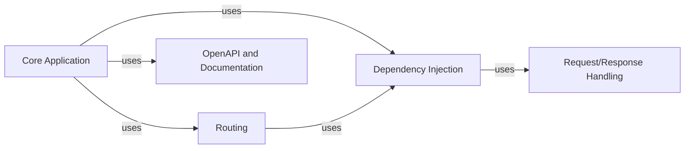

## Details

Simplified component diagram for FastAPI

### Core Application [[Expand]](./Core_Application.md)
The central entry point for the FastAPI application. It initializes the application, configures middleware, and integrates other components.

**Related Classes/Methods**: _None_

### Routing
Manages the mapping of incoming HTTP requests to the appropriate endpoint functions.

**Related Classes/Methods**: _None_

### Dependency Injection [[Expand]](./Dependency_Injection.md)
Resolves and injects dependencies into endpoint functions.

**Related Classes/Methods**: _None_

### Request/Response Handling [[Expand]](./Request_Response_Handling.md)
Parses incoming requests and serializes outgoing responses.

**Related Classes/Methods**: _None_

### OpenAPI and Documentation [[Expand]](./OpenAPI_and_Documentation.md)
Generates the OpenAPI schema and serves interactive API documentation.

**Related Classes/Methods**: _None_

### [FAQ](https://github.com/CodeBoarding/GeneratedOnBoardings/tree/main?tab=readme-ov-file#faq)