```mermaid
graph LR
    Core_Application_Routing["Core Application & Routing"]
    Request_Response_Handling["Request/Response Handling"]
    Dependency_Injection["Dependency Injection"]
    Security_Authentication["Security & Authentication"]
    API_Documentation_Schema_Generation["API Documentation & Schema Generation"]
    Core_Application_Routing -- "Uses" --> Request_Response_Handling
    Core_Application_Routing -- "Orchestrates" --> Dependency_Injection
    Request_Response_Handling -- "Used by" --> Core_Application_Routing
    Request_Response_Handling -- "Provides data to" --> API_Documentation_Schema_Generation
    Dependency_Injection -- "Integrates with" --> Core_Application_Routing
    Dependency_Injection -- "Leverages" --> Security_Authentication
    Security_Authentication -- "Provides dependencies to" --> Dependency_Injection
    Security_Authentication -- "Informs" --> API_Documentation_Schema_Generation
    API_Documentation_Schema_Generation -- "Consumed by" --> Core_Application_Routing
    API_Documentation_Schema_Generation -- "Receives data from" --> Request_Response_Handling
    click Request_Response_Handling href "https://github.com/CodeBoarding/GeneratedOnBoardings/blob/main/fastapi/Request_Response_Handling.md" "Details"
    click Dependency_Injection href "https://github.com/CodeBoarding/GeneratedOnBoardings/blob/main/fastapi/Dependency_Injection.md" "Details"
    click Security_Authentication href "https://github.com/CodeBoarding/GeneratedOnBoardings/blob/main/fastapi/Security_Authentication.md" "Details"
    click API_Documentation_Schema_Generation href "https://github.com/CodeBoarding/GeneratedOnBoardings/blob/main/fastapi/API_Documentation_Schema_Generation.md" "Details"
```

## Details

The `fastapi` framework operates by having the **Core Application & Routing** component as the central entry point for all incoming requests. It dispatches these requests to the appropriate route handlers. Before a handler is executed, the **Dependency Injection** system plays a crucial role by resolving and injecting any declared dependencies, which can include parameters processed by **Request/Response Handling** or security requirements managed by **Security & Authentication**.

**Request/Response Handling** is responsible for validating and parsing incoming data from various sources (path, query, body) and serializing Python objects into appropriate response formats (e.g., JSON). This component also contributes significantly to the **API Documentation & Schema Generation** by providing the necessary metadata for API parameters and data models.

**Security & Authentication** integrates directly with the **Dependency Injection** system to enforce access control, ensuring that only authorized requests proceed. It also informs the **API Documentation & Schema Generation** about the security schemes implemented in the API, making them visible in the generated documentation.

Finally, **API Documentation & Schema Generation** leverages information from **Request/Response Handling** and **Security & Authentication** to build a comprehensive OpenAPI schema. This schema is then exposed and served by the **Core Application & Routing** component, providing interactive documentation for developers. This interconnected flow ensures a robust, well-documented, and secure API development experience.

### Core Application & Routing
The central orchestrator of the FastAPI application, responsible for initializing the application, defining and managing API endpoints, and dispatching incoming requests to the appropriate handlers. It forms the backbone of the web framework.

**Related Classes/Methods**:

- <a href="https://github.com/fastapi/fastapi/fastapi/applications.py#L0-L0" target="_blank" rel="noopener noreferrer">`fastapi.applications` (0:0)</a>
- <a href="https://github.com/fastapi/fastapi/fastapi/routing.py#L0-L0" target="_blank" rel="noopener noreferrer">`fastapi.routing` (0:0)</a>

### Request/Response Handling [[Expand]](./Request_Response_Handling.md)
Manages the parsing, validation, and serialization of data for both incoming requests (e.g., path, query, body parameters) and outgoing responses. It ensures data integrity and proper formatting.

**Related Classes/Methods**:

- <a href="https://github.com/fastapi/fastapi/fastapi/params.py#L0-L0" target="_blank" rel="noopener noreferrer">`fastapi.params` (0:0)</a>
- <a href="https://github.com/fastapi/fastapi/fastapi/encoders.py#L0-L0" target="_blank" rel="noopener noreferrer">`fastapi.encoders` (0:0)</a>
- <a href="https://github.com/fastapi/fastapi/fastapi/exceptions.py#L0-L0" target="_blank" rel="noopener noreferrer">`fastapi.exceptions` (0:0)</a>
- <a href="https://github.com/fastapi/fastapi/fastapi/exception_handlers.py#L0-L0" target="_blank" rel="noopener noreferrer">`fastapi.exception_handlers` (0:0)</a>

### Dependency Injection [[Expand]](./Dependency_Injection.md)
A powerful mechanism that automatically resolves and injects required components (dependencies) into API route functions. This promotes modularity, testability, and reusability across the application.

**Related Classes/Methods**:

- <a href="https://github.com/fastapi/fastapi/fastapi/dependencies/utils.py#L0-L0" target="_blank" rel="noopener noreferrer">`fastapi.dependencies.utils` (0:0)</a>
- <a href="https://github.com/fastapi/fastapi/fastapi/dependencies/models.py#L0-L0" target="_blank" rel="noopener noreferrer">`fastapi.dependencies.models` (0:0)</a>

### Security & Authentication [[Expand]](./Security_Authentication.md)
Provides utilities and classes for implementing various security schemes (e.g., OAuth2, API Keys, HTTP Bearer). It integrates with the dependency injection system to enforce authentication and authorization policies on API endpoints.

**Related Classes/Methods**:

- `fastapi.security` (0:0)
- <a href="https://github.com/fastapi/fastapi/fastapi/openapi/models.py#L0-L0" target="_blank" rel="noopener noreferrer">`fastapi.openapi.models` (0:0)</a>

### API Documentation & Schema Generation [[Expand]](./API_Documentation_Schema_Generation.md)
Automatically generates the OpenAPI specification for the API based on defined routes, parameters, and models. It also provides built-in interactive documentation UIs (Swagger UI, ReDoc) for easy API exploration.

**Related Classes/Methods**:

- <a href="https://github.com/fastapi/fastapi/fastapi/openapi/utils.py#L0-L0" target="_blank" rel="noopener noreferrer">`fastapi.openapi.utils` (0:0)</a>
- <a href="https://github.com/fastapi/fastapi/fastapi/openapi/docs.py#L0-L0" target="_blank" rel="noopener noreferrer">`fastapi.openapi.docs` (0:0)</a>
- <a href="https://github.com/fastapi/fastapi/fastapi/openapi/models.py#L0-L0" target="_blank" rel="noopener noreferrer">`fastapi.openapi.models` (0:0)</a>

### [FAQ](https://github.com/CodeBoarding/GeneratedOnBoardings/tree/main?tab=readme-ov-file#faq)