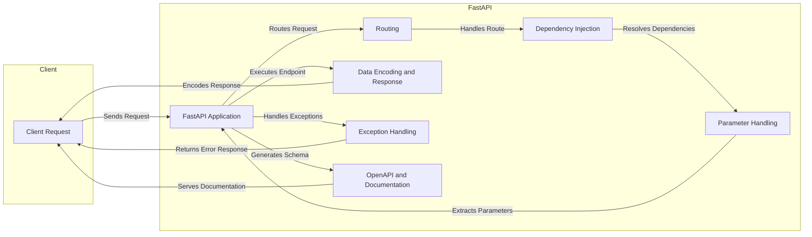

Okay, I'm ready to generate the high-level data flow diagram for FastAPI.

**1. Project Description:**

FastAPI is a modern, high-performance, web framework for building APIs with Python 3.7+ based on standard Python type hints. It simplifies API development by providing automatic data validation, serialization, and API documentation generation using OpenAPI and JSON Schema.

**2. Data Flow Diagram (Mermaid Format):**

**3. Component Descriptions:**

*   **Client Request:** Represents an incoming HTTP request from a client (e.g., a web browser, mobile app, or another service). It sends requests to the FastAPI application and receives responses.

*   **FastAPI Application:** The core of the framework. It receives client requests, orchestrates the routing and dependency injection processes, executes the appropriate endpoint function, and handles exceptions. It routes the request to the `Routing` component and uses `DataEncoding` to format the response. It also uses `OpenAPIDocs` to generate API documentation.

*   **Routing:** Responsible for mapping incoming requests to the correct endpoint function based on the URL path and HTTP method. It receives requests from the `FastAPI Application` and uses the defined routes to determine which endpoint to execute. It then passes control to the `DependencyInjection` component.

*   **Dependency Injection:** Manages the resolution and injection of dependencies into endpoint functions. It receives control from the `Routing` component and uses the `ParameterHandling` component to extract parameters. It then injects the resolved dependencies into the endpoint function before execution by the `FastAPI Application`.

*   **Parameter Handling:** Extracts, validates, and transforms request parameters from various sources (query parameters, path parameters, request body, headers, cookies). It is used by the `DependencyInjection` component to extract the necessary parameters for the endpoint function.

*   **Data Encoding and Response:** Encodes data into JSON-compatible formats for responses and handles custom response classes. It receives the result of the endpoint function execution from the `FastAPI Application` and encodes it into a JSON response that is sent back to the client.

*   **Exception Handling:** Handles exceptions raised during request processing and returns appropriate HTTP error responses. It receives exceptions from the `FastAPI Application` and formats them into error responses that are sent back to the client.

*   **OpenAPI and Documentation:** Generates the OpenAPI schema and serves the interactive API documentation (Swagger UI, ReDoc). It is used by the `FastAPI Application` to generate the API documentation, which is then served to the client.